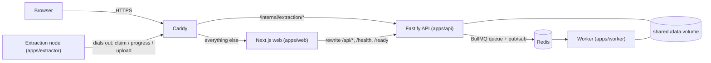

# SERA.toolkit — codebase reference

A file-by-file description of everything in this repository: what each file is for, what
it exports, how it behaves, and how the pieces connect. It is written to be read alongside
the code, not instead of it — where a function has a non-obvious rule, the rule is spelled
out here; where the code's own comments explain _why_, this document points at the _what_.

**Snapshot.** Written against `main` at commit `1da3bd8` ("Make import failures diagnosable
from the alert, and lead with sign-in"), plus the uncommitted `serve:node` script and the
matching paragraph in `deploy/EXTRACTION-NODE.md`. The tree is 198 tracked files and about
33,400 lines, excluding `package-lock.json`. The test suite collects 521 tests locally, plus 9
that run only when a Redis URL is supplied.

**Where to go for what.** [README.md](README.md) is the user-facing introduction and
[deploy/](deploy/) holds the operator guides. This file is the map of the code.

---

## Contents

1. [What the system does](#1-what-the-system-does)
2. [Architecture at a glance](#2-architecture-at-a-glance)
3. [The four main flows](#3-the-four-main-flows)
4. [Repository layout](#4-repository-layout)
5. [Root configuration files](#5-root-configuration-files)
6. [`packages/contracts` — the shared model](#6-packagescontracts--the-shared-model)
7. [`packages/engine` — core modules](#7-packagesengine--core-modules)
8. [`packages/engine` — security and utilities](#8-packagesengine--security-and-utilities)
9. [`packages/engine` — providers](#9-packagesengine--providers)
10. [`packages/engine` — extraction](#10-packagesengine--extraction)
11. [`packages/engine` — normalization, resolver, jobs, queue, storage, conversion](#11-packagesengine--normalization-resolver-jobs-queue-storage-conversion)
12. [`apps/api` — the HTTP surface](#12-appsapi--the-http-surface)
13. [`apps/worker` — the standalone worker](#13-appsworker--the-standalone-worker)
14. [`apps/extractor` — the extraction node](#14-appsextractor--the-extraction-node)
15. [`apps/web` — the interface](#15-appsweb--the-interface)
16. [`apps/extension` — the browser-import docs](#16-appsextension--the-browser-import-docs)
17. [`scripts/` — tooling](#17-scripts--tooling)
18. [Containers and Compose](#18-containers-and-compose)
19. [`deploy/` — the public deployment](#19-deploy--the-public-deployment)
20. [Continuous integration](#20-continuous-integration)
21. [Tests](#21-tests)
22. [Reference tables](#22-reference-tables)
23. [Observations from this read-through](#23-observations-from-this-read-through)

---

## 1. What the system does

SERA.toolkit is a self-hostable media downloader and converter. A visitor pastes one link;
the server works out which platform it belongs to, asks that platform what the post contains,
and offers only the formats that genuinely exist — video in the resolutions the site
publishes, audio extracted as MP3/M4A/Opus/WAV, images untouched, short videos as GIFs. A
carousel or gallery resolves to every item in it. Several files come back as a ZIP or
separately. Progress is streamed live, and finished files are deleted on a timer.

Four design decisions shape almost every file:

- **One normalized model.** Every provider's answer is flattened into
  `MediaInfo → items[] → options[]` before it reaches the browser. The UI never sees a codec
  string, a format id or a provider name it has to branch on, so adding a platform changes no
  UI code.
- **Signed handles instead of server state.** A resolution returns HMAC-signed tokens rather
  than keys into a table. The API and workers share no state, and a client cannot edit a
  token to point the pipeline at a URL the resolver never approved.
- **Re-resolve at download time.** A job re-reads the link rather than trusting a CDN URL
  from the client, so an expired signed URL is never the reason a download fails. The one
  exception is a post the visitor's own browser read (Instagram "visitor import"), whose
  approved media is signed into the token because the server cannot read it again.
- **An SSRF-proof fetcher.** A service that fetches arbitrary URLs is an SSRF engine unless
  built not to be. Address filtering happens inside the DNS lookup the socket uses; no shell
  is ever invoked; the extractor only receives hosts a provider explicitly claims.

Some platforms refuse datacentre addresses (YouTube answers "Sign in to confirm you're not a
bot" from every cloud). SERA's answer is the **extraction node**: a machine on a residential
connection that dials out to the deployment, claims work, runs the whole job locally and
uploads the result. It listens on nothing.

## 2. Architecture at a glance



| Package / app        | Role                                                                                                                             |
| -------------------- | -------------------------------------------------------------------------------------------------------------------------------- |
| `packages/contracts` | Types shared by server and browser, plus zod schemas for everything that crosses the network, with compile-time drift guards.    |
| `packages/engine`    | All the logic: config, providers, extraction routing, format normalization, tokens, the job pipeline, queues, storage, security. |
| `apps/api`           | Fastify HTTP server. Resolves links, accepts jobs, streams progress, serves files, and (optionally) talks to extraction nodes.   |
| `apps/worker`        | The job pipeline with no HTTP surface, for the Redis deployment where workers scale separately.                                  |
| `apps/extractor`     | The extraction node program.                                                                                                     |
| `apps/web`           | Next.js 16 / React 19 / Tailwind 4 front end. Proxies `/api` to the API so everything is one origin.                             |
| `apps/extension`     | Documentation for the Instagram browser-import bookmarklet (the extension itself is not built yet).                              |

Two deployment shapes share the same code:

- **Single process** (`SERA_QUEUE_DRIVER=memory`): the API runs its own worker in-process.
  Used by `npm run dev`, `npm run serve:public` and `docker-compose.standalone.yml`.
- **Distributed** (`SERA_QUEUE_DRIVER=redis`): API, one or more workers and Redis, sharing a
  `/data` volume. Used by `docker-compose.yml` and the Oracle deployment.

## 3. The four main flows

### 3.1 Resolving a link — `POST /api/media/info`

1. `routes/media.ts` checks the client's abuse cooldown, parses `{url}` with
   `resolveRequestSchema`, and ties an `AbortSignal` to the client connection.
2. `MediaResolver.resolve` runs `parseUserUrl` (scheme, credentials, port, private IP
   literals), checks `SERA_BLOCKED_HOSTS`, and asks the `ProviderRegistry` which provider
   claims the host.
3. The URL is canonicalized: the provider's `normalize()`, then `normalizeUrl()` (tracking
   parameters removed, query sorted).
4. `route()` checks a 5-minute cache, then asks the `ExtractionRouter`, which tries the
   local backend and — only for provider/failure combinations where it can help — healthy
   extraction nodes. As a last resort it lets the provider return a degraded representation
   (e.g. Instagram's 640px cover image).
5. Inside a provider, a **strategy ladder** may try several routes (e.g. X's syndication
   endpoint, then yt-dlp).
6. If the specific provider answers `UNSUPPORTED_SOURCE`, the generic page reader gets one
   try.
7. `toMediaInfo` signs an info token (URL + provider), one option token per plan (a keyed
   digest of the resolution + item index + source id + plan key), and a thumbnail token per
   image, and returns `MediaInfo`.

### 3.2 Downloading — `POST /api/jobs`

1. `JobService.create` verifies the info token and every option token, checks that every
   option belongs to that exact resolution, enforces item, queue-depth and per-client limits,
   builds a `JobSpec` and submits it to the backend.
2. A worker (in-process or separate) runs `JobService.execute` → `JobRunner.run`:
   re-resolve (or rebuild an imported post from its signed entries), match each selection
   back to a plan by key, check limits, create a workspace.
3. If the resolution came from an extraction node, the whole job is dispatched to a node and
   the uploaded files are moved into the workspace. Otherwise each selection is fetched
   locally (yt-dlp or the guarded HTTP client), stepping down to a lower rendition if the
   chosen one fails in a way a different format could answer. Then it is converted with
   FFmpeg if needed, named, and moved into `out/`.
4. Outputs are packaged (one file, or a ZIP), a manifest is written, and every file is
   validated (non-empty, under the size cap, not an HTML/JSON "imposter", playable per
   ffprobe).
5. The browser follows along over Server-Sent Events (`/api/jobs/:id/events`), falling back
   to polling. When the job is ready it navigates to `/api/jobs/:id/download`.

### 3.3 Extraction nodes

1. The node long-polls `POST /internal/extraction/claim` with its id, providers, capacity
   and network class. The held request is the heartbeat.
2. The router dispatches `resolve` tasks to it; the node resolves locally and posts the
   `ResolvedMedia` back. The resolver marks the result with `remoteBackend`.
3. Because the result came from a node, the job runner dispatches a `job` task to the node.
   The node re-resolves, runs the full `JobRunner` locally, uploads each output file as a raw
   stream, then posts `complete`.
4. In the distributed deployment the worker cannot see the node (the node is connected to
   the API process), so the worker uses `RemoteOverHttp` to ask the API over HTTP.

### 3.4 Instagram visitor import

1. The `/import` page offers a bookmarklet. On instagram.com, signed in, the bookmarklet
   reads one post through Instagram's own media-info endpoint, trims it, and navigates the
   same tab to `/import#v=2&p=<payload>`.
2. `/import` reads and clears the fragment, refuses off-CDN media client-side, and POSTs it
   to `/api/media/import`.
3. `MediaResolver.importSubmitted` re-derives the slides, admits only HTTPS URLs on
   `cdninstagram.com` / `fbcdn.net`, bounds the token lifetime by Instagram's own `oe`
   expiry, and signs the approved entries into the info token.
4. A job made from it never re-resolves: `mediaFromImport` rebuilds the plans from the
   signed entries, and every download hop is re-checked against the CDN allowlist.

## 4. Repository layout

```
sera-toolkit/
├─ package.json, tsconfig*.json, vitest.config.ts, eslint.config.js, .prettierrc.json …
├─ packages/
│  ├─ contracts/src/        types.ts, schemas.ts, index.ts
│  └─ engine/src/
│     ├─ config.ts, engine.ts, errors.ts, logging.ts, resolver.ts, index.ts
│     ├─ security/          url, ip, http, robots, abuse
│     ├─ util/              cache, filename, format, sniff, spawn, tokens
│     ├─ providers/         types, capabilities, index, ytdlp-base + 19 providers
│     ├─ extract/           ytdlp(-types), direct-download, html, failure, strategy,
│     │                     router, remote, remote-http
│     ├─ normalize/         formats, plans
│     ├─ jobs/              runner, service, zip
│     ├─ queue/             types, memory, redis
│     ├─ storage/           workspace
│     └─ convert/           ffmpeg
├─ apps/
│  ├─ api/src/              index, server, plugins/{client,disconnect,errors},
│  │                        routes/{meta,media,jobs,extraction-node}
│  ├─ worker/src/index.ts
│  ├─ extractor/src/{index,node}.ts
│  ├─ web/                  next.config.ts, src/{app,components,lib,styles}
│  └─ extension/README.md
├─ scripts/                 dev, clean, fetch-tools, serve-public, smoke-live,
│                           update-providers, check-providers, node-check, check-split
├─ docker/                  api.Dockerfile, web.Dockerfile
├─ docker-compose.yml, docker-compose.standalone.yml
├─ deploy/                  Caddyfile, docker-compose.oracle.yml, provision.sh,
│                           auto-update.sh, alert-check.sh, install-timers.sh, systemd/,
│                           node-windows/, node-android/ + guides
├─ test/                    end-to-end suites + helpers
├─ .github/workflows/       ci.yml, update-ytdlp.yml
└─ .devcontainer/devcontainer.json
```

Git-ignored runtime directories you will see locally: `.tools/` (pinned yt-dlp, FFmpeg,
ffprobe, cloudflared), `.data/` (workspaces, fixtures, run copies, provider-matrix output),
`dist/` and `.next/` build output, and the env files `.env`, `.env.local`,
`.env.production.local`, `.env.node.local`.

## 5. Root configuration files

### `package.json`

The npm-workspaces root (`"workspaces": ["packages/*", "apps/*"]`), `"type": "module"`,
Node `>=22.12.0`, MIT. It only holds dev tooling (ESLint 10 with typescript-eslint,
Prettier 3 with the Tailwind plugin, TypeScript 6.0, Vitest 5 with V8 coverage,
`@types/node`) and the scripts:

| Script                                  | What it runs                                                                                                                                        |
| --------------------------------------- | --------------------------------------------------------------------------------------------------------------------------------------------------- |
| `build`                                 | Builds, in dependency order: contracts → engine → api → worker → extractor → web.                                                                   |
| `clean`                                 | `scripts/clean.mjs`: removes build output and `.data`.                                                                                              |
| `dev`                                   | `scripts/dev.mjs`: TypeScript in watch mode, the API from `dist` with `--watch`, and `next dev`.                                                    |
| `dev:api` / `dev:web` / `dev:worker`    | Each workspace's own `dev` script.                                                                                                                  |
| `format` / `format:fix`                 | `prettier --check .` / `--write .`                                                                                                                  |
| `lint` / `lint:fix`                     | `eslint .`                                                                                                                                          |
| `serve:public` / `serve:local`          | `scripts/serve-public.mjs`: production build on this machine, with or without a Cloudflare quick tunnel.                                            |
| `serve:node`                            | `node --env-file=.env.node.local apps/extractor/dist/index.js` — runs this machine as an extraction node from a git-ignored env file (uncommitted). |
| `start`                                 | `node apps/api/dist/index.js`                                                                                                                       |
| `test` / `test:watch` / `test:coverage` | Vitest.                                                                                                                                             |
| `check:providers`                       | Live matrix of every provider against real sites.                                                                                                   |
| `check:node`                            | The extraction-node architecture end to end on one machine.                                                                                         |
| `check:split`                           | The same with API and "worker" in separate processes.                                                                                               |
| `tools:fetch`                           | Pinned, checksum-verified yt-dlp and FFmpeg into `.tools/`.                                                                                         |
| `typecheck`                             | `tsc --build` (Node packages), then the tests project, then the web project.                                                                        |
| `build:node`                            | Builds only what an extraction node runs: contracts, engine, extractor. Used on a phone, with a matching filtered `npm ci`.                         |
| `update-providers`                      | Checks for a newer yt-dlp; `--write` pins it in both places.                                                                                        |
| `verify`                                | format → lint → typecheck → test → build.                                                                                                           |

### `tsconfig.base.json`

Shared compiler options: `target`/`lib` ES2023, `module`/`moduleResolution` NodeNext,
`verbatimModuleSyntax`, `isolatedModules`, full `strict` plus `noUncheckedIndexedAccess`,
`noImplicitOverride`, `noImplicitReturns`, `noFallthroughCasesInSwitch`,
`useUnknownInCatchVariables`; `exactOptionalPropertyTypes` is off. Emits declarations,
declaration maps and source maps as `composite` + `incremental` projects. `esModuleInterop`
and `allowSyntheticDefaultImports` are not set: TypeScript 6 deprecates turning them off, so
they are simply how it behaves.

### `tsconfig.json`

A solution file with no sources of its own, referencing contracts, engine, api, worker and
extractor. The web app is type-checked separately because Next needs `noEmit` and a DOM lib,
which a composite project cannot have; that is `apps/web/tsconfig.json`.

### `tsconfig.tests.json`

A non-emitting project for the test files (which the emitting projects exclude so they stay
out of `dist/`). It maps `@sera/contracts`, `@sera/contracts/types` and `@sera/engine` to
their `src/` entry points and includes `packages/*/src/**/*.test.ts`, API and worker tests,
`test/**/*.ts` and `vitest.config.ts`.

### `vitest.config.ts`

Collects `packages/*/src/**/*.test.ts`, `apps/api|worker|web/src/**/*.test.ts` and
`test/**/*.test.ts` in a Node environment. Test and hook timeouts are 60 s, because the
end-to-end suite does real conversions. Coverage is V8 over `packages/*/src` and
`apps/api/src`, excluding tests, `dist`, `index.ts` and `.d.ts`. The same three aliases point
the workspace packages at their sources, so tests run without a build.

### `eslint.config.js`

Flat config built with ESLint's own `defineConfig` and `globalIgnores` (typescript-eslint's
`tseslint.config()` is deprecated in their favour), with `typescript-eslint`'s presets:

- Ignores build output, coverage, `.tools`, `.data` and the generated `next-env.d.ts`.
- `js.configs.recommended` + `recommendedTypeChecked` + `stylisticTypeChecked`, using the
  project service.
- House rules: type-only imports written inline; unused variables allowed only with a `_`
  prefix; `no-floating-promises`; `no-misused-promises` (except void-returning arguments and
  JSX attributes); `require-await`; exhaustive `switch`; restricted template expressions that
  still allow numbers, booleans and nullish values; `no-console` except `warn`/`error`;
  `eqeqeq` (with `== null` allowed).
- **Shell execution is banned by lint**: `no-restricted-syntax` rejects `child_process.exec`
  / `execSync` whether called on the module or imported by name (from `child_process` or
  `node:child_process`), with the message "Use spawn() with an argument array."
- Test files are linted against `tsconfig.tests.json` with the unsafe-any and non-null rules
  relaxed and `console` allowed. Web tests use `apps/web/tsconfig.json`. Scripts and config
  files (`*.mjs`, `*.config.js`) have type-aware rules disabled.
- `eslint-config-prettier` goes last, so formatting is Prettier's job alone.

### `.prettierrc.json`, `.prettierignore`

Semicolons, single quotes, trailing commas everywhere, 100-column lines, 2-space indent,
always-parenthesized arrow parameters, LF line endings, and `prettier-plugin-tailwindcss`
pointed at `apps/web/src/styles/globals.css` for class ordering. The ignore file skips
`node_modules`, `dist`, `.next`, `coverage`, `.tools`, `.data`, build info, the lockfile and
`apps/web/next-env.d.ts`, which Next regenerates on every build.

### `.gitattributes`, `.gitignore`, `.dockerignore`

- `.gitattributes` normalizes everything to LF in the repository — Dockerfiles and shell
  scripts are read by Linux tools, where CRLF is a syntax error — and marks image and font
  formats binary.
- `.gitignore` excludes dependencies, build output, coverage, local runtime state (`.data/`,
  `.tools/`, `tmp/`), the generated `deploy/caddy.globals/`, and env files (`.env`,
  `.env.local`, `.env.*.local`), keeping `.env.example`. That last pattern is why
  `.env.node.local` and `.env.production.local` are safe to keep secrets in.
- `.dockerignore` keeps the build context small: no `node_modules`, build output, `.tools`,
  `.data`, `.git`, CI files, env files (except the example), Markdown (except the README) or
  tests.

### `.env.example`

Every runtime setting with its default and an explanation, grouped as Required
(`SERA_SECRET`), Networking, Storage and retention, Limits, Queue and workers, Rate limiting,
External tools, Source policy, Sources that need a credential, Where extraction runs,
settings read only by an extraction node, and Logging. CI checks that every `SERA_*` name
documented here, in the README, in `deploy/` or in `docker/` exists in the config schema (see
§20). The full list is in [§22.1](#221-environment-variables).

### `.devcontainer/devcontainer.json`

The GitHub Codespaces environment: the `javascript-node:1-24-bookworm` image with
docker-in-docker (so the four-service Compose stack can run inside it). It installs FFmpeg
from apt at create time, then `npm ci`, fetches only the pinned yt-dlp and builds. Port 3200
(web) is forwarded publicly; 4000 (API) stays private because the web app proxies `/api`. It
adds the ESLint, Prettier and Tailwind VS Code extensions, formats on save, needs 2 CPUs /
8 GB / 32 GB, and runs as the `node` user.

### `LICENSE`, `README.md`

MIT, © 2026 SERA.toolkit contributors. The README covers what SERA does, the supported
sources and the datacentre-versus-home table (measured 7 September 2026), running with
Docker, on Oracle's free tier, in Codespaces, from prebuilt images, publicly from your own
machine via a tunnel, and from source; the architecture; the normalized model and signed
handles; adding a provider; the configuration highlights; the security design; development
commands; and responsible use. (Its "449 tests" comment predates the current suite.)

---

## 6. `packages/contracts` — the shared model

`@sera/contracts` is imported by both the server and the browser. It exports two entry
points: `.` (types **and** zod schemas, server-only) and `./types` (types only, so the browser
bundle never pulls in the validator). Its only runtime dependency is `zod` 4.6.5.

### `src/types.ts`

Dependency-free declarations of everything the UI consumes.

- **`SERA_VERSION = '1.0.0'`** — shown in the footer and reported by `/api/info` and
  `/health`. It lives here because the browser cannot import the engine.
- **Media model**
  - `MediaKind`: `video`, `audio`, `image`, `gif`, `unknown`.
  - `MediaInfoType`: `single`, `collection` (several items published together — a carousel),
    `playlist` (separately publishable entries).
  - `ContainerFormat`: `mp4 webm mov mkv mp3 m4a aac opus ogg wav flac gif jpg png webp avif
zip bin`.
  - `DownloadOption` — one concrete thing a user can ask for: `id` (opaque signed token),
    `itemId`, `kind`, `container`, `label` (e.g. `1080p`, `MP3`, `Original`), optional
    `detail`, dimensions, `fps`, `audioBitrateKbps`, codecs, `filesizeBytes` and
    `filesizeIsApproximate`, plus `requiresConversion` and `recommended` (at most one
    default per kind).
  - `MediaItem` — `id`, 1-based `index`, `kind`, `title`, `thumbnail` (a proxied API path,
    never a third-party URL), dimensions, `duration`, `container`, `filesizeBytes`,
    `isLive`, and a non-empty `options` list.
  - `MediaInfo` — the normalized resolution: `id` (the signed info token), provider id and
    label, canonical `url`, `type`, `title`, and optional description, author, author URL,
    thumbnail, duration and `createdAt`, then `items`, a small `metadata` record, and
    `expiresIn` (seconds until the tokens stop validating).
- **Jobs**
  - `JobState`: `queued resolving downloading merging converting packaging finalizing ready
failed cancelled expired`; `TERMINAL_JOB_STATES` (`ready failed cancelled expired`) and
    the guard `isTerminalJobState`.
  - `JobProgress` — a monotonic `percent`, plus optional byte counts, smoothed speed, ETA,
    and `currentFile` / `totalFiles`.
  - `JobResultFile` (name, size, MIME type, `downloadPath`); `JobDelivery` (`backend`:
    `local`, a node's network class, or `visitor-browser`; plus `substituted`, a list of
    `{requested, actual}` renditions); `JobResult` (primary `downloadPath`, `filename`,
    size, MIME type, `isArchive`, individual `files`, `expiresAt`, `delivery`).
  - `ErrorCode` — 26 codes (see [§22.3](#223-error-codes)). `JobError` is
    `{code, message, hint?, retryable}`. `Job` is the public job record.
- **Requests** — `ResolveRequest {url}`; the Instagram import shapes `ImportedCandidate`,
  `ImportedPostNode` (id, shortcode, `media_type` 1/2/8, carousel slides, image and video
  candidates, duration, alt text, user, caption) and `ImportRequest {url, node}`;
  `PackagingMode` (`auto`, `zip`, `individual`); `CreateJobRequest` (`infoId`,
  `optionIds`, `packaging?`, `filename?`).
- **Server-sent events** — `JobEvent`: `state`, `progress`, `done` and `error` each carry a
  `Job`; `ping` is a keep-alive.
- **Meta** — `ProviderCapabilities` (below), `ProviderSummary` (id, label, hosts, status
  `ok`/`degraded`/`unavailable`, capabilities), `ServiceInfo` (name, version, providers,
  limits), `HealthCheck`, `HealthReport` (`ok`/`degraded`/`error`, version, uptime, checks),
  and `ApiErrorBody {error: JobError}`, the envelope of every non-2xx response.

`ProviderCapabilities` is how a provider declares what it can do, so routing and the About
page stop guessing:

| Field                            | Meaning                                                                                                                      |
| -------------------------------- | ---------------------------------------------------------------------------------------------------------------------------- |
| `video`, `image`, `audio`, `gif` | Media the platform serves (`audio` means audio as media in its own right).                                                   |
| `audioExtraction`                | An audio file can be produced from its video.                                                                                |
| `carousel`, `gallery`            | Several items behind one post (in order), or behind a container link such as a board or album.                               |
| `live`                           | Streams still in progress (refused everywhere).                                                                              |
| `authenticatedMode`              | An operator-credential mode exists (session or app registration).                                                            |
| `requiresOauth`                  | Nothing works without operator credentials.                                                                                  |
| `residentialFallback`            | A residential node could succeed where a datacentre did not. `false` keeps the provider off nodes entirely.                  |
| `cloudExtraction`                | Extraction from a datacentre is expected to work. `false` (YouTube) makes the router ask a node first when one is connected. |
| `browserImport`                  | A visitor's signed-in browser can read a post and hand it over (Instagram only).                                             |
| `authRequiredFor?`               | Names the part of the provider that needs credentials this installation lacks, e.g. `['photo posts', 'carousels']`.          |

**Trim** (in `types.ts`, so the web app can run it): `TrimRequest {start?, end?}` as typed,
`TrimRange {start, end?}` in seconds, `TIMECODE_PATTERN` (`m:ss`, `mm:ss`, `h:mm:ss`),
`parseTimecode`, `formatTimecode`, `MIN_TRIM_SECONDS` (1), and **`checkTrim(trim, duration?)`**
— the one rule the form and the server share: at least one time; a missing start is 0 and a
missing end is the end; the start before the end by at least a second; both inside the media
when its length is known (an end up to a second past a rounded length counts as the end);
and not the whole thing. It returns the range, with an end at the media's length dropped, or
a sentence for the visitor. `trimSuffix(range, duration?)` is the filename's
`-trim-0m10s-0m30s` (hours when needed, `-end` when the end is unknown).

**Subtitles**: `MediaItem.subtitles?: SubtitleTrack[]` (`{lang, label, auto}`), and
`SubtitleRequest {lang, auto?, format, only?}` with `SubtitleFormat` `srt`, `vtt` or `embed`
(a soft track inside the video). `SUBTITLE_EMBED_CONTAINERS` is MP4, MKV and WebM.

### `src/schemas.ts`

Runtime validation for everything that crosses the network; only the server imports it.

- Enum schemas mirroring the unions: `mediaKindSchema`, `mediaInfoTypeSchema`,
  `containerFormatSchema`, `errorCodeSchema`, `packagingModeSchema`, plus
  `jobErrorSchema` and `downloadOptionSchema`.
- **Constants**: `MAX_URL_LENGTH` 2048; `MAX_FILENAME_LENGTH` 200; `MAX_TOKEN_LENGTH` 4096
  (a token embedding one URL); `MAX_INFO_TOKEN_LENGTH` 40,000 (a resolution token can embed
  every media URL of an imported 20-slide carousel, measured at about 24,000 characters);
  `MAX_IMPORTED_ITEMS` 50; `MAX_OPTIONS_PER_JOB` 64.
- `resolveRequestSchema` — trimmed URL, 1–2048 characters, with the messages "Enter a link."
  and "That link is too long."
- `importRequestSchema` — the same URL rule, plus `node` run through `withoutNulls` (which
  recursively turns Instagram's `null`s into absent fields) and then
  `importedPostNodeSchema`. Unknown keys are stripped, which keeps viewer data (liked,
  saved, following) out. Bounds: candidate URLs ≤ 2048, dimensions ≤ 20,000, at most 20
  candidates per list, duration ≤ 86,400 s, alt text ≤ 2,000, carousel ≤ 50 slides,
  username ≤ 64, full name ≤ 256, caption ≤ 10,000.
- `createJobRequestSchema` — `infoId` ≤ 40,000 characters; 1–64 `optionIds` of ≤ 512
  characters each; optional `packaging`; optional `filename` ≤ 200; optional `trim`
  (`trimRequestSchema`: `start`/`end` matching `TIMECODE_PATTERN`, then `checkTrim` for order,
  with its sentence as the issue message, which the API returns as the error); optional
  `subtitles` (`subtitleRequestSchema`: `lang` of letters, digits, `-` and `_`, 1–40, never
  leading with `-`, since it goes onto yt-dlp's command line; `only` refused with `embed`).
- **Drift guards** — type-level assertions that fail the build if a schema and its public
  type diverge. Unions are compared with an identity check (`Exact`). Object types are
  compared structurally (`SameShape`: same keys, same optional keys, same value types),
  because zod infers `x?: T | undefined` where the declaration says `x?: T`. The import
  request is checked one way only (what the server parses must fit `ImportRequest`),
  because its nested readonly arrays would need a recursive `Writable`.

### `src/index.ts`, `package.json`, `tsconfig.json`

`index.ts` re-exports both modules. The package builds with `tsc --build` into `dist/`.

---

## 7. `packages/engine` — core modules

`@sera/engine` is the whole media pipeline, shared by the API, the worker and the extraction
node. Runtime dependencies: `@sera/contracts`, `bullmq` 6.3.11, `cheerio` 1.2.0, `ioredis`
6.0.0, `pino` 10.4.0, `undici` 8.11.2, `yazl` 3.3.1 and `zod` 4.6.5.

### `src/index.ts` — the public API

It re-exports the pieces the apps and scripts use: config (`loadConfig`, `locateTool`,
`ConfigError`, `VERSION`), `SeraEngine`, errors (`SeraError`, `seraError`, `MESSAGES`,
`HINTS`), logging, `MediaResolver`, the provider registry and types, the Instagram media
helpers, `JobService` / `JobRunner` / `matchSelection` / `createZip`, both queue types, the
workspace manager and MIME table, the safe HTTP client, `AbuseGuard`, IP / robots / URL
helpers, FFmpeg (`convert`, `probe`, `ffmpegVersion`), yt-dlp (`dumpInfo`, `download`,
`classifyYtdlpFailure`, `version`), `downloadDirect`, `discoverMedia`, format normalization,
filename and format utilities, tokens, the extraction router, failure classification, the
node registry and its HTTP client, `TtlCache`, and `run` (the spawn wrapper).

### `src/config.ts` — configuration

The environment is parsed once with a zod schema (`envSchema`) into an immutable
`EngineConfig`. The helper parsers are `bytes` and `seconds` (coerced positive integers),
`booleanish` (true for `1`, `true`, `yes`, `on`, case-insensitive) and `csv`
(comma-separated, trimmed, lowercased, empties dropped). Every variable, with its default,
is listed in [§22.1](#221-environment-variables).

`loadConfig(env = process.env)`:

1. On a parse failure, throws `ConfigError` listing every invalid field.
2. In production it **requires** `SERA_SECRET` (and prints the command to generate one) and
   **refuses** `SERA_ALLOW_PRIVATE_ADDRESSES`.
3. Derives the HMAC key: `sha256(SERA_SECRET)`, or 32 random bytes per boot outside
   production (tokens then stop validating on restart).
4. `dataDir` is `SERA_DATA_DIR` resolved, or `<cwd>/.data/workspaces`.
5. Builds the derived values:
   - `resolveTimeoutMsFor(providerId)` — the per-provider probe ceiling (YouTube 60 s,
     Instagram 30 s, X 25 s, Reddit 25 s), otherwise `SERA_RESOLVE_TIMEOUT_SECONDS`.
   - `reddit.configured` — true when both the client id and secret are set.
   - `extractionNodes {token, enabled, claimHoldMs}` — `enabled` when a token is set.
   - `proxyFor(providerId)` — the extraction proxy if one is set and the provider is on
     `SERA_EXTRACTION_PROXY_PROVIDERS` (an empty list means all providers).
   - `apiUrl` — trailing slashes stripped.
   - `instagram.configured`, and `youtube {playerClients, potProviderUrl}`.
   - `embeddedWorker` — always true for the memory driver.
   - Tool paths from `locateTool`.

`locateTool(name, override)` resolves an external binary. It returns the override if one is
set; otherwise a bundled `.tools/<name>[.exe]`, found by walking up to six directories from
the module (so it works from `src/` and `dist/`); otherwise the first match on `PATH` (on
Windows also trying `.exe`, `.cmd`, `.bat`); otherwise the bare name. A pinned binary in
`.tools/` therefore beats whatever the host has installed.

`VERSION` re-exports `SERA_VERSION`, so the engine and the browser can never disagree.

### `src/errors.ts` — the error model

`SeraError` is the only error type that crosses module boundaries. It carries:

- `code` — an `ErrorCode`;
- `message` — a user-safe sentence;
- `hint?` — what the user can do next;
- `retryable` — defaults from the code;
- `httpStatus` — defaults from the code;
- `detail?` — technical context that goes to the log and is **never** sent to a client;
- `cause` — the underlying error.

`toJobError()` is the client-safe projection (code, message, hint, retryable), and
`SeraError.from(value, fallback?)` wraps anything thrown into an `INTERNAL` error with the
original message kept as `detail`.

`MESSAGES` holds the exact wording for every code, in one place so the tone stays consistent
and no provider name or internal id leaks into a message. `HINTS` holds the next-step
suggestions. `DEFAULT_STATUS` maps codes to HTTP statuses (notably `SOURCE_BLOCKED` → 502,
because the refusal is about the server, and `PROVIDER_AUTH_REQUIRED` → 501, because the
request is fine but this installation lacks credentials). `DEFAULT_RETRYABLE` covers
`RATE_LIMITED`, `NETWORK_ERROR`, `TIMEOUT`, `PROVIDER_UNAVAILABLE`, `QUEUE_FULL` and
`INTERNAL`.

`seraError(code, {message?, hint?, detail?, cause?})` builds an error with the canonical
message and hint for its code. The full table is in [§22.3](#223-error-codes).

### `src/logging.ts` — logging and privacy

- `Logger` is pino's own return type.
- `createLogger({level, pretty?, name?})` builds pino with ISO timestamps, `level` written
  as a label, and a redaction list. With `pretty` it uses the `pino-pretty` transport
  (coloured, `HH:MM:ss`, pid and hostname hidden); production always emits JSON lines.
- `REDACTED_PATHS` is "the privacy policy in code". It redacts request `authorization` and
  `cookie` headers, `x-forwarded-for`, the remote address and port, `set-cookie`, any
  `url` / `sourceUrl` / `mediaUrl` / `token`, every credential field name at the top level or
  one level down (`cookie`, `sessionId`, `clientSecret`, `accessToken`, `proxy`,
  `authorization`), and `imported` (a visitor-import payload full of signed CDN URLs). The
  censor string is `[redacted]`.
- `silentLogger()` is for tests.
- `logSafeUrl(url)` reduces a URL to host plus first path segment
  (`youtube.com/watch?v=abc` → `youtube.com/watch`), so logs name the site and never which
  video. It returns `(unparseable)` on garbage.

### `src/engine.ts` — `SeraEngine`, the composition root

Everything a process needs, assembled in one place. `SeraEngine.create(options)` accepts
optional `config`, `env`, `logger`, `backend`, `dispatcher` (an undici dispatcher, for
tests), `probe` (a replacement for yt-dlp's metadata dump, so the whole pipeline is testable
without it), `importHosts` (the visitor-import CDN allowlist — deliberately not settable
from the environment) and `usage` (a `UsageCounter`). It then:

1. Loads config and builds a logger (pretty outside production, named `sera`).
2. Creates the data directory.
3. Builds the `ProviderRegistry`, and an `ExtractionNodeRegistry` that holds any nodes that
   dial in to this process.
4. Chooses where to ask about nodes. It uses `RemoteOverHttp(apiUrl, token)` when nodes are
   enabled **and** `SERA_API_URL` is set — meaning "I am a standalone worker, not the API" —
   and otherwise the local registry.
5. Builds the `MediaResolver`, wiring in remote backends only when nodes are enabled.
6. Builds the `WorkspaceManager`, the job backend (memory, or Redis loaded lazily so a
   memory deployment never loads the Redis client), the usage counter (`RedisUsageCounter` on
   its own connection with the Redis driver, `MemoryUsageCounter` otherwise) and the
   `JobService`.
7. Starts the workspace reaper and runs one sweep at boot.

The instance exposes `config`, `logger`, `registry`, `extractionNodes`, `resolver`,
`workspaces`, `backend`, `jobs`, `usage` and `abuse` (one `AbuseGuard` shared by every entry
point).
Its methods:

- `startWorker(concurrency?)` — starts consuming jobs in this process.
- `serviceInfo()` — the `/api/info` body: name, version, provider summaries, and the size,
  duration, item and retention limits.
- `health()` — runs the real binaries rather than checking that paths exist:
  - `yt-dlp` — its version;
  - `ffmpeg` — its version;
  - `storage` — number of workspaces and MB used;
  - `queue` — driver and waiting count;
  - `extraction-nodes` — only when nodes are enabled. It lists healthy nodes as
    `id [networkClass] (providers)`, and reports `error` with "none connected" or "all nodes
    are stale".

  The overall status is `ok` when nothing failed, `error` when everything failed, and
  `degraded` otherwise.

- `close()` — stops the reaper, the worker, the backend and the usage counter.

### `usage/counts.ts` — usage counts

Per source and UTC day: resolves and downloads, each as successes and failures by error code,
and bytes delivered — and nothing about the visitor. `usageField(event)` is the only way an
event becomes storage: `<source>:resolve|download:ok`, `<source>:resolve|download:fail:<CODE>`
or `<source>:bytes`, where a source or code that is not a plain token (`[A-Za-z0-9_-]{1,64}`)
becomes `other` or `INTERNAL`, so a URL or message cannot end up in a field.
`RedisUsageCounter` increments the day's hash `sera:usage:YYYY-MM-DD` and sets it to expire
in 90 days (`USAGE_RETENTION_DAYS`) in one transaction; a write that fails is logged and
dropped, never thrown. `MemoryUsageCounter` does the same in a map, pruning past 90 days.
`read(days)` answers the last `days` days newest first (`usageDates`), `parseUsageDay` turns a
hash back into `{date, sources: {id: {resolves, downloads, bytes}}}`, and `totalUsage` adds
days up per source.

---

## 8. `packages/engine` — security and utilities

### `security/url.ts` — parsing what people paste

- `parseUserUrl(input, {allowPrivateAddresses?})` turns user input into a `URL` or throws.
  It rejects empty input ("Enter a link."), and rejects any control character, space,
  DEL, C1 control, zero-width, bidi-override, ideographic space or BOM — rather than letting
  `new URL()` silently strip them, which is how `http://evil\n.example` becomes a host
  nobody inspected. It then:
  - assumes `https://` when no scheme is given;
  - accepts only `http:` and `https:`;
  - rejects embedded credentials;
  - rejects ports other than the default, 80 and 443, and IP literals that are not public —
    unless private addresses are allowed, the development-only mirror of the transport
    guard;
  - drops the fragment.

  It returns `{url, host (without www), rawHost}`.

- `normalizeUrl(url)` produces the canonical form. It drops the fragment, lowercases the
  host, removes tracking parameters (`utm_*`, `fbclid`, `gclid`, `dclid`, `msclkid`,
  `mc_cid`/`mc_eid`, `igshid`/`igsh`, `si`, `feature`, `ref_src`, `ref_url`, `s`, `t`, `_r`,
  `_t`, `share_id`, `share_app_id`, `is_from_webapp`, `sender_device`, `web_id`,
  `__twitter_impression`, `spm_id_from`) while always preserving `v`, `list`, `index`, `id`,
  `p`, `story_fbid` and `set`. It then sorts the query and trims a trailing slash from any
  non-root path.
- `stripWww`, `hostMatches(host, domain)` (exact domain or a subdomain of it),
  `hostMatchesAny`.
- `MEDIA_EXTENSIONS` — 29 video, audio and image extensions, including `m3u8` and `mpd`.
- `urlExtension(url)` — the lowercase 1–5 character extension of the decoded path, never
  the query.

### `security/ip.ts` — which addresses are public

A Node `BlockList` denies these IPv4 ranges: `0.0.0.0/8`, `10/8`, `100.64/10` (CGNAT),
`127/8`, `169.254/16` (link-local, including cloud metadata), `172.16/12`, `192.0.0/24`,
`192.0.2/24`, `192.31.196/24`, `192.168/16`, `198.18/15`, `198.51.100/24`, `203.0.113/24`,
`224/4` and `240/4`. For IPv6 it denies `::`, `::1`, `64:ff9b::/96`, `100::/64`,
`2001:db8::/32`, `fc00::/7`, `fe80::/10` and `ff00::/8`. The IPv4-mapped range is
deliberately not in the list: Node maps IPv4 arguments into it before comparing, which would
block the whole IPv4 internet.

- `unwrapIpv4Mapped(address)` handles both `::ffff:1.2.3.4` and the hex form
  `::ffff:0102:0304`.
- `isPublicAddress(address)` strips any zone index, checks IPv4 directly, and unwraps a
  mapped IPv6 address before re-checking it as IPv4. Anything that is not an address is not
  public.
- `isIpLiteral(hostname)` accepts both bare and bracketed forms.

### `security/http.ts` — the guarded HTTP client

- `guardedLookup` is a `net.connect`-compatible DNS lookup. It resolves all addresses,
  keeps only public ones, and fails with a `BlockedAddressError` (code `EBLOCKED`) when none
  remain. Because this is the lookup the socket itself uses, there is no window for DNS
  rebinding.
- `createSafeDispatcher({allowPrivateAddresses?, connectTimeoutMs = 10 s,
headersTimeoutMs = 15 s, bodyTimeoutMs = 60 s})` builds an undici `Agent` with that
  lookup (omitted only when private addresses are allowed) and pipelining off. Requests use
  undici's own `request`, not global `fetch`: Node's bundled undici rejects a dispatcher
  from the installed package.
- `DEFAULT_HEADERS` send a Chrome 131 user agent, `accept-language: en-US` and
  `accept: */*` — never cookies, auth or a referrer.
- `header(headers, name)` reads a header, collapsing repeats. `discard(body)` destroys a
  body safely, attaching an error listener first so undici's `AbortError` cannot surface as
  an unhandled rejection.
- `safeOpen(url, options)` follows redirects **one hop at a time** (default 5). On every hop
  it re-checks the scheme and the optional `allowUrl` predicate, whose error detail names
  only which hop failed. It combines a 20 s default timeout with any caller signal. Errors
  map as follows: a blocked address → `BLOCKED_ADDRESS`; timeout or abort → `TIMEOUT`;
  `ENOTFOUND` → `INVALID_URL` ("We couldn't find that site." — a typo, not an outage);
  anything else → `NETWORK_ERROR`. A 3xx without `location` is a `NETWORK_ERROR`. It returns
  the response with the body unread.
- `safeFetch(url, options)` buffers the body. `HEAD` requests skip the size cap. Otherwise a
  declared `content-length` above `maxBytes` (default 8 MiB) fails early with `TOO_LARGE`,
  and the body is read with a mid-stream cap.

### `security/robots.ts` — robots.txt

- `parseRobots(text, userAgent)` groups rules by user-agent, with consecutive `User-agent`
  lines sharing a group. A group whose agent name is a substring of the given agent wins over
  `*`.
- `isAllowed(rules, path)` supports `*` wildcards and a trailing `$` anchor. The longest
  match wins, `Allow` beats `Disallow` at equal length, and an empty `Disallow` means allow
  everything.

SERA uses the agent token `sera-toolkit` and consults robots.txt only on the generic page
reader.

### `security/abuse.ts` — cooldown for probing clients

- `countsAsAbuse(code)` is true only for `INVALID_URL`, `BLOCKED_ADDRESS`,
  `UNSUPPORTED_SOURCE`, `EXPIRED` and `NOT_FOUND` — outcomes a person rarely produces by
  accident. Private, deleted and geo-blocked posts never count.
- `AbuseGuard({maxFailures = 12, windowMs = 5 min, cooldownMs = 5 min, maxTracked = 10,000})`
  is in-memory and per instance — a speed bump, not an access control.
  - `assertAllowed(clientKey)` throws `RATE_LIMITED` ("You're downloading too quickly.")
    during a cooldown.
  - `recordFailure(clientKey, code?)` counts within the window, trips the cooldown at the
    threshold, and resets the counter so requests made during a cooldown don't extend it.
  - `recordSuccess` forgives one failure.
  - `size` reports how many clients are tracked; eviction drops stale entries, then the
    oldest.

### `util/cache.ts` — `TtlCache<V>`

A `Map`-backed cache bounded by both size and TTL, with least-recently-used eviction (a hit
re-inserts the key). The resolver uses 200 entries for 5 minutes, deliberately short: a cache
that stays around long enough to be convenient also becomes a record of what people looked
at.

### `util/filename.ts` — safe names

- `sanitizeStem(input, fallback = 'media')`:
  1. NFC-normalizes the text and removes zero-width and bidi characters.
  2. Replaces characters filesystems reject (`<>:"/\|?*` and control characters) with spaces.
  3. Collapses whitespace, and strips leading dots, dashes and spaces and trailing dots and
     spaces.
  4. Truncates to 120 characters on a word boundary, then re-strips the edges.
  5. Falls back to `fallback` for an empty result or a Windows reserved name (`CON`, `PRN`,
     `AUX`, `NUL`, `COM0-9`, `LPT0-9`, including the superscript-digit variants).
- `sanitizeExtension` — lowercase alphanumeric, at most 8 characters, else `bin`.
  `buildFilename(stem, ext)` combines the two.
- `mediaFilename({author, title, container, index})` builds `author - title (n).ext`; each
  part is optional.
- `dedupeFilename(name, taken)` — a case-insensitive collision check that appends ` (2)`,
  ` (3)` and so on.
- `assertSafeFilename(name)` throws for anything that could name a path: empty, over 255
  characters, containing NUL, `/` or `\`, `.` or `..`, starting with a drive letter, or not
  equal to its own `basename`.
- `contentDispositionValue(filename)` — `attachment; filename="<ascii>";
filename*=UTF-8''<encoded>`, with quotes and backslashes replaced in the ASCII fallback.

### `util/format.ts` — presentation helpers

- `formatBytes` — 1024 steps, units B to TB.
- `formatDuration` — `m:ss` or `h:mm:ss`.
- `qualityLabel(height, width?)` — labels by the short edge (so vertical video is
  `1080p`, not `1920p`), with a 6 % tolerance, from 8K down to 144p; `Source` when unknown.
- `codecLabel` — H.264, H.265, AV1, VP9, VP8, AAC, Opus, Vorbis, MP3, FLAC, Dolby, or the
  upper-cased prefix.
- `truncate(text, max)` — cuts on a word boundary when that keeps at least 60 % of the text,
  and adds `…`.
- `nonEmpty` — treats blank strings as absent.

### `util/sniff.ts` — what a file really is

- `SNIFF_BYTES = 32`.
- `sniffContainer(head)` reads magic numbers:
  - Images: JPEG, PNG and GIF; RIFF `WEBP`.
  - Audio: RIFF `WAVE`, `OggS`, `fLaC`, `ID3`, and a bare MPEG audio frame.
  - ISO `ftyp` brands: `avif`/`avis` → avif; `heic`/`heix`/`mif1` → jpg; `qt  ` → mov;
    anything else → mp4.
  - EBML (Matroska/WebM) → webm.

  It returns `undefined` rather than guessing.

- `sniffTextImposter(head)` skips a UTF-8 BOM and whitespace, then detects `html`, `xml` or
  `json` — a refusal that arrived as a 200.
- `contradicts(claimed, sniffed)` — true unless the two are equivalent (jpg/jpeg;
  mp4/m4v/m4a; ogg/oga/opus; mkv/webm).

### `util/spawn.ts` — the only way to start a process

`run(command, {args, cwd?, timeoutMs, onStdoutLine?, onStderrLine?, captureStdout?,
maxStdoutBytes = 64 MiB, signal?, env?})` behaves as follows:

- It spawns with `shell: false`, `windowsHide` and stdin ignored.
- The child gets a minimal environment — `PATH`, `TMPDIR`/`TEMP`/`TMP`, and `LC_ALL=C` and
  `LANG=C` for parseable output, plus `SYSTEMROOT`, `WINDIR` and `PATHEXT` on Windows — so it
  cannot inherit the server's credentials or proxy settings.
- stdout is line-split or captured (killing the process past the cap), and the last 40
  stderr lines are kept for diagnostics.
- Termination sends SIGTERM, then SIGKILL after 3 s.
- It resolves `{code, stdout, stderrTail}` and throws only on abort (`CANCELLED`), timeout
  (`TIMEOUT`), stdout overflow (`TOO_LARGE`) or a spawn failure (`INTERNAL`); callers
  interpret the exit code.

### `util/tokens.ts` — signed, self-contained ids

Format: `base64url(JSON(payload + {e: expiryEpochSeconds})) + "." +
base64url(HMAC-SHA256(secret, encodedPayload))`.

- `signToken(payload, secret, ttlSeconds)` creates one.
- `readToken(token, secret)` checks the separator, verifies the signature in constant time
  **before** parsing anything, then parses JSON and requires an object with a numeric `e`.
  Every failure is `EXPIRED`, with a specific detail. It deliberately does not check
  expiry, so a caller can say something useful about an expired token.
- `verifyToken` adds the expiry check.
- `newJobId()` — a UUID without dashes (32 hex characters).

The three token payloads (info, option, thumbnail) are described under the resolver (§11.3).

---

## 9. `packages/engine` — providers

A provider turns a URL into `ResolvedMedia`. It never downloads, never touches the
filesystem and never names files, which is why adding a platform is one file and one
registry line.

### `providers/types.ts` — the provider contract

- **`MediaProvider`** — `id`, `label`, `hosts` (which doubles as the extractor allowlist),
  `priority` (lower runs first), `capabilities`, `canHandle(url, host)`, optional
  `normalize(url)`, and `resolve(url, context)`.
- **`ProviderContext`** — everything a provider may reach, injected so tests can fake it:
  - `config`, `logger`, `signal`;
  - `allowDegraded` — set only by the router's last resort;
  - `probe(url, {playlist, flatPlaylist, extractorArgs, timeoutMs, proxy})` — yt-dlp's
    metadata dump;
  - `fetchText(url, maxBytes?, {headers?})` and `head(url)` — both through the guarded
    client.
- **`FetchPlan`** — how to get the bytes. Either `{via: 'ytdlp', selector, merge?, audio?:
{format, quality?}, remux?, extractorArgs?}` or `{via: 'direct', url}`.
- **`DownloadPlan`** — the server-side twin of `DownloadOption`: the same descriptive fields
  plus `fetch` and an optional post-download `convert: ConversionSpec`.
- **`ResolvedItem`** — `sourceId` (the provider's own id, used to re-find the item if a
  carousel shifts), a 0-based `index`, `kind`, title, `thumbnailUrl`, dimensions, duration,
  container, size, `isLive` and `plans`.
- **`ResolvedMedia`** — the unsigned provider answer, plus `remoteBackend`. That field is set
  only by the resolver, from the router's outcome, and it decides that a job belongs to the
  node that resolved it. It once lived in `metadata` and collided with a provider diagnostic.
- **`planKey(plan)`** — `kind/container/label`, the plan's identity across resolutions.
  Option tokens store this rather than an array index.

### `providers/capabilities.ts`

`DEFAULT_CAPABILITIES` describes a yt-dlp video site with no credentials: video with audio
extraction, datacentre extraction expected to work, residential fallback allowed, everything
else `false`. `declare(differences)` spreads a provider's differences over those defaults,
so each provider states only what is special about it.

### `providers/index.ts` — the registry

- **`createProviders(config?)`** instantiates all 19 providers, sorted by priority: YouTube,
  X, TikTok, Instagram (which needs `config` to know whether a session exists), Reddit,
  Twitch, Vimeo, SoundCloud, Facebook, Pinterest, Bandcamp, Dailymotion, Tumblr, Threads,
  Bluesky, Mastodon, Snapchat, Direct file, Generic.
- **`ProviderRegistry`** —
  - `detect(url)` returns the first provider whose `canHandle` accepts the www-stripped host;
    `get(id)` and `list()` look providers up.
  - `markDegraded(id, reason, forMs = 10 min)`, `markHealthy(id)` and `statusOf(id)` track
    runtime failures. A degradation lapses on its own, and it never stops routing — it only
    changes what `/api/info` reports.
  - `summarize()` returns the `ProviderSummary` list for providers that claim hosts, so
    the direct and generic fallbacks are not listed.
- **`normalizeForProvider(provider, url)`** applies `normalize()` and swallows any error, so
  a normalizer can never break resolution.

### `providers/ytdlp-base.ts` — `YtdlpProvider`, the shared base

Most providers are a subclass of this, with a host list and a few overrides. The defaults
and hooks:

| Member                          | Default                     | Purpose                                                                                        |
| ------------------------------- | --------------------------- | ---------------------------------------------------------------------------------------------- |
| `priority`                      | `100`                       | Subclasses set 10–40.                                                                          |
| `capabilities`                  | `declare()`                 |                                                                                                |
| `canHandle`                     | host matches any of `hosts` |                                                                                                |
| `normalize`                     | identity                    | Canonicalizes the URL forms a platform serves.                                                 |
| `wantsPlaylist(url)`            | `false`                     | Expand entries (carousels, albums) instead of `--no-playlist`.                                 |
| `extractorArgs(url, ctx)`       | `[]`                        | `--extractor-args` values, carried onto every ytdlp plan so the download uses the same tuning. |
| `treatsSilentShortVideoAsGif()` | `false`                     | Offer a GIF conversion when every format is silent.                                            |
| `multiItemType(url)`            | `'collection'`              | Whether several entries are a carousel or a playlist.                                          |
| `strategies(url, ctx)`          | one rung: `ytdlp`           | The extraction ladder (§10.5).                                                                 |

- `resolve()` runs a one-rung ladder directly. A longer ladder goes through
  `runStrategies`, with degraded rungs allowed only when `context.allowDegraded`. When a
  later rung answered, it records `metadata.extractionStrategy`.
- `runExtractor()` calls `probe` with the provider's playlist flag, extractor args,
  per-provider timeout and proxy, then `toResolvedMedia()`.
- `toResolvedMedia()`:
  - flattens the info into entries with `collectEntries` (one level of nesting);
  - turns each entry into an item with `toItem()`;
  - copies extractor args onto every ytdlp plan;
  - throws `MEDIA_UNAVAILABLE` ("No downloadable media was found at that link.") if nothing
    is usable;
  - fills in the title (title → fulltitle → the last path segment), author (uploader →
    channel → creator → uploader id), author URL, thumbnail, duration, creation date, a
    500-character description and metadata (view and like counts, `wasLive`, extractor).
- `toItem()` classifies the entry with `kindOf`, cleans its format list with
  `toUsableFormats`, and builds plans by kind:
  - image → the original image;
  - gif → the real GIF plus its MP4/WebM conversions;
  - video → the video renditions, a MOV remux of the best one, the audio targets, and a GIF
    conversion if the provider treats silent video as GIF;
  - audio → the audio targets.

  It then marks one recommended plan per kind. The item also carries `tags` (`artist`,
  `album`, `track`, where the site publishes them — YouTube Music, SoundCloud, Bandcamp) and
  `thumbnailFallbackUrl`, yt-dlp's own verified `thumbnail`, when it differs from the picked
  one: YouTube lists a `maxresdefault` for videos that never had one, and it answers 404.
  Video and audio items carry `subtitles` from `subtitleTracks(entry)`
  (`providers/subtitles.ts`): every manual track but `live_chat`, labelled with its own name or
  `Intl.DisplayNames`, and the original-language automatic track — yt-dlp's `-orig` key, else
  the entry's `language` — as "English (auto-generated)", only when no manual track has the
  same base language. YouTube's ~160 machine translations of that track are left out.

- `pickThumbnail` prefers yt-dlp's `preference`, then the width closest to 640 px.
  `parseTimestamp` reads `timestamp`, `release_timestamp` or `upload_date` (`YYYYMMDD`).

### The providers

| id            | Label       | Hosts                                                                      | Priority | Declared differences from the defaults                                                                        |
| ------------- | ----------- | -------------------------------------------------------------------------- | -------- | ------------------------------------------------------------------------------------------------------------- |
| `youtube`     | YouTube     | youtube.com, youtu.be, youtube-nocookie.com, music.youtube.com             | 10       | image (thumbnail), gallery, **cloudExtraction: false**                                                        |
| `twitter`     | X           | x.com, twitter.com, mobile.twitter.com, t.co, vxtwitter.com, fxtwitter.com | 20       | image, carousel, gif                                                                                          |
| `tiktok`      | TikTok      | tiktok.com, vm./vt./m.tiktok.com                                           | 20       | image, carousel, gif                                                                                          |
| `instagram`   | Instagram   | instagram.com, instagr.am, ddinstagram.com                                 | 20       | image/carousel only with a session; authenticatedMode; **browserImport**; `authRequiredFor` without a session |
| `reddit`      | Reddit      | reddit.com, redd.it, v.redd.it, i.redd.it, old.reddit.com                  | 20       | image, carousel, gif, authenticatedMode (OAuth optional)                                                      |
| `twitch`      | Twitch      | twitch.tv, clips.twitch.tv, m.twitch.tv                                    | 20       | —                                                                                                             |
| `vimeo`       | Vimeo       | vimeo.com, player.vimeo.com                                                | 30       | gallery                                                                                                       |
| `soundcloud`  | SoundCloud  | soundcloud.com, snd.sc, m.soundcloud.com, on.soundcloud.com                | 30       | no video, audio, gallery                                                                                      |
| `facebook`    | Facebook    | facebook.com, fb.watch, fb.com, m.facebook.com, web.facebook.com           | 30       | —                                                                                                             |
| `pinterest`   | Pinterest   | pinterest.com, pin.it, pinterest.co.uk/.ca/.de                             | 30       | `authRequiredFor`: photo pins (robots.txt forbids reading)                                                    |
| `bandcamp`    | Bandcamp    | any `*.bandcamp.com`                                                       | 30       | no video, audio, gallery                                                                                      |
| `dailymotion` | Dailymotion | dailymotion.com, dai.ly                                                    | 30       | —                                                                                                             |
| `tumblr`      | Tumblr      | any `*.tumblr.com`                                                         | 30       | `authRequiredFor`: photo posts                                                                                |
| `threads`     | Threads     | threads.net, threads.com                                                   | 30       | — (deliberately unclaimed images; unmeasured)                                                                 |
| `bluesky`     | Bluesky     | bsky.app, bsky.social (post URLs only)                                     | 30       | image, carousel                                                                                               |
| `mastodon`    | Mastodon    | 9 large instances + any fediverse status path                              | 40       | image, carousel, gif, **residentialFallback: false**                                                          |
| `snapchat`    | Snapchat    | snapchat.com, t.snapchat.com                                               | 40       | —                                                                                                             |
| `direct`      | Direct file | any URL ending in a media extension                                        | 900      | image, gif, **residentialFallback: false**                                                                    |
| `generic`     | Web page    | everything else                                                            | 1000     | image, carousel, **residentialFallback: false**                                                               |

#### `youtube.ts`

- **Normalization**: `youtu.be/<id>`, `/shorts/`, `/live/`, `/embed/` and `/v/` all become
  `https://www.youtube.com/watch?v=<id>` (keeping `list`); anything else gets host
  `www.youtube.com` over https.
- A bare `/playlist?list=` URL expands as a `playlist`.
- **Ladder**: `ytdlp` (the configured player clients or yt-dlp's default), then
  `ytdlp:web_safari` and `ytdlp:android`, each answering only `FORMAT_UNAVAILABLE` or
  `PO_TOKEN_REQUIRED` (a bot challenge is about the address, and a different client doesn't
  change that). A client equal to the configured one is skipped.
- **Extractor args**: `youtube:player_client=<SERA_YOUTUBE_PLAYER_CLIENTS>` when set, and
  `youtubepot-bgutilhttp:base_url=<PO token provider>` when set. The token itself never
  passes through SERA.
- **`resolve`** logs `youtube extraction succeeded` / `failed` with the backend, player
  client, PO-token status, failure class and duration. On success it adds a **Thumbnail**
  image plan to every video item (a direct fetch, with the container guessed from the URL
  and corrected from the bytes later) and records `metadata.extractionPath` and
  `poTokenStatus`.

#### `twitter.ts` (X)

- **Normalization**: the host becomes `x.com` (mirrors like fxtwitter are for embeds), and a
  trailing `/photo/N` or `/video/N` is removed.
- **Ladder**: `syndication`, then `ytdlp`. The syndication rung calls
  `cdn.syndication.twimg.com/tweet-result?id=…&token=…&lang=en`, with the token derived from
  the post id exactly as X's embed widget does (`((id / 1e15) · π).toString(36)`, with zeros
  and dots removed). If the post has no media of its own, the quoted post's media is used.
  A post that answered but has nothing is `MEDIA_UNAVAILABLE` ("That post has no media to
  download."). If the endpoint didn't answer at all, it throws `UNSUPPORTED_SOURCE` so the
  extractor gets its turn.
- **Items**, in post order and capped at `maxItemsPerJob`:
  - **Photos** — the original upload (`name=orig`), one "Original" plan.
  - **Videos** — every progressive MP4 variant, best bitrate first, labelled by the size in
    the variant path, with an approximate size (bitrate × duration). Two audio conversions
    are added (MP3 320 kbps and M4A).
  - **animated_gif** — the MP4 labelled "Original", plus a real GIF conversion.

  Titles use the alt text; the post title is its text, truncated.

#### `tiktok.ts`

The host becomes `www.tiktok.com` (short-link hosts are left for the extractor to follow).
`/@user/photo/<id>` is rewritten to `/@user/video/<id>`, which yt-dlp 2026.08.19 accepts for
the same post. Playlist expansion is on (photo slideshows) and silent short video is offered
as GIF.

#### `instagram.ts` and `instagram-media.ts`

- `InstagramProvider` builds its capabilities from config. With a session it claims images
  and carousels; without one it declares `authRequiredFor: ['photo posts', 'carousels']`.
  It always declares `authenticatedMode` and `browserImport`.
- **Ladder**:
  1. `ytdlp` (reels and video posts work anonymously).
  2. `web-api` — only when `SERA_INSTAGRAM_SESSION_ID` is set, and only answering
     `UNSUPPORTED_MEDIA`, `LOGIN_REQUIRED` or `AUTH_CONFIGURATION_ERROR`. It gets the numeric
     media id from oEmbed, calls `/api/v1/media/<pk>/info/` with the session headers, and
     builds items with `itemsFrom`.
  3. `oembed` — **degraded**: the 640 px cover image Instagram publishes for embeds,
     labelled "Cover image", with `metadata {source: 'oembed', degraded: 'cover-image'}`.
     Because it is degraded, it runs only as the router's last resort.
- `resolve` turns an `UNSUPPORTED_SOURCE` from the ladder ("no video in this post") into
  `PROVIDER_AUTH_REQUIRED`: "Instagram photo posts need an account, and this server does not
  have one." The hint points at sending the post from the visitor's own browser.
- `instagram-media.ts` holds the shape shared by the operator's session route and the
  visitor-import route:
  - **Types**: `InstagramNode`, `InstagramCandidate` and `InstagramOembed`.
  - **Instagram calls**: `APP_ID` (Instagram's public web-client id); `oembedFor` and
    `mediaIdFor` (the `<pk>` from oEmbed's `media_id`); `coverItemFrom`; `sessionHeaders`
    (`x-ig-app-id`, `x-requested-with`, and `cookie: sessionid=…`, which is never logged).
  - **Slides**:
    - `ImportedEntry {s, kind, url, w?, h?, container, d?}` — single-letter keys, because an
      imported carousel carries 20 of these inside a token.
    - `slideFrom` — `media_type` 2 becomes a video from its widest `video_versions`
      candidate; anything else becomes an image from its widest image candidate.
    - `slideCount`, `slidesFrom` (in order, skipping empty slides), and `itemFromEntry` — a
      **pure** function giving "Original", plus MP3 320 for video.
    - `itemsFrom`, `titleFor` (the caption, else "Post by …"), `authorUrlFor` (only for a
      username Instagram could have issued), and `shortcodeFrom` (`/p/`, `/reel/`,
      `/reels/`, `/tv/`).
  - **Visitor import**:
    - `ImportedPost` and `mediaFromImport(post)` — pure and deterministic, with
      `metadata.source: 'visitor-browser'`.
    - `MediaHostPolicy` and `INSTAGRAM_MEDIA_HOSTS` — `cdninstagram.com` and `fbcdn.net`,
      HTTPS only.
    - `isAllowedMediaUrl` — no credentials, HTTPS on the default port, host on the list.
    - `assertCdnHosts` — throws `BLOCKED_ADDRESS` "That post pointed at media somewhere other
      than Instagram.", with a detail naming only the index of the bad URL.
    - `cdnExpiry(url)` — the hex `oe` parameter as epoch seconds.
    - `importExpired` and `importRefused` — `EXPIRED` errors telling the visitor to re-send
      the post.
    - `isImportedEntries` — validates the shape of a signed entry list: 1–50 entries,
      container jpg/png/webp/mp4, finite non-negative numbers.

#### `reddit.ts`, `reddit-api.ts`, `reddit-embed.ts`

- **Normalization**: `reddit.com` and `old.reddit.com` become `www.reddit.com`. Playlist
  expansion is on, and silent video is offered as GIF.
- **Ladder**:
  1. `oauth-api` — available only when `SERA_REDDIT_CLIENT_ID` and `SERA_REDDIT_CLIENT_SECRET`
     are set. A `v.redd.it` URL is rejected so the embed rung answers it.
  2. `embed` — needs no credentials.
- `reddit-api.ts`:
  - `RedditTokenSource` — a client-credentials OAuth token from
    `www.reddit.com/api/v1/access_token`, cached in memory and renewed 60 s before it
    expires. Concurrent callers share one in-flight request. A 401/403 becomes
    `PROVIDER_CONFIGURATION_ERROR` ("Reddit rejected this server's credentials."), and other
    failures become `PROVIDER_UNAVAILABLE`. It logs only the token's lifetime.
  - `fetchPost` — `oauth.reddit.com/comments/<id>?raw_json=1&limit=1`, retried once with a
    fresh token after a 401. It maps 404 → `MEDIA_UNAVAILABLE`, 403 → `PRIVATE_CONTENT`
    ("…private or quarantined community"), 429 → `RATE_LIMITED`, anything else →
    `PROVIDER_UNAVAILABLE`.
  - The post types.
- `reddit.ts` (the API route):
  - `postIdFrom` — reads `/comments/<id>` or `redd.it/<id>`.
  - Crossposts are followed to the original post.
  - `itemsFrom` tries, in order:
    1. a **gallery** — valid entries in gallery order; an `AnimatedImage` becomes an MP4
       (recommended) plus the original GIF; containers come from Reddit's recorded MIME type;
    2. a **hosted video** — through the HLS/DASH manifest with a yt-dlp `best` merge to MP4,
       because the progressive `DASH_720.mp4` is refused to datacentres and the manifest
       carries the separate audio track (marked "silent" when Reddit says there is none);
    3. an **`i.redd.it` link post**;
    4. a **`reddit_video_preview`**, treated as a GIF.

    Escaped `&amp;` sequences in URLs are unescaped. The resolution's `url` is the manifest
    for a video post (so the job's yt-dlp call has something to fetch). The user agent is
    `server:sera.toolkit:v<version> (by /u/sera-toolkit)`.
- `reddit-embed.ts` (no credentials), `readViaEmbed(url, fetchText, limit)`:
  - A `v.redd.it/<id>` URL — which the job's re-resolution asks about, since that is the
    `url` a video resolution produced — resolves directly to a "Reddit video" item pointed
    at `/HLSPlaylist.m3u8`.
  - Otherwise it fetches `embed.reddit.com/<same path>` (query dropped) and reads:
    - the `<shreddit-screenview-data data="…">` JSON (post type, subreddit);
    - every `https://i.redd.it/…` image in document order (`preview.redd.it` deliberately
      excluded);
    - the first `v.redd.it/<id>` base.

    Video wins over images; with neither it is `MEDIA_UNAVAILABLE`. A video item offers "Best
    available" (yt-dlp `bestvideo*+bestaudio/best` merged to MP4) and MP3 192 kbps.

  - `www.reddit.com/oembed` supplies the title and author best-effort; its failure doesn't
    fail the resolve.
  - Requests identify as `SERA.toolkit (+https://github.com/seraphicidal/sera-toolkit)`.

#### `twitch.ts`, `vimeo.ts`, `soundcloud.ts`, `bandcamp.ts`, `dailymotion.ts`, `facebook.ts`, `pinterest.ts`, `tumblr.ts`, `threads.ts`, `snapchat.ts`

Thin subclasses of the base:

- **Twitch** — refuses anything that is neither a clip nor a `/videos/` VOD with
  `LIVE_IN_PROGRESS` ("Only Twitch clips and past broadcasts can be downloaded.") before any
  request; `m.` becomes `www.`.
- **Vimeo** — rewrites `/<id>`, `/channels/x/<id>` and `/groups/x/videos/<id>` to
  `player.vimeo.com/video/<id>`, carrying an unlisted hash (from the path or `?h=`) as `h`.
  Measured: the watch page now requires login while the public embed answers.
- **SoundCloud** — `m.soundcloud.com` becomes `soundcloud.com`; `/sets/` expands as a
  playlist.
- **Bandcamp** — any `*.bandcamp.com`; `/album/` expands as a playlist.
- **Dailymotion** — `dai.ly/<id>` becomes `www.dailymotion.com/video/<id>`.
- **Facebook** — `m.`, `web.` and the bare domain become `www.facebook.com`; only public
  posts resolve.
- **Pinterest** — forced https; declares photo pins unavailable, because Pinterest's
  robots.txt disallows everything and yt-dlp only reads video.
- **Tumblr** — any `*.tumblr.com`, playlist expansion on; photo posts declared unavailable
  (measured: no route without an API key).
- **Threads** — host becomes `www.threads.net`, playlist expansion on; capabilities left at
  the defaults on purpose (nothing was measured).
- **Snapchat** — only `/spotlight/`, `/add/`, `/p/` and `/t/` paths; anything else is refused
  with `PRIVATE_CONTENT` before any request.

#### `bluesky.ts`

Claims only URLs containing `/post/`. The ladder is `ytdlp` (video, several renditions),
then `at-protocol`, which answers only `UNSUPPORTED_MEDIA` — "the extractor found no video" —
because yt-dlp does not see photos:

1. Resolve the handle with `public.api.bsky.app` `com.atproto.identity.resolveHandle`
   (skipped for a `did:`).
2. Read `app.bsky.feed.getPostThread` at depth 0.
3. Take the images from `embed.images` or `embed.media.images` (full-size, https only).
4. Make **one HEAD request** to find the real container — the CDN serves WebP from URLs
   ending in `@jpeg`.

Each image becomes an item titled by its alt text, with the CDN blob hash as `sourceId`. Any
API error falls back to the extractor's own verdict.

#### `mastodon.ts`

Claims nine large instances by host, plus any host whose path is unmistakably a status
(`/@user/<id>` or `/users/<name>/statuses/<id>`). Because the host then comes from the
visitor, `residentialFallback` is `false`: a node must never become an open relay. The ladder:

1. `instance-api` — `GET <origin>/api/v1/statuses/<id>`. It accepts only statuses whose
   attachments are all images (declining video so the extractor can offer several
   qualities).
2. `ytdlp`.
3. `instance-api-anything` — the API's answer, whatever it is.

Attachment types map to kinds as `video`, `gifv` → gif, `audio`, else image. Each gets an
"Original" plan, plus a GIF conversion for `gifv` and MP3 320 for video. Titles use alt text
and the status HTML is stripped to text.

#### `direct.ts` — `DirectFileProvider`

Claims only URLs whose path ends in a `MEDIA_EXTENSIONS` extension; without that gate it
would be an open web proxy. It sends a HEAD request (≥ 400 → `MEDIA_UNAVAILABLE` for 404,
else `NETWORK_ERROR`), then classifies with `classify(contentType, extension)`. The server's
content type beats the extension: a `.gif` served as `text/html` is not a GIF. Generic binary
types fall back to the extension, and HLS/DASH manifests count as video. An unknown type is
`UNSUPPORTED_SOURCE` ("That link doesn't point to a media file."); a declared length over the
cap is `TOO_LARGE`. Plans:

- "Original" (fetching the final URL after redirects);
- for video: MP3 320, M4A 256 and WAV conversions;
- for GIF: MP4 (H.264) and WebM (VP9) conversions.

`normalizeContainer(contentType, extension)` maps MIME types and extensions to a
`ContainerFormat`, else `bin`. Other providers reuse it.

#### `generic.ts` — `GenericProvider`

The last resort, which claims everything. If the host is in `SERA_EXTRA_ALLOWED_HOSTS`, it
delegates to an anonymous `YtdlpProvider` (letting yt-dlp's many extractors try). Otherwise
it:

1. Fetches `/robots.txt` — an unreadable file counts as permission — and refuses a disallowed
   path with `UNSUPPORTED_SOURCE` ("This site asks not to be read automatically.").
2. Reads the page (≤ 2 MiB) and runs `discoverMedia`.
3. Drops preview images when the page declares a video or audio, and caps the list at
   `maxItemsPerJob`.

Each item gets "Original", plus MP3 320 for video. The provider label becomes the page's
`og:site_name` when it has one.

---

## 10. `packages/engine` — extraction

### 10.1 `extract/ytdlp-types.ts`

The subset of yt-dlp's JSON the engine reads (`YtdlpInfo`, `YtdlpFormat`, `YtdlpThumbnail`,
`YtdlpFragment`), with every field optional. `num()` and `str()` treat `null`, `undefined`,
`NA`, `none`, `null` and blank strings as absent, and accept numeric strings.

### 10.2 `extract/ytdlp.ts` — the yt-dlp adapter

- **Base arguments on every call**: `--ignore-config` (so a stray config file cannot inject
  `--exec`), `--no-warnings`, `--no-colors`, `--no-playlist`, `--no-mtime`,
  `--socket-timeout 15`, `--retries 3`, `--fragment-retries 5`, `--extractor-retries 2`, plus
  `--ffmpeg-location`, `--proxy` and each `--extractor-args` when given. The URL always comes
  last, after a bare `--`.
- **`dumpInfo(url, options)`** — `--dump-single-json`. With `playlist` it swaps in
  `--yes-playlist --playlist-end 100`, so one paste cannot enumerate a whole channel;
  `flatPlaylist` adds `--flat-playlist`. stdout is capped at 48 MiB. A non-zero exit is
  classified; unparseable JSON is `PROVIDER_UNAVAILABLE`.
- **`download(request)`**:
  - Arguments: `--playlist-items N` for one slide of a multi-item post; `--newline
--progress` with two machine-readable `--progress-template`s (fields separated by
    `\u0001`, prefixed `SERA-PROGRESS` and `SERA-POSTPROCESS`); `--paths temp:/home:` into the
    workdir; `--output`; `--format`; `--no-overwrites --no-post-overwrites`; and, when set,
    `--merge-output-format`, `--remux-video`, `--extract-audio --audio-format
--audio-quality` and `--max-filesize`.
  - Progress: byte counters are kept per format id and summed, because a video+audio download
    would otherwise report 0–100 % twice. The percentage never regresses and is capped at
    99.5 until finished. Post-processor starts (`Merger`, `ExtractAudio`, …) are reported
    separately.
- **Subtitles**: `subtitleArgs({lang, auto})` is `--write-subs` or `--write-auto-subs`, then
  `--sub-langs LANG`. `download` with `subtitles` adds them and `--embed-subs`, so yt-dlp
  writes the track into the merged file (mov_text in MP4). **`downloadSubtitles(request)`**
  fetches the track alone: `--skip-download`, `--sub-format F/best --convert-subs F`, output
  `subtitle.%(ext)s` in the workdir, and answers the `.srt`/`.vtt` written, or
  `MEDIA_UNAVAILABLE` "Those subtitles are not available any more."
- **`version(binary)`** runs `--version`.
- **`scrubCredentials(text)`** replaces `scheme://user:pass@` with `scheme://[redacted]@`, so
  a proxy password never reaches an error detail.
- **`classifyYtdlpFailure(stderr, exitCode)`** maps stderr text to an error code, first match
  wins (the detail keeps the last 600 characters, scrubbed):

  | Phrases (lowercased)                                                                                   | Code                                                                  |
  | ------------------------------------------------------------------------------------------------------ | --------------------------------------------------------------------- |
  | is private, private video/account, this post is private                                                | `PRIVATE_CONTENT`                                                     |
  | sign in to confirm your age, age-restricted, inappropriate for some users                              | `AGE_RESTRICTED`                                                      |
  | drm, protected by widevine, encrypted                                                                  | `DRM_PROTECTED`                                                       |
  | you're not a bot, not a bot, unusual traffic, suspicious activity                                      | `SOURCE_BLOCKED` (before the login rule, whose words it contains)     |
  | sign in to confirm, login required, requires authentication, use --cookies, account is required        | `LOGIN_REQUIRED`                                                      |
  | not available in your country, available in your country, geo restricted, blocked in your country      | `GEO_RESTRICTED`                                                      |
  | live event will begin, is not yet available, premieres in, live stream is offline                      | `LIVE_IN_PROGRESS`                                                    |
  | http error 429, too many requests, rate limit                                                          | `RATE_LIMITED`                                                        |
  | no video could be found, no video formats found, there is no video in this post, no media found        | `UNSUPPORTED_SOURCE` ("no extractable video" — photos, usually)       |
  | unsupported url, no suitable extractor, is not a valid url                                             | `UNSUPPORTED_SOURCE`                                                  |
  | video unavailable, has been removed, no longer available, http error 404, not found, account suspended | `MEDIA_UNAVAILABLE`                                                   |
  | requested format is not available, no formats found                                                    | `MEDIA_UNAVAILABLE` ("The requested quality is no longer available.") |
  | larger than max-filesize                                                                               | `TOO_LARGE`                                                           |
  | unable to download webpage, connection reset/refused, name resolution, timed out, ssl                  | `NETWORK_ERROR`                                                       |
  | unable to extract, failed to parse, unable to recognize, extractor                                     | `PROVIDER_UNAVAILABLE` (hint: clears once the extractor updates)      |
  | anything else                                                                                          | `PROVIDER_UNAVAILABLE`                                                |

### 10.3 `extract/direct-download.ts` — `downloadDirect`

This streams a URL to disk through `safeOpen`, keeping arbitrary hosts inside the address
guard (yt-dlp resolves DNS itself, so it is reserved for claimed hosts). It accepts
`allowUrl`, checked on every redirect hop — used for visitor imports.

1. A status ≥ 400 discards the body and throws `MEDIA_UNAVAILABLE` (404) or
   `NETWORK_ERROR`, with detail `GET <status>`.
2. A declared length above `maxBytes` is `TOO_LARGE` before reading.
3. A counting `Transform` enforces the cap mid-stream (a server lying about its length still
   cannot fill the disk) and reports bytes, speed and ETA every 250 ms.
4. On failure the partial file is removed. Size errors pass through, aborts become
   `CANCELLED`, and anything else is `NETWORK_ERROR`. An empty body is `MEDIA_UNAVAILABLE`.
5. It returns `{bytes, contentType, url}`, where `url` is the final one after redirects.

### 10.4 `extract/html.ts` — `discoverMedia(html, pageUrl)`

Reads only what a page declares about itself, with cheerio — no scripts run, no links
followed. Sources, in rank order:

1. `og:video:secure_url`, `og:video:url`, `og:video` (with width, height and type);
2. `twitter:player:stream`;
3. `<video src>` and `<source>`;
4. `<audio>` and `<source>`;
5. JSON-LD `VideoObject` / `AudioObject` `contentUrl` (scripts up to 512 KiB, `@graph` and
   nested `video` followed three levels deep, malformed JSON ignored);
6. `og:image` (with dimensions);
7. `link[rel=image_src]`.

URLs are made absolute and deduplicated; `data:`, `blob:` and non-HTTP schemes are refused.
A URL's extension can override the hinted kind. The result also carries the title
(`og:title` → `<title>` → JSON-LD `name`), description, site name, author (`meta author` →
JSON-LD author → site name → hostname) and thumbnail.

### 10.5 `extract/failure.ts` — the failure taxonomy

An `ErrorCode` answers "what do we tell the visitor"; a `FailureClass` answers "is another
attempt worth making, where, and how".

| Group                    | Classes                                                                                     |
| ------------------------ | ------------------------------------------------------------------------------------------- |
| The address that asked   | `DATACENTER_BLOCKED`, `BOT_DETECTION`                                                       |
| A media URL, not a page  | `STREAM_403`, `CDN_DOWNLOAD_FAILURE`                                                        |
| The extractor's footing  | `PO_TOKEN_REQUIRED`, `FORMAT_UNAVAILABLE`                                                   |
| Credentials              | `LOGIN_REQUIRED`, `AGE_RESTRICTED`, `AUTH_CONFIGURATION_ERROR`                              |
| The same from everywhere | `PRIVATE_CONTENT`, `DELETED_CONTENT`, `GEO_BLOCKED`, `UNSUPPORTED_URL`, `UNSUPPORTED_MEDIA` |
| Worth another try        | `RATE_LIMITED`, `SOURCE_ERROR`, `UPSTREAM_TIMEOUT`, `NETWORK_ERROR`                         |
| Ours                     | `EXTRACTOR_BUG`, `OUTPUT_ERROR`, `CANCELLED`                                                |

- `classifyFailure(error)` first searches the message and detail for phrases that outrank the
  code. In order:
  - `BOT_DETECTION` — "not a bot", "unusual traffic", "confirm your identity";
  - `PO_TOKEN_REQUIRED`;
  - `FORMAT_UNAVAILABLE`;
  - `STREAM_403` — "http error 403";
  - `CDN_DOWNLOAD_FAILURE` — fragment failures, "download is incomplete";
  - `AGE_RESTRICTED`, `DELETED_CONTENT`, `GEO_BLOCKED`;
  - `SOURCE_ERROR` — "http error 5…".

  Otherwise it falls back to `FAILURE_BY_CODE` (every one of the 26 codes is mapped; see
  [§22.3](#223-error-codes)), and then to `EXTRACTOR_BUG`.

- **Predicates**:
  - `isEgressProblem` — another network could fix it: `DATACENTER_BLOCKED`, `BOT_DETECTION`,
    `PO_TOKEN_REQUIRED`, `CDN_DOWNLOAD_FAILURE`.
  - `isDefinitive` — no route will help: private, age-restricted, deleted, geo-blocked,
    unsupported URL, cancelled.

### 10.6 `extract/strategy.ts` — the provider ladder

An `ExtractionStrategy` has an `id`, a `label`, and optional `available(ctx)` (a missing
credential), `degraded` (a lesser representation, which only the router's last resort may
run) and `answers` (the failure classes it can fix; omitted means anything non-definitive),
plus `run`.

`runStrategies(strategies, url, context, {provider, logger, includeDegraded})`:

1. Drops rungs that are unavailable, and degraded rungs unless allowed. With none left, it
   throws `UNSUPPORTED_SOURCE` ("no extraction strategy is available").
2. Tries each rung **once** — this is not a retry loop. A rung whose `answers` doesn't
   include the previous failure is skipped.
3. Stops at the first success, returning `{media, strategy, attempts}`, and logs when a later
   rung answered.
4. Stops immediately on a definitive failure, or when no remaining rung answers the failure.
5. Throws the **first** error (the provider's main route), unless a definitive answer turned
   up later, which is the truest thing learned. With two or more attempts it appends
   `[tried a=CLASS → b=CLASS]` to the detail (never to the message).

### 10.7 `extract/router.ts` — `ExtractionRouter`

Chooses backends. A backend (`ExtractionBackend`) has an `id`, a `kind` (`local` or
`remote`), a `networkClass` (`datacenter`, `residential` or `unknown`), `providers` (an empty
list means all), `isHealthy()` and `resolve(url, providerId, signal)`. The router's
dependencies are the `primary` backend, a `fallbacks()` function (read at call time, so a
node that connects later is picked up), `capabilitiesOf(providerId)` and `lastResort`.

- **Planning**:
  - A provider without `residentialFallback` (or an unknown provider) gets **the primary
    only**.
  - Otherwise the candidates are the healthy remotes that accept the provider. The remotes go
    **first** only when the provider declares `cloudExtraction: false`, the primary is a
    declared `datacenter`, and a non-datacentre remote exists. Otherwise the primary goes
    first. `unknown` never reorders anything.
- **Escalating** to the next backend happens only for:
  - an egress-shaped failure, when the next backend is on a different network class; or
  - a remote backend failing with `NETWORK_ERROR` / `UPSTREAM_TIMEOUT` (the node may have
    dropped).
- **Last resort**: when the chain is exhausted and the failure is not definitive, it asks
  the provider again with `allowDegraded`. Its errors are swallowed; the visitor gets the
  real first error instead.
- **Outcome**: `{media, backend, networkClass, remote, fallbackUsed, attempts,
firstFailure?}`. `remote` (did a node answer?) is separate from `fallbackUsed` (did the
  first choice fail?), because a node can be the first choice and the download must still
  follow it.
- `describe()` lists the backends for diagnostics.

### 10.8 `extract/remote.ts` — `ExtractionNodeRegistry`

The dispatch point between this process and connected nodes. It is deliberately in memory:
tasks expire and are never durable.

- **Types**:
  - `RemoteTask {id, kind: 'resolve' | 'job', url, providerId, networkClass?, planKeys?,
filename?, createdAt}`;
  - `RemoteProgress`, `RemoteFile {name, mimeType, path}`, `NodeStatus`;
  - the `RemoteExtraction` interface, which both the registry and `RemoteOverHttp`
    implement.
- **Construction**: `new ExtractionNodeRegistry(logger, staleAfterMs = 90 s, taskTimeoutMs =
15 min, leaseMs = 45 s)`.
- **Node side**:
  - `register` — records or refreshes a node, logging the first connection.
  - `claim(nodeId, providers, capacity, holdMs, networkClass)` — hands out a queued task the
    node accepts, or waits up to `holdMs`, so the claim doubles as a heartbeat. A node accepts
    a task when the provider is on its list (or its list is empty), the task's network class
    matches, and the node's own in-flight count is below its capacity — counted **per
    node**.
  - `isCancelled`, `reportProgress`, `completeResolve`, `acceptFile` (keeps upload order),
    `completeJob` (no files → `MEDIA_UNAVAILABLE`), and `fail`.
  - **Leases.** A claim holds the task for `leaseMs` (45 s), renewed by every progress report
    and upload for it — a working node reports within a second and then every second. A
    lapsed lease means the claim died with its connection: the task goes back to the
    **front** of the queue under a **new id**, its uploaded files are dropped, and the silent
    node's slot is freed. Everything a node sends is addressed by task id, so the old one
    simply stops existing: a late progress report is told `cancelled` (which stops the node),
    a late upload is refused and deleted, and a late result or failure is not accepted.
    45 s fits one heartbeat lost to its 30 s request timeout plus the next, and sits well
    under the 90 s after which a node is no longer offered work.
- **Caller side**:
  - `status()` — each node's id, providers, network class, capacity, in-flight count, time
    since last seen, and health (seen within 90 s).
  - `availableProviders`, `hasHealthyNode`, `networkClasses`.
  - `dispatch(task)` and `dispatchJob(task)` enqueue a task with a random id. It times out
    with `TIMEOUT` after 15 minutes; aborting cancels it (removing it from the queue if
    unclaimed) and rejects with `CANCELLED`.
  - `wakeOne()` matches queued work against **every** waiting node, not just the head of
    each list.
- `remoteBackend(registry, networkClass)` presents all nodes of one class as a single router
  backend (id = the class name). `remoteBackends(registry)` returns one per connected class.

### 10.9 `extract/remote-http.ts` — `RemoteOverHttp`

The same `RemoteExtraction` interface, reached over HTTP. A node holds one connection to one
process (the API), so a standalone worker asks the API instead:

- The node list comes from `GET /internal/extraction/nodes`. It is primed on construction
  and refreshed on a timer every 5 s (unreferenced), because the router reads it
  synchronously and a lazy cache would answer the first job with "no nodes". If the
  control plane is unreachable it is treated as "no nodes".
- `dispatch` and `dispatchJob` call `POST /internal/extraction/dispatch`, then poll
  `GET /dispatch/:id` every second, forwarding progress. On `failed` they rebuild the node's
  `SeraError`; on cancellation they `DELETE /dispatch/:id`.
- Every call sends the node token as a bearer; a non-2xx answer is `PROVIDER_UNAVAILABLE`.

Files need no transfer: the API and the worker share the `/data` volume, so the runner simply
renames the node's upload into the job workspace.

---

## 11. `packages/engine` — normalization, resolver, jobs, queue, storage, conversion

### 11.1 `normalize/formats.ts` — cleaning yt-dlp's format list

- `UsableFormat` — a flattened format: id, ext, protocol, codecs, dimensions, rounded fps,
  total/audio bitrate, sample rate, size with an `filesizeIsApproximate` flag, `hasVideo` /
  `hasAudio`, and the note.
- `toUsableFormats(formats)` keeps a format only if:
  - it has an id;
  - it is not a storyboard (`mhtml`, or a "storyboard" note);
  - it is not a redundant twin (an id ending `-drc`, or a note containing "drc" or
    "premium");
  - its protocol is supported (`https`, `http`, `m3u8_native`, `m3u8`, `http_dash_segments`,
    `mhtml_ignored`);
  - it carries video or audio.
- `estimateSize(format, duration)` — the reported size, else bitrate × duration / 8.
- `nativeContainer(vcodec)` — `webm` for VP8/VP9, else `mp4`.
- `fitsInMp4(vcodec, acodec)` — video must be absent, AVC/H.264, AV1, VP9 or HEVC; audio must
  be absent, AAC/mp4a, AC-3 or E-AC-3. VP9 is included on purpose: Instagram serves VP9+AAC
  in MP4, and forcing WebM broke every reel in the merge. VP8 is excluded.
- `splitFormats` → video-only, audio-only and progressive (both).
- `bestAudio(audio, prefer)` — highest bitrate, with a +2000 bonus for AAC when MP4 is
  preferred or Opus when WebM is.
- `bestVideoPerHeight` — one rendition per height, highest first. It ranks ≥ 50 fps first,
  then codec (H.264 > AV1 > VP9, because H.264 remuxes into MP4 untouched), then bitrate.
- `audioBitrateChoices(sourceAbr)` — from 320/192/128, only rates ≤ max(source × 1.1, 128),
  so a 320 kbps option is never offered for a 64 kbps source.

### 11.2 `normalize/plans.ts` — building the option list

The rule is that every row must mean something different to the person choosing.

- `kindOf(info)`:
  - the extension decides for gif, images and audio;
  - otherwise the formats decide (video if any video stream, unless every format is an image
    extension; audio if only audio);
  - otherwise the codec fields decide;
  - else `unknown`.
- `buildVideoPlans(formats, duration, options)`:
  - For each height it prefers a progressive (already-muxed) rendition if its bitrate is at
    least 80 % of the best split pair; otherwise it pairs the best video-only stream with
    `bestAudio`.
  - The container is `mp4` if the pair fits MP4, else `webm`; a single stream uses its native
    container.
  - The label comes from `qualityLabel`. The detail reads, for example,
    `MP4 · H.264 + AAC · 60 fps · ~48 MB`. The selector is `videoId+audioId` with
    `merge: container`, and `requiresConversion` is false (a merge is not an encode).
  - Plans larger than `maxFilesizeBytes` are dropped. The first plan is recommended. A
    progressive-only source (much of TikTok, X, Reddit) falls back to its muxed renditions.
- `buildAlternateContainerPlans(best)` — for an MP4-compatible best rendition, adds a
  `<label> (MOV)` plan that is a pure `--remux-video mov`.
- `buildAudioPlans(formats, duration, options)` — one plan per target:

  | Target | Prefers    | Copy selector               | Notes                          |
  | ------ | ---------- | --------------------------- | ------------------------------ |
  | MP3    | any        | —                           | recommended                    |
  | M4A    | AAC (mp4a) | `bestaudio[acodec^=mp4a]/…` | copies when the source is AAC  |
  | Opus   | Opus       | `bestaudio[acodec=opus]/…`  | copies when the source is Opus |
  | WAV    | any        | —                           | lossless                       |

  The pool is the audio-only streams, else the progressive ones. A target that can copy says
  "Original quality · <codec>" and has `requiresConversion: false`; one that transcodes gets
  the first bitrate from `audioBitrateChoices`. Sizes are estimated (WAV at 44.1 kHz × 16-bit
  stereo), and plans over the cap are dropped. The fetch is yt-dlp with `audio: {format,
quality: 'NNNK' or '0'}`.

- `buildImagePlans(info, directUrl)` — one "Original" plan: a direct fetch when the entry has
  a URL, else yt-dlp `best`.
- `buildGifPlans(sourceIsRealGif, videoPlans, duration, options)`:
  - a real GIF gets "Original" (unmodified) plus MP4 and WebM conversions;
  - a short silent video (≤ 30 s by default) gets a **GIF** conversion at 15 fps and 480 px
    wide.
- `applyRecommendations` keeps at most one recommended plan per kind;
  `ensureRecommendations` additionally guarantees each kind has one.

### 11.3 `resolver.ts` — `MediaResolver`

Turns a pasted link into the `MediaInfo` the UI renders, and owns the tokens.

**Token payloads** (all signed with `util/tokens`):

| Token     | Payload                                                                                                                                                       | Lifetime                                            |
| --------- | ------------------------------------------------------------------------------------------------------------------------------------------------------------- | --------------------------------------------------- |
| Info      | `u` canonical URL, `p` provider; for a visitor import also `o: 'visitor'`, `m` the approved `ImportedEntry[]`, `t` title, `a` author, `x` earliest CDN expiry | `SERA_OPTION_TTL_SECONDS`, or shorter for an import |
| Option    | `h` resolution hash, `i` item index, `s` source id, `k` plan key                                                                                              | same as its info token                              |
| Thumbnail | `t` third-party image URL                                                                                                                                     | `SERA_OPTION_TTL_SECONDS`                           |

The **resolution hash** is `HMAC-SHA256(secret, provider NUL url [NUL "visitor" NUL
sha256(canonical entries)])`, base64url, first 22 characters. It is keyed, so a client cannot
compute one for a resolution the server never ran. It is shared by every option in a
resolution, so a 40-slide carousel carries the URL once rather than 240 times. For imports it
also covers the approved media, so an option from one import of a post cannot be spent
against another import with different media.

**Construction.** The resolver builds an `ExtractionRouter` with:

- a `local` primary backend (this worker, in the configured network class) that calls the
  provider;
- the remote backends passed in;
- `capabilitiesOf` from the registry;
- a last resort that re-runs the provider with `allowDegraded`.

It also builds the guarded dispatcher and a default probe (`dumpInfo` with config paths and
timeouts), and a `TtlCache` of 200 routed outcomes for 5 minutes, so submitting a job just
after analyzing doesn't hit the provider twice.

**`resolve(input, signal?, requestId?)`**:

1. Parses the input, checks the blocked hosts, detects the provider (none →
   `UNSUPPORTED_SOURCE`) and canonicalizes the URL.
2. Routes it. On `UNSUPPORTED_SOURCE` from a specific provider it retries through the
   `generic` page reader. If that also fails, the original error stands — unless the reader's
   error was a robots.txt refusal, which is the more truthful answer.
3. On success it marks the provider healthy. On `PROVIDER_UNAVAILABLE` or `SOURCE_BLOCKED` it
   marks the provider degraded, so `/api/info` says so.
4. It logs a line with the request id, provider, `logSafeUrl`, yt-dlp version (cached), and
   the backend, network class, attempts, first failure, media type and kinds, duration and
   item count — or, on failure, the error code, failure class and detail.
5. It returns `toMediaInfo`.

**`importSubmitted(request, requestId?, now?)`** handles visitor import. It makes no network
request at all:

1. Parses the URL and checks the blocked hosts. The provider must be Instagram with
   `browserImport`, otherwise `UNSUPPORTED_SOURCE` ("Only Instagram posts can be sent from
   your browser.").
2. Canonicalizes. The URL must contain a shortcode ("Open a single post…"), and if the
   payload carries a `code` it must match — a consistency check against honest races, not a
   security boundary.
3. Enforces `maxItemsPerJob` (`TOO_LARGE`) and requires at least one usable slide.
4. Runs `assertCdnHosts` over every media **and thumbnail** URL (the thumbnail proxy fetches
   those too).
5. `importLifetime` computes the token TTL as the minimum of the option TTL, the earliest
   `oe` expiry, and 600 s if any URL carries no expiry. It refuses with an "expired" error if
   less than 60 s remain.
6. Builds the resolution with `mediaFromImport`, then lays the presentation (slide titles,
   thumbnails, author URL, cover) over it. None of that is signed, so none of it can change
   what is fetched.
7. Mints the token with the entries signed in, refusing (`TOO_LARGE`) a token longer than
   40,000 characters **at mint time**, rather than when someone presses Download.
8. Logs `imported` or `import refused`, never with the post id.

**Other methods**:

- `resolveCanonical(url, providerId, signal)` — used by the runner and the node: routes an
  already-canonical URL.
- `route()` — the cache plus the router. It assigns `remoteBackend` **only** from the router's
  outcome (never merged from what a node claims), and treats an empty result as
  `MEDIA_UNAVAILABLE`.
- `providerContext(signal)` — `fetchText` through `safeFetch` (default 2 MiB, resolve
  timeout, 404 → `MEDIA_UNAVAILABLE`, other ≥ 400 → `NETWORK_ERROR`) and `head`.
- `toMediaInfo(resolved, {ttlSeconds?, imported?})` signs everything. Item ids are
  `provider:index` and indexes become 1-based; every thumbnail becomes
  `/api/thumb/<token>`.
- `verifyThumbnailToken`, `verifyOptionId` (shape-checked) and `verifyInfoId`:
  - It reads the token first, then decides what an expiry means: an import gets "The links
    Instagram gave your browser for this post have expired", an ordinary resolution gets
    "Analyze the URL again".
  - It validates the shape of an imported token.
  - It **re-checks the CDN hosts**, so a token cannot outlive a tightened allowlist.

### 11.4 `jobs/runner.ts` — `JobRunner`, the download pipeline

**Inputs**:

- `JobSpec {jobId, provider, url, selections: JobSelection[], packaging, filename?,
imported?: ImportedJob}`;
- `JobSelection {itemIndex, sourceId?, planKey}`;
- `ImportedJob {entries, title, author?, expiresAt?}`;
- progress arrives as `JobUpdate {state, step, progress}` through a `ReportFn`.

**`run(spec, report, signal)`**:

1. Refuses more selections than `maxItemsPerJob`. Reports `resolving` / "Reading the link".
2. **Re-resolves** through the resolver — or, for an import, rebuilds with `mediaFromImport`
   from the signed entries (it cannot re-read the post).
3. `matchSelection` finds each item by `sourceId` first (so a carousel that gained a slide
   still downloads the one picked), then by index, and the plan by `planKey`. A missing item
   or plan is `EXPIRED` ("That item is no longer part of this post." / "The quality you chose
   is no longer available.").
4. `assertWithinLimits` refuses live items (`LIVE_IN_PROGRESS`), items longer than
   `maxDurationSeconds` (`TOO_LONG`), and a known total size above `maxFilesizeBytes`
   (`TOO_LARGE`).
5. Creates the workspace.
6. **Remote path** — if the resolution carries `remoteBackend` and a remote is configured:
   - it dispatches one `job` task with every plan key and the filename, forwarding progress
     (capped at 99);
   - renames each uploaded file into `out/`;
   - removes only the upload directories whose names start with `remote-`.
7. **Local path** — for each selection:
   - checks cancellation, and for an import, `assertImportFresh`: a job queued past the
     earliest `oe` fails with "expired" before a byte is fetched;
   - `fetchWithFallback` tries the chosen plan, then `lowerQualityAlternatives` (same kind,
     lower height, highest first), but only for `FORMAT_UNAVAILABLE`, `STREAM_403`,
     `CDN_DOWNLOAD_FAILURE` and `SOURCE_ERROR`. Each substitution is recorded as
     `{requested, actual}`;
   - converts with FFmpeg if the plan has a `ConversionSpec`;
   - names the file and moves it to `out/`.
8. Packages, attaches `delivery {backend: 'visitor-browser' | node class | 'local',
substituted?}`, clears the scratch directory, validates, and logs `job complete`.

**`fetchOne`**:

- Every selection gets its own scratch directory, `work/sel-N/`.
- **Direct plans** — `downloadDirect` to `media.<container>`, with the size cap and job
  timeout. For an import, `allowUrl` re-checks **every hop** against the CDN allowlist, and a
  CDN `GET 403` becomes `importRefused`. Afterwards `renameToActualFormat` sniffs the bytes
  and corrects the extension when it contradicts the claim.
- **yt-dlp plans** — `download` of `resolved.url` with the plan's selector, output
  `media.%(ext)s`, the size cap, the provider's proxy (the same proxy as the resolve, because
  a signed URL is bound to an address), merge, remux or audio settings, `--playlist-items`
  for one slide of a multi-item post, the expected size, and the extractor args. Progress
  maps post-processors to states: `ExtractAudio` → `converting`, others → `merging`, with
  steps such as "Merging video and audio". `findSingleFile` takes the one output, or the
  largest if a merge left sources behind, ignoring `.part` files.
- The download counts for 85 % of a file's share of the progress bar; conversion fills the
  rest.

**Naming** (`nameFor`): a user-supplied filename is used only for a single file, sanitized.
Otherwise it is `mediaFilename(author, item title or post title, extension, index for
collections)`, deduplicated case-insensitively. A trimmed job's name gains `trimSuffix`
before the extension.

**Tagging** (`tagOne`, every audio output in MP3, M4A or Opus, after any conversion — so on
a node too): title (the item's `track`, else its title, else the post's), artist (`tags.artist`,
else the post's author) and album, and a cover. The cover is the first of the item's thumbnail,
its fallback and the post's thumbnail that downloads (through the guarded client, ≤ 10 MB, 30 s)
and crops; an imported post gets no cover, since its pictures are Instagram's. Best effort: a
thumbnail that fails is logged and skipped, and a tagging failure keeps the untagged file.

**Trimming** (`spec.trim`, one video or audio item): through yt-dlp, `fetchOne` passes
`sections` — `--download-sections "*S-E"`, so only that part is fetched, plus
`--force-keyframes-at-cuts` whenever the start is not 0, because a copy can only begin where
the stream allows (a video's keyframe, or a fragment of a DASH audio stream — measured on
YouTube, an audio copy from 0:03 came back starting at 0:00). A direct download is fetched
whole and cut by `trimMedia` (§11.9) before any conversion. A job routed to a node carries
`trim` in its task, and the node's runner does the cutting.

**Subtitles** (`spec.subtitles`, one item): the re-resolved item must still list the track
(`assertSubtitlesOffered`, else `MEDIA_UNAVAILABLE`). `embed` passes the track to yt-dlp with
the media (a direct plan cannot embed and fails). `srt`/`vtt` fetch it with
`downloadSubtitles` after the media and deliver it beside it, named after it with the
language: "Title.en.srt" (`-orig` dropped from the name). With `only`, no media is fetched
and the file is the job's whole result. A job routed to a node carries `subtitles` in its
task, so the track comes from the same network as the media.

**Packaging** (`package`):

- `auto` zips when more than one file was produced; `zip` always zips; `individual` never
  does.
- It writes `manifest.json` with the primary file, `isArchive`, and each file's name, size
  and MIME type.
- The result uses `downloadPath /api/jobs/<id>/download`, lists each file at
  `/api/jobs/<id>/files/<name>` when there are several, and sets `expiresAt = now +
retention`.
- The archive is named from the user filename, else `author - title`, else `media`.

**Validation** (`validate`) checks every produced file:

- an empty file → `CONVERSION_FAILED` ("…produced an empty file");
- a file at or above the size cap → `TOO_LARGE` (FFmpeg's `-fs` leaves a truncated file, and
  this turns it into an honest answer);
- HTML, XML or JSON bytes → `MEDIA_UNAVAILABLE` ("The source returned a page instead of the
  media.");
- for audio/video extensions, ffprobe: zero duration or no stream → `CONVERSION_FAILED`.

### 11.5 `jobs/service.ts` — `JobService`, the job lifecycle

This is the only place client input becomes a `JobSpec`.

- **`create(request, clientKey)`**:
  1. Verifies the info token and recomputes the expected resolution hash (including the
     imported entries).
  2. Verifies every option token. A hash mismatch is `EXPIRED` ("Those options came from a
     different link."), so selections cannot be stitched together from different links.
  3. Checks there is at least one selection ("Choose something to download."), at most
     `maxItemsPerJob`, that the backend's waiting count is below `maxQueueDepth`
     (`QUEUE_FULL`), and that the client's active jobs are below the per-client cap
     (`RATE_LIMITED` "You already have downloads in progress.").
     3a. A `trim` (`trimFor`) must have exactly one option, of kind video or audio, and pass
     `checkTrim` against the item's length **from the option token's `d`**, signed when the
     option was minted, so the client cannot lie about it. Refusals are `INVALID_URL` with
     the rule's own sentence. The spec carries the range in seconds.
     3b. `subtitles` (`subtitlesFor`) must have exactly one option and no trim (the track
     would keep the whole timeline), and `embed` needs a video option in a container from
     `SUBTITLE_EMBED_CONTAINERS`. Whether the item offers the language is checked by the run.
  4. Builds the spec, carrying the imported entries **only** from the signed token.
  5. Submits a `queued` record and logs `job queued`. `create(request, clientKey,
{uncounted})` marks the record `uncounted` for the canary.
- **`get(id)`**, and **`cancel(id)`**: if the job is not terminal, it aborts the in-process
  controller, patches the job to `cancelled`, and destroys the workspace.
- **`events(id, signal)`** — an async generator that yields the current state first (so a
  late subscriber of a finished job still gets a result), then every backend update. It
  wakes every 15 s to emit a `ping`, and ends on `done` or `error`.
- **`startWorker(concurrency)`**.
- **`execute(record)`** (private):
  - Creates an `AbortController`, and **subscribes to the job's own updates** so a
    cancellation made through another process (the API) still reaches this worker.
  - Aborts after `jobTimeoutSeconds`.
  - Throttles progress patches to one per 250 ms, but always sends state changes.
  - On success it patches `ready`, 100 %, keeping `currentFile`/`totalFiles`, with the
    result.
  - On failure it patches `cancelled` or `failed` with the error, destroys the workspace, and
    logs `job finished` with the error code and failure class.
  - It counts a `ready` job as a download and a `failed` one as a failure by its code, under
    the record's provider; a cancelled or `uncounted` job is not counted.
- `eventTypeFor(job)` maps `ready` → `done`; `failed`/`cancelled`/`expired` → `error`;
  `queued` → `state`; everything else → `progress`.

### 11.6 `jobs/zip.ts` — `createZip`

Builds a ZIP with `yazl`. Each entry name is re-validated with `assertSafeFilename` at
archive time — in a ZIP a crafted name becomes a path on someone else's disk. Duplicate names
become `name (2).ext`. A missing source file is an `INTERNAL` error, an empty entry list is
refused, and cancellation is honoured. Entries keep their mtime with mode 0644. Formats that
are already compressed (video, audio, jpg/png/webp/avif/gif) are stored; everything else is
deflated. Progress is reported once per entry.

### 11.7 `queue/types.ts`, `queue/memory.ts`, `queue/redis.ts` — job backends

- **`types.ts`**:
  - `JobRecord` — the public fields plus the server-only `spec` and `clientKey`;
  - `JobPatch`, and `toPublicJob` (strips `spec` and `clientKey`);
  - `JobHandler`, `WorkerHandle.close()`;
  - the `JobBackend` interface: `submit`, `get`, `patch`, `subscribe`, `waitingCount`,
    `activeCountFor`, `startWorker`, `close`;
  - `ACTIVE_STATES` (every non-terminal state) and `isActive`.
- **`MemoryJobBackend`** — the single-process default:
  - Holds records in a `Map`, waiting ids in an array, and an `EventEmitter` per job id.
  - `patch` refuses to move a **terminal** job (so a late `failed` cannot overwrite
    `cancelled`), keeps progress **monotonic**, stamps `updatedAt`, emits, and evicts
    finished records after 60 minutes.
  - `activeCountFor` scans the records.
  - The worker is a dispatch loop that fills free slots up to the concurrency and wakes on
    submit or completion (falling back to a 250 ms poll). A handler that throws is logged.
    `close()` drains in-flight jobs.
- **`RedisJobBackend`** — the distributed driver:
  - Two ioredis connections, with `maxRetriesPerRequest: null` as BullMQ requires.
  - The queue is named **`sera-jobs`** — BullMQ rejects a `:` in queue names.
  - Records are JSON at `sera:job:<id>`, expiring after 24 h. Each client's active job ids
    live in the set `sera:client:<key>`, and updates fan out over the pub/sub channel
    `sera:job-updates` to local listeners. The channel subscription is made in the
    constructor; `ready()` resolves once Redis has confirmed it, for a backend that is used
    the moment it is created (the live tests' second process).
  - `submit` writes the record, adds the id to the client set, and enqueues `download` with
    BullMQ `jobId` = our id, `attempts: 1` (the pipeline is not idempotent), completed jobs
    removed after 1 h or beyond 1000, failed ones after 24 h.
  - `patch` has the same terminal and monotonic rules as the memory backend, then publishes
    and removes the id from the client set once inactive. `activeCountFor` prunes stale ids.
  - Workers use a BullMQ `Worker` on a fresh connection; a failure is logged.

### 11.8 `storage/workspace.ts` — per-job scratch space

- **Layout**: `<dataDir>/<jobId>/` containing `work/` (scratch, never served), `out/`
  (finished files, the only thing reachable over HTTP) and `manifest.json` (`JobManifest`:
  job id, created and expires timestamps, primary file, `isArchive`, and each file's name,
  size and MIME type).
- **`WorkspaceManager(rootDir, retentionSeconds, logger)`**:
  - `jobDir` accepts only `^[a-f0-9]{16,64}$`, so an id cannot contain a separator.
  - `create`, `readManifest`, `destroy`.
  - `resolveFile(jobId, filename)` has **two independent guards** — `assertSafeFilename`,
    then a check that the resolved path is still inside `out/` — and requires a real file.
    Anything else is `NOT_FOUND`.
  - `reap(now)` deletes **every top-level directory** older than the retention window by
    mtime, without consulting the job store — so a crashed worker cannot leave media behind,
    and abandoned `remote-*` upload directories age out the same way. `startReaper(interval)`
    runs it on a timer.
  - `usage()` reports the workspace count and bytes, for `/health`.
- **`Workspace`** — `outputPath` (validates the name), `writeManifest` and `clearScratch`.
- **Helpers**: `MIME_TYPES` / `mimeTypeFor(filename)` (from the extension, else
  `application/octet-stream`). The download route takes its content type from this, never
  from upstream.

### 11.9 `convert/ffmpeg.ts` — FFmpeg and ffprobe

- **`probe(path, options)`** — `ffprobe -show_format -show_streams` as JSON, with a timeout of
  at most 30 s and a 4 MiB output cap. It returns the duration, format name, size, bitrate,
  the first video stream (codec, dimensions, fps parsed from `avg_frame_rate`) and the first
  audio stream (codec, channels, sample rate, bitrate). A failure is `CONVERSION_FAILED`
  ("The downloaded file could not be read.").
- **`ConversionSpec`**:
  - `{kind: 'audio', container, bitrateKbps?}`;
  - `{kind: 'remux', container}` — copy only;
  - `{kind: 'gif', fps?, maxWidth?}`;
  - `{kind: 'video', container: 'mp4' | 'webm'}`.
- **Arguments** always include `-hide_banner -nostdin -loglevel error -y -i <input> -threads
2 -max_muxing_queue_size 1024`, then per kind:
  - **audio** — `-c:a copy` when the source codec already fits the container (mp3/mp3,
    m4a/aac, opus/opus, ogg/vorbis, flac/flac); otherwise libmp3lame, aac, libopus,
    libvorbis, pcm_s16le or flac, with `-b:a` for lossy formats. Always `-map_metadata 0
-id3v2_version 3`, so tags survive.
  - **remux** — `-c copy`, plus `+faststart` for MP4/MOV.
  - **gif** — a single-pass palette graph (`fps, scale=W:-1 lanczos, split, palettegen
stats_mode=diff, paletteuse bayer`) with `-loop 0`; defaults 15 fps and 480 px wide.
  - **video → mp4** — libx264 veryfast CRF 23, yuv420p, even dimensions, `+faststart`, and
    AAC 160 k or `-an`.
  - **video → webm** — libvpx-vp9 CRF 32, `-b:v 0`, `row-mt`, and libopus 128 k or `-an`.

  Then `-fs <maxOutputBytes>` (the output ceiling, because a re-encode can be larger than its
  input) and `-progress pipe:1 -nostats`.

- **`convert(request)`** probes first. Extracting audio from a file with no audio track is
  `CONVERSION_FAILED` ("This media has no audio track to extract.", hinting at choosing a
  video format). Progress is parsed from `out_time_us` / `out_time_ms` (both microseconds),
  capped at 99 until done. A non-zero exit is `CONVERSION_FAILED` with the stderr tail as
  detail.
- `ffmpegVersion`.

`convert/tags.ts` — **`tagAudio({input, output, tags, coverPath?, scratchDir})`** remuxes an
MP3, M4A or Opus (`TAGGABLE_AUDIO`) with its audio copied, never re-encoded. Tags go in as an
FFMETADATA file (`=`, `;`, `#`, `\` and newlines escaped), not as arguments, because an Opus
cover is a tag tens of kilobytes long and Windows will not pass a command line that size; the
source's own tags are replaced, not merged. MP3 and M4A get the cover as an attached MJPEG stream
(`-disposition:v attached_pic`, ID3v2.3 for MP3); Opus gets a `METADATA_BLOCK_PICTURE` comment
holding `pictureBlock(jpeg, w, h)`, a FLAC picture block. `squareCover` crops the centre square
and scales it to at most 1000 px, as a JPEG. Checked with Debian's FFmpeg 5.1, which production
runs, as well as 8.1.

`convert/trim.ts` — **`trimMedia({input, output, range})`** cuts a file to part of itself in
the same container. A stream copy when it is accurate — no video stream, a start of 0, or the
last keyframe at or before the start (`keyframeAtOrBefore`, an ffprobe of key frames from up
to 30 s before) within `KEYFRAME_TOLERANCE_SECONDS` (0.25) — and otherwise a re-encode:
H.264/AAC (VP9/Opus for WebM). The audio is re-encoded with the video, because a copied
audio stream keeps its own start: on the fixture, a 0:01–0:02 cut gave 1.0 s of picture over
2.02 s of sound. Input seeking (`-ss` before `-i`), `-t` for the length, and
`-avoid_negative_ts make_zero`. A failure is `CONVERSION_FAILED` "…trimming it failed."
`copyIsAccurate(start, keyframe)` is the decision on its own.

---

## 12. `apps/api` — the HTTP surface

Fastify 5 with `@fastify/cors`, `@fastify/rate-limit` and `fastify-plugin`. The `dev` script
builds and runs `dist/index.js` with `node --watch`.

### `src/index.ts`

- **`loadDevEnv()`** — outside production, loads `apps/api/.env` with `process.loadEnvFile`,
  resolved relative to the module (npm runs workspace scripts from wherever the command was
  typed, so a relative path would be a guess).
- **`main()`**:
  1. `SeraEngine.create()`, then `buildServer(engine)`.
  2. Starts the embedded worker when configured (always, for the memory driver).
  3. On SIGTERM/SIGINT, closes HTTP first (so in-flight downloads finish streaming), then the
     engine.
  4. Listens on `SERA_HOST:SERA_PORT` and logs the queue driver and worker mode.

### `src/server.ts` — `buildServer(engine)`

It returns the app without starting it, so tests can drive it with `inject()`.

- **Fastify options**:
  - pino passed as `loggerInstance`, and `trustProxy` from config;
  - `bodyLimit` 64 KiB (bodies are a URL and a handful of ids);
  - `routerOptions.maxParamLength` 4096 — signed thumbnail tokens are far longer than the
    default 100;
  - Fastify's own request logging disabled, through a `LogController` (the top-level
    `disableRequestLogging` option is deprecated);
  - `requestTimeout: 0`, so long downloads aren't cut off;
  - `keepAliveTimeout` 72 s.
- **Plugins, in order**: the error handler; client keys; CORS (the configured origins, else
  disabled; GET/POST/DELETE; `maxAge` 600); rate limiting (not global — per route — keyed by
  the hashed client key, with `retry-after` and limit headers).
- **`onSend` hook** — sets `nosniff`, `referrer-policy: no-referrer`, `x-frame-options: DENY`
  and 2-year HSTS on every response, plus `content-security-policy: default-src 'none';
frame-ancestors 'none'` unless a route set its own.
- **`onResponse` hook** — debug log of method, **route pattern** (never the URL), status and
  duration.
- Registers the meta, media, job and extraction-node routes (the last only when a token is
  configured).

### `src/plugins/client.ts` — client keys

Decorates each request with `clientKey = HMAC-SHA256(secret, address)`, base64url, first 22
characters. It is stable for the process and meaningless outside it, so rate limiting works
without storing addresses. With `SERA_TRUST_PROXY` it uses the first `X-Forwarded-For` hop.

It also sets `request.canary` when `x-sera-canary` matches `SERA_CANARY_TOKEN`
(`isCanaryToken`, a constant-time comparison; nothing is a canary when no token is
configured). Canary requests are on the rate limiter's `allowList`, and `abuseGuardFor` —
which the media and job routes use instead of `engine.abuse` directly — gives them a guard
that never asserts, records or cools down. Canary requests are not counted in usage either.
`matchesToken` is the constant-time comparison itself, shared with the admin routes.

### `src/routes/admin.ts` — the operator's endpoints

Mounted only when `SERA_ADMIN_TOKEN` is set. **`GET /api/admin/usage?days=N`** (1–90,
default 7; 30 requests a minute) requires `Authorization: Bearer <token>` — anything else is
401 with the same "Not found." body as an unknown route — and answers `{days, totals}`:
`engine.usage.read(days)` and `totalUsage` of it, `no-store`.

### `src/stats.ts` and `src/stats-cli.ts` — `sera stats`

`formatUsage(days, totals)` prints a table per source over the period (resolves, of which
failed, downloads, of which failed, bytes delivered, and failure codes most frequent first,
then an `all` row), then one row per day. `stats-cli.js` (`--days=`, `--json`, `--api=`)
fetches the admin endpoint on loopback with `SERA_ADMIN_TOKEN` from its environment;
`deploy/stats.sh` runs it in the API container.

### `src/canary.ts` and `src/canary-cli.ts` — the canary

`runCanary` checks each case in turn, through the API's own routes with the canary header:
resolve, `smallestOption` of the case's kind (smallest declared size, else the last listed),
create the job, poll it, then fetch the result and count the bytes. Each case has one
`AbortSignal.timeout` (180 s by default) for all of it. A result is `{source, label, ok,
code?, durationMs, at, bytes?}`; `code` is the API's error code, or the canary's own
`TIMEOUT`, `NO_OPTION`, `EMPTY`, `HTTP_<status>` or `NETWORK_ERROR`. `canaryCases` picks the
entries of `scripts/provider-cases.json` with a valid `canary: {label, kind}`.
`canary-cli.js` (`--only=`, `--timeout=` seconds, `--api=`, `--cases=`) prints the results as
JSON; it refuses to run without `SERA_CANARY_TOKEN`. `deploy/canary.sh` runs it in the API
container.

### `src/plugins/disconnect.ts`

`onClientGone` and `clientAbortSignal` fire only when the **response** closes before it
finished (`writableFinished` is false). The obvious alternative — the request's `close`
event — fires as soon as a POST body is read, which would cancel every request immediately.

### `src/plugins/errors.ts` — the single error mapper

| Thrown                          | Response                                                                                                 |
| ------------------------------- | -------------------------------------------------------------------------------------------------------- |
| `SeraError`                     | its `httpStatus` + `toJobError()`; logged at info with code and detail (not a fault).                    |
| `ZodError`                      | 400, `INVALID_URL`, the first issue's message.                                                           |
| Fastify error with status < 500 | same status; 429 → `RATE_LIMITED` "Too many requests…", else `INVALID_URL` "That request was not valid." |
| anything else                   | 500 `INTERNAL` "Something went wrong on our side."; the error is logged.                                 |
| unknown route                   | 404 `NOT_FOUND` "We couldn't find that."                                                                 |

### `src/routes/meta.ts`

- `GET /api/info` — `serviceInfo()`, cached publicly for 60 s.
- `GET /health` — the full `HealthReport`, always **200** (liveness: an orchestrator
  shouldn't restart over a flaky extractor), `no-store`.
- `GET /ready` — **503** unless the `yt-dlp` and `ffmpeg` checks pass (readiness gates
  traffic); body `{ready, checks}`.

### `src/routes/media.ts`

- **`POST /api/media/info`** (rate-limited per `SERA_RATE_LIMIT_RESOLVE_PER_MINUTE`):
  1. Checks the abuse cooldown **before parsing**.
  2. Parses the body and resolves with a client-disconnect signal and the request id.
  3. On success, `recordSuccess`. On failure, `recordFailure` — unless the client simply
     left.
  4. Counts the resolve (not for the canary): a success under `info.provider`, a failure by
     its error code under `resolver.sourceOf(url)` (the provider that claims the link, or
     `other`). A client that left is not counted.
- **`POST /api/media/import`** — the same rate limit, with its own `bodyLimit` of 512 KiB.
  It parses with `importRequestSchema` and calls `importSubmitted`. Refusals count toward the
  cooldown (off-CDN media is probing). Counted as an `instagram` resolve either way.
- **`GET /api/thumb/:token`** — verifies the signed token and fetches the image through the
  guarded client (10 s timeout, 4 MiB cap). Only real image types are passed through (jpeg,
  png, webp, gif, avif, bmp), so a signed token cannot become an HTML delivery vector. The
  response is cached publicly for an hour as `immutable`, with `default-src 'none'; sandbox`
  and `nosniff`. The browser never contacts a platform CDN.

### `src/routes/jobs.ts`

Job ids must match `^[a-f0-9]{16,64}$`, otherwise `NOT_FOUND`.

- **`POST /api/jobs`** — rate-limited per `SERA_RATE_LIMIT_JOBS_PER_MINUTE`, abuse-checked,
  parsed by `createJobRequestSchema`, then `jobs.create`. Answers **202** with the public
  job. Forged or expired handles count toward the cooldown.
- **`GET /api/jobs/:id`** — the job, or `NOT_FOUND` "That download has expired."
- **`DELETE /api/jobs/:id`** — 200 `{cancelled: true}`, or 409 when the job had already
  finished.
- **`GET /api/jobs/:id/events`** — Server-Sent Events. It writes the head itself (`text/event-stream`,
  `no-cache, no-transform`, keep-alive, and `x-accel-buffering: no` for nginx), then `retry:
3000`, then `event: <type>` / `data: <json>` for each event, stopping when the client
  leaves. A stream error becomes a final `error` event.
- **`GET /api/jobs/:id/download`** — the manifest's primary file.
- **`GET /api/jobs/:id/files/:name`** — one file; the **manifest is the allowlist**, so a name
  not listed is not served, whatever exists on disk.
- **`sendFile`** — resolves through `workspaces.resolveFile`, and sets the content type from
  the extension, the length, an attachment `content-disposition`, `private, no-store`,
  `nosniff` and a sandbox CSP, then streams the file. Once the response has finished
  (`finish`, so an abandoned download is not counted) it counts the file's size as bytes
  delivered under the job's provider — unless the request is the canary's.

### `src/routes/extraction-node.ts` — the node protocol

Mounted **only** when `SERA_EXTRACTION_NODE_TOKEN` is set. It lives in an encapsulated plugin
that adds a raw `application/octet-stream` parser (uploads are streamed, never buffered)
without changing how the public API parses bodies. Every route is exempt from the client rate
limiter and requires `Authorization: Bearer <token>`, compared with `timingSafeEqual` after a
length check. A failure is a 401 with the deliberately bland body `{error: {code: 'NOT_FOUND',
message: 'Not found.'}}`.

| Route                                          | Body / query                                                                      | Does                                                                                                                                                                                                                                                 |
| ---------------------------------------------- | --------------------------------------------------------------------------------- | ---------------------------------------------------------------------------------------------------------------------------------------------------------------------------------------------------------------------------------------------------- |
| `POST /internal/extraction/claim`              | `{nodeId ≤64, providers ≤50, capacity 1–8, networkClass}`                         | Registers the node and holds for `SERA_EXTRACTION_CLAIM_HOLD_SECONDS`; 204 when idle, else the task.                                                                                                                                                 |
| `POST /internal/extraction/:taskId/progress`   | `{percent, step, bytesDownloaded?, bytesTotal?}`                                  | Forwards progress; answers `{cancelled}` so the node stops when the visitor has left.                                                                                                                                                                |
| `POST /internal/extraction/:taskId/resolved`   | `{media}` (must have `items[]`), up to 4 MiB                                      | Completes a resolve task; `{accepted}`. Its own body limit, since a resolution is far larger than anything a visitor sends: about 4 KB per YouTube video, so a 17-video playlist (74 KB) was refused by the 64 KB default.                           |
| `POST /internal/extraction/:taskId/failed`     | `{code, message?, detail?}`                                                       | Fails the task with the node's own error (detail prefixed `node:`).                                                                                                                                                                                  |
| `POST /internal/extraction/:taskId/file`       | raw body; `?name=&mime=`                                                          | Task id must be hex; 409 if cancelled. The name is re-sanitized with `buildFilename`, and the stream goes to `<dataDir>/remote-<taskId>/`, cut off at `maxFilesizeBytes` **while arriving** (a counting transform, since `bodyLimit` doesn't apply). |
| `POST /internal/extraction/:taskId/complete`   | —                                                                                 | Settles a job task with the uploaded files, in order.                                                                                                                                                                                                |
| `GET /internal/extraction/nodes`               | —                                                                                 | `{nodes: status()}` — for `RemoteOverHttp`.                                                                                                                                                                                                          |
| `POST /internal/extraction/dispatch`           | `{kind, url, providerId, planKeys?, filename?, networkClass?, trim?, subtitles?}` | Starts a task on behalf of another process; answers `{taskId}`.                                                                                                                                                                                      |
| `GET /internal/extraction/dispatch/:taskId`    | —                                                                                 | `{state: pending/done/failed, progress?, media?, files?, error?}`.                                                                                                                                                                                   |
| `DELETE /internal/extraction/dispatch/:taskId` | —                                                                                 | Aborts it.                                                                                                                                                                                                                                           |

Dispatched tasks live in an in-memory map, kept for 60 s after they settle and swept every
30 s.

---

## 13. `apps/worker` — the standalone worker

`src/index.ts` runs the pipeline and nothing else — no HTTP port. It **refuses to start**
unless the queue driver is `redis` (with the memory driver the API runs its own worker, and
an idle standalone worker would only look healthy). It starts the worker, then writes
`<dataDir>/.worker-alive` and touches it every 15 s from the event loop. Compose's
healthcheck reads that file's mtime: a wedged loop stops touching it and goes unhealthy. The
image's own HTTP healthcheck can't work for a process with no HTTP surface — it had failed
2,832 times in production while the worker was fine. On SIGTERM/SIGINT it drains in-flight
jobs, then closes.

---

## 14. `apps/extractor` — the extraction node

A program for a machine on a connection the platforms don't refuse. It **listens on
nothing**: it dials out, asks for work, does it, and reports back. `src/node.ts` holds the
`ExtractionNode` class; `src/index.ts` reads the environment, assembles the engine pieces and
runs it, which is what lets the end-to-end suite drive the real class in-process.

**Environment** (read by `index.ts` directly from `process.env`, not the engine schema, and
passed to the class as `NodeOptions`):

| Variable                     | Default       | Meaning                                                                                              |
| ---------------------------- | ------------- | ---------------------------------------------------------------------------------------------------- |
| `SERA_API_URL`               | — (required)  | The deployment to dial.                                                                              |
| `SERA_EXTRACTION_NODE_TOKEN` | — (required)  | The same secret the API has.                                                                         |
| `SERA_CANARY_TOKEN`          | empty         | The canary's secret (`x-sera-canary`): exempt from rate limits and abuse strikes. Empty disables it. |
| `SERA_ADMIN_TOKEN`           | empty         | Bearer token for `GET /api/admin/usage`. Empty leaves the endpoint unmounted.                        |
| `SERA_NODE_ID`               | `residential` | Distinct per machine; nodes that share an id share one capacity slot.                                |
| `SERA_NODE_PROVIDERS`        | empty = all   | Comma-separated allow-list, normally `youtube`.                                                      |
| `SERA_NODE_NETWORK_CLASS`    | `residential` | `datacenter` for a second cloud node.                                                                |

It also reads the ordinary engine settings (tool paths, `SERA_DATA_DIR`, and so on) through
`loadConfig`. On this laptop these live in the git-ignored `.env.node.local`, loaded by
`npm run serve:node`.

**The `ExtractionNode` class**:

- **`run()`** loops forever. It claims work and handles it. A failure to reach the API backs
  off from 5 s, doubling to 60 s ("A deployment that is restarting, a laptop that slept, a
  flaky link home"), and success resets the backoff.
- **`claim()`** posts `{nodeId, providers, capacity: 1, networkClass}`. A 204 means sleep 2 s
  and ask again; any other non-2xx answer is an error. A claim is abandoned after 60 s
  (`CLAIM_TIMEOUT_MS`, which must stay above the API's 25 s hold), and every other control-plane
  call after 30 s. Without these, a request sent just before a network change waited up to
  undici's 5-minute default, while the API treats a node silent for 90 s as gone. Uploads have
  no timeout.
- **`accept(task)`** is the node's **own** safety check, which doesn't trust the control
  plane. The provider must be on this node's list. The URL must pass `parseUserUrl`, which
  refuses private and loopback literals, odd ports and credentials. And the provider the
  registry detects for that URL must be the one the task names, so a task cannot borrow
  `youtube` to fetch another host. This matters because yt-dlp makes its own connections,
  outside the guarded dispatcher.
- **`handle(task)`** starts a heartbeat (progress "Working" every second), then:
  - for a **resolve** task — `resolveCanonical`, then posts `resolved` with the media. Results
    (`resolved`, `complete`) go through `report()`, which throws on a non-2xx answer, so a
    refused result becomes a `failed` report instead of a node that falls silent and is
    handed the same task again by the lease;
  - for a **job** task — `runJob`;
  - on any failure — posts `failed` with the code, message and detail, and logs
    `task failed`.
- **`runJob`**:
  1. Resolves locally, and maps each plan key to a selection (item i, or 0 when there are
     fewer items).
  2. Runs the full `JobRunner` with `packaging: 'individual'` and the filename. Never a ZIP:
     packaging is the server's job, and it packages whatever the node uploads. A node that
     zipped as well shipped its archive plus every loose file, which the server then zipped
     again.
  3. Reads the manifest and uploads every listed file **in order** — `POST
…/file?name=&mime=`, streaming the body with `duplex: 'half'`.
  4. Posts `complete`.
  5. Always destroys the local workspace — "Nothing stays on the node".
- **`progress()`** forwards progress and aborts the work when the server says the visitor
  has gone.

`main()` builds the config, logger (`sera-node`, pretty in development), registry, resolver
(with no remote backends of its own), workspaces and runner, handles SIGTERM/SIGINT, and
runs. A failed start is printed and exits 1, as in the API and the worker.

---

## 15. `apps/web` — the interface

Next.js 16.3 (App Router), React 19.3 and Tailwind CSS 4.3 (through `@tailwindcss/postcss`).
The dev and start servers run on port **3200**. The app imports only
`@sera/contracts/types` — never the engine, never zod.

### Configuration files

- **`package.json`** — scripts `build` (`next build`), `dev`, `start`, and `clean` (removes
  `.next`).
- **`tsconfig.json`** — standalone (not composite): `jsx: react-jsx`, bundler resolution,
  `noEmit`, the same strictness as the Node projects, and the aliases `@/*` → `src/*` and
  `@sera/contracts/types` → the contracts source file.
- **`postcss.config.mjs`** — the single `@tailwindcss/postcss` plugin.
- **`next-env.d.ts`** — generated by Next; its route-type imports flip between `.next/types`
  and `.next/dev/types` depending on whether you last ran `build` or `dev`.
- **`next.config.ts`**:
  - `apiOrigin` = `SERA_API_URL` (default `http://127.0.0.1:4000`).
  - **Rewrites** `/api/:path*`, `/health` and `/ready` to the API. Everything is therefore
    same-origin: there is no CORS, and the browser never connects to the backend or any CDN.
    The destination is resolved at **build** time and baked into the standalone bundle.
  - **Headers** on every path:
    - a strict CSP — `default-src 'self'`; scripts and styles `'self' 'unsafe-inline'` (for
      Next's bootstrap); `img-src 'self' data: blob:`; `connect-src 'self'`; `object-src
'none'`; `frame-ancestors 'none'`; `upgrade-insecure-requests`;
    - `no-referrer`, `nosniff`, `x-frame-options: DENY`;
    - a permissions policy denying camera, microphone, geolocation and interest-cohort;
    - `cross-origin-opener-policy: same-origin`;
    - 2-year HSTS.
  - A later rule overrides **only** `/import`'s COOP to `unsafe-none`, which the v1 popup
    handshake needs to keep `window.opener`.
  - `experimental.isrFlushToDisk: false`: a revalidated page is written over its prerendered
    copy in `.next/server/app`, which is read-only in the container, so every revalidation
    of `/about` logged `EROFS`. It stays in memory instead.
  - `experimental.proxyTimeout: 180_000`: how long the `/api` rewrite waits on a silent
    connection to the API. Next's 30 s default cut off playlist resolves that an extraction
    node was still working on, and the visitor got a bare 500. It is an idle timeout, so
    streamed downloads and progress events are unaffected.
  - `reactStrictMode`; `poweredByHeader: false`; `output: 'standalone'` with
    `outputFileTracingRoot` at the repository root (via `fileURLToPath`, which is correct on
    Windows).

### Pages (`src/app`)

- **`layout.tsx`** — metadata (title template `%s · SERA.toolkit`, description, robots,
  `referrer: no-referrer`, the SVG favicon and Apple touch icon, `appleWebApp`) and light/dark
  theme colours. It runs the inline `themeScript` in
  `<head>` so dark mode never flashes white, and adds a skip-to-content link. The header has
  the small wordmark linking home (`HeaderHomeLink`, which renders nothing on `/`, where the
  large one sits just below; the controls keep right with `ml-auto`), the status dot, an About
  link and the theme toggle; `<main>`; the footer has the rights
  reminder, "How this works" and `v{SERA_VERSION}`.
- **`page.tsx`** (home) — static. The large wordmark, the tagline "One link in, whatever media
  is available out.", the `Downloader`, the `ShareHint`, and a pointer to `/import` for
  Instagram photo posts. Nothing else: the supported sources and how it works are on
  `/about`.
- **`manifest.ts`** — the web app manifest at `/manifest.webmanifest`: `SERA.toolkit` /
  `SERA`, standalone, start and scope `/`, the light canvas as background and theme colour
  (the layout's `theme-color` meta tags carry light and dark), icons 192 and 512 (`any`) and
  512 (`maskable`) from `public/icons/`, and a **`share_target`** — `GET /share` with
  `title`, `text` and `url`. No service worker: none is needed to install, and the site
  stays network-only.
- **`share/page.tsx`** — `noindex`; renders `ShareRedirect`, which pulls the first http(s)
  link out of `url`, then `text`, then `title` (`lib/share.ts`), and `location.replace`s to
  `/#url=<link>` — so `/share?…` leaves no history entry, and the second request carries
  nothing. With no link it says so and links home.
- **`about/page.tsx`** — a server component revalidated every 60 s. It fetches `/api/info`
  through `loadServiceInfo` (`lib/service-info.ts`, shared with the home page) and renders:
  - How it works;
  - Supported sources, each with a status dot;
  - a line for each provider with `authRequiredFor`, linking to `/import` when it supports
    `browserImport`;
  - a notice for degraded providers;
  - Formats;
  - Limits (file size, duration, items per download, retention);
  - Privacy, Responsible use, and Open source.

  It degrades gracefully when the API is unreachable. `ExternalNote` names dependencies
  without linking out, so the page makes no third-party requests.

- **`import/page.tsx`** — metadata "Import from Instagram", marked `noindex`, rendering
  `ImportClient`.

`public/` holds `icon.svg` (the favicon) and `icons/` — `icon-192.png`, `icon-512.png`,
`maskable-512.png` (glyph inside the safe zone) and `apple-touch-icon.png`: a download arrow
over a tray in the accent colour, drawn on the 24-unit grid `icons.tsx` uses.

### Components (`src/components`)

- **`downloader.tsx` — `Downloader`**, the whole interaction as one state machine: `idle →
analyzing → ready → submitting → running → done`.
  - **State**: the URL; the `MediaInfo`; the error; the job id; the selected item ids (all by
    default); the kind (from `initialKind`); the quality label; the filename; the packaging;
    and whether the advanced section is open.
  - **Import mode**: with `initialInfo` (from `/import`) the form is hidden, and "Start over"
    reseeds the same post instead of emptying the page.
  - **`analyze()`** aborts any earlier analysis, calls `resolveMedia`, and seeds the kind,
    selection and label.
  - An effect keeps the label valid when the kind or selection changes.
    `resolveSelection` produces the option ids, total size and file count.
  - **`start()`** calls `createJob`. `useJob` follows the job; `ready` → `done`, and a
    failure returns to `ready` with the error.
  - **`cancel()`** calls `cancelJob`. **Escape** cancels a running job, or resets from
    `ready`/`done`.
  - **Error actions**: "Try again" when retryable; "Download from your browser" (opens
    `/import`) for `PROVIDER_AUTH_REQUIRED` outside import mode; "Change format"; "Start
    over"/"Clear".
  - **Layout**: `UrlForm`, the analyzing skeleton, `ErrorPanel`, `MediaPreview`, then either
    `ResultPanel`, `ProgressPanel`, a "Starting…" notice, or the choice panel (`ItemPicker`
    for collections, `FormatPicker`, `AdvancedOptions`, and a Download button showing the
    file count and total size, with `~` when estimated).
  - **Trim** — `trimItem` is the selected item when exactly one video or audio file is
    selected; `summarizeTrim` (`lib/trim.ts`) turns the two fields into a `TrimSummary`, an
    invalid one disables Download, and a valid one is sent as `trim` and replaces the size on
    the Download button with its estimate. `TrimFields` shows start and end (placeholders
    `0:00` and the media's length, `inputMode="numeric"`), `aria-invalid` and a `role="alert"`
    sentence when the times cannot be used, and otherwise "Keeps 0:20 · about 4.1 MB".
  - **Subtitles** — `SubtitleFields`, shown under the format picker when one video or audio
    item with tracks is selected (`subtitleChoices`, `lib/subtitles.ts`) and no trim is set:
    a language select (None, then the tracks), then "In the video" (only for an MP4, MKV or
    WebM video), "SRT file" or "VTT file", and for a file "Only the subtitles", which turns
    the button into "Download subtitles". A chosen track hides the trim fields.
  - **`AdvancedOptions`** — a filename input (max 200) and, for several files, a packaging
    radio: Automatic, One ZIP, Separate files.
- **Shared links and history in `Downloader`** (not in import mode): on mount it reads
  `/#url=…` with `urlFromFragment`, clears the fragment with `history.replaceState`, fills the
  input and analyses at once. A job reaching `ready` is recorded with `addToHistory`
  (`lib/history.ts`). `RecentDownloads` sits at the bottom, and its "Download again" fills the
  input, analyses and scrolls to the top.
- **`recent-downloads.tsx` — `RecentDownloads`**: renders nothing until mounted (the server
  has no history) or when empty. Each entry shows title, source and `timeAgo`; within
  retention a **Download** link to the stored same-origin path, after it "expired" and a
  **Download again** button. **Clear history** empties it. It follows this tab
  (`sera-history-change`) and other tabs (`storage`), and re-renders every 30 s so times and
  expiry stay current.
- **`share-hint.tsx` — `ShareHint`**: one muted line under the form — add SERA to the home
  screen to share links to it — rendered only after mounting, and only when `isInstalledApp`
  says the page is not already the installed app.
- **`share-redirect.tsx` — `ShareRedirect`**: see `share/page.tsx`.
- **`url-form.tsx` — `UrlForm`**:
  - a URL input sized at 16 px, which prevents iOS zoom;
  - autofocus on desktop only (≥ 640 px);
  - a clear button, and a Paste button (only where the async clipboard exists) that pastes
    and analyzes at once;
  - Analyze / "Analyzing" with a spinner.
- **`format-picker.tsx` — `FormatPicker`**:
  - a kind radiogroup (Video, Audio, Image or Thumbnail, GIF — named by `kindLabel`), shown
    only when there is more than one kind. With three or more kinds, the icons are dropped
    below 400 px, where "Thumbnail" and an icon do not fit a third of a phone;
  - a quality `<select>`, shown only when there is more than one label;
  - a detail line describing exactly what will be produced (plus "converted after download");
  - a size line when there is only one choice.
- **`item-picker.tsx` — `ItemPicker`**: "N items found", Select all / Clear all, and a grid
  of tiles. Each tile is a real (visually hidden) checkbox, a proxied thumbnail or a kind
  icon, and the index, kind and duration. A live region says "N items selected", or asks for
  at least one.
- **`media-preview.tsx` — `MediaPreview`**: the thumbnail (or a kind icon on error), the
  untruncated title, a subtitle (author · duration · N items) and the provider label.
- **`progress-panel.tsx` — `ProgressPanel`**: the current step, "File X of Y", the percentage,
  an ARIA progress bar (shimmering while queued), bytes / speed / ETA in tabular figures, a
  Cancel button, and a screen-reader status announced per step rather than per percent.
- **`result-panel.tsx` — `ResultPanel`**: starts the download automatically, once, with a
  same-origin navigation to the attachment URL (no blob held in memory). It also shows a
  Download / Download ZIP button, per-file links when there are several, "Deleted from the
  server in about N minutes", and "New link".
- **`error-panel.tsx` — `ErrorPanel`**: `role="alert"`, the message, the hint, the error code
  in small monospace (so a phone user can report it without devtools), and the action
  buttons.
- **`import-client.tsx` — `ImportClient`**, the receiving end of visitor import:
  - It reads the fragment **exactly once** (a ref guard, because React StrictMode runs
    effects twice in development and the read clears the hash).
  - **v2** (fragment present): an accepted payload goes to `importMedia`. A client-side
    refusal shows a local error **without POSTing**: `TOO_LARGE` "That import link is too
    large to open." or `BLOCKED_ADDRESS` "That link points at media somewhere other than
    Instagram.".
  - **v1** (the page was opened as a popup): `openImportChannel`. With no opener, the page
    shows the explainer immediately.
  - **Ready**: a provenance line "From instagram.com/p/<code>", then `Downloader` with
    `initialInfo`. **Error**: an `ErrorPanel` with "Back to SERA".
  - **`HowItWorks`** explains the idea. It says prominently to sign in on instagram.com **in
    this browser** (the app's login doesn't count), then shows the `BookmarkletLink`,
    installation steps for a computer, iPhone Safari and Android Chrome, three usage steps,
    and a note that reels need none of this.
- **`bookmarklet-link.tsx` — `BookmarkletLink`**:
  - The draggable "SERA: Import post" link. React 19 strips `javascript:` hrefs in JSX, so the
    href is set through a ref after mount, built for `window.location.origin`. Clicking it on
    SERA just shows a nudge.
  - **Copy code**: the async clipboard, falling back to `execCommand('copy')` and then to a
    pre-selected textarea for a manual long-press.
  - A "What this runs" disclosure showing the exact source string.
- **`theme-toggle.tsx`**:
  - `ThemePreference` (`system`, `light`, `dark`), stored in `localStorage['sera-theme']`.
  - `applyTheme` sets `data-theme` and `data-theme-preference` on `<html>`.
  - `ThemeToggle` is a three-button radiogroup (Light, System, Dark); in System mode it
    follows the OS live.
  - `themeScript` is the inline pre-paint script.
- **`health-indicator.tsx` — `HealthIndicator`**, the status dot in the header (before
  About):
  - asks `/health` (same-origin, through the rewrite; 10 s timeout, `no-store`) every 60 s,
    **only while the tab is visible**, and at once on returning to a tab whose last answer is
    over a minute old;
  - feeds each answer, or its absence, to `nextHealth` (`lib/health.ts`), and shows green,
    amber or red with the matching `--color-*` token (`--color-warning` was added for amber).
    Until the first answer (or a second failure) there is no dot — `showsLight` is false and
    it is transparent, fading in — while the button and its "checking" label are there;
  - a button whose `aria-label` and `title` are the summary ("Service status: …") with
    `aria-expanded`/`aria-controls`, opening a region listing each line from
    `describeHealth` with a dot and a screen-reader "Working:"/"Not working:" prefix; it
    closes on Escape and on a pointer outside it. On a phone the panel is positioned against
    the (now `relative`) header, since the dot sits mid-row and a panel anchored to it ran off
    the left edge.
- **`wordmark.tsx`** — "SERA" in tight tracking plus a muted ".toolkit", in sizes sm/md/lg.
- **`icons.tsx`** — hand-drawn 24-unit, 1.6-stroke, `aria-hidden` icons: Link, Clipboard,
  Download, Check, Close, Alert, Spinner (using `animate-spin-slow`), Sun, Moon, Monitor,
  Chevron, Video, Audio, Image, Gif.

### Library (`src/lib`)

- **`api.ts`** — the browser's view of the API. Every call is same-origin through `call()`,
  which turns a thrown fetch into `NETWORK_ERROR` "We couldn't reach the server." and a
  non-2xx response into an `ApiError` carrying the server's `JobError`. It exports
  `ApiError`, `resolveMedia`, `importMedia`, `createJob`, `getJob` and `cancelJob`
  (fire-and-forget DELETE). Server components read `/api/info` through `service-info.ts`.
- **`format.ts`** — browser-side copies of the formatting helpers (deliberately duplicated,
  so the engine never enters the bundle): `formatBytes`, `formatDuration`, `formatEta`,
  `formatSpeed`, `KIND_LABELS`, `pluralize`, `isRunning`, and `cx` for class joining.
- **`share.ts`** — `firstHttpUrl` (the first http(s) link in text, without the sentence's
  trailing punctuation but keeping a balanced `)`), `sharedUrl` (`url`, then `text`, then
  `title`), the fragment hand-off `homeWithUrl` / `urlFromFragment`, and `isInstalledApp`
  (`display-mode: standalone`, or iOS's `navigator.standalone`; false where neither can be
  asked).
- **`history.ts`** — recent downloads in `localStorage['sera-history']`, never sent anywhere:
  `readHistory`, `addToHistory` (newest first, one per job, at most 10), `clearHistory`,
  `isExpired`, `timeAgo`. Every storage access is in `try`/`catch` and reads as empty when
  storage is missing, full or forbidden. Entries are validated on read — every field a string,
  the download path a same-origin `/api/` path, the link http(s) — since a stored value
  becomes an `href`.
- **`service-info.ts`** — `loadServiceInfo`, the `/api/info` fetch (cached 60 s) for server
  components.
- **`health.ts`** — the status light's rules:
  - `nextHealth(state, observation)` — a report sets the light (`ok` green, `degraded` amber,
    `error` red) and resets the failure count; a missing report only turns it red at
    `FAILURES_BEFORE_DOWN` (2) in a row, keeping the previous light and report until then.
  - `isHealthReport` — tells a report from whatever a proxy returns when the API is down.
  - `describeHealth` — the visitor's view: a Server line, then each check renamed for what
    it is for (`yt-dlp` → "Media extractor", `extraction-nodes` → "YouTube", …) without the
    operator detail; only the Server line while the server is down.
  - `showsLight` — whether the dot is drawn: not while the light is `unknown`.
  - `summarizeHealth` — the accessible name for each light.
- **`trim.ts`** — `summarizeTrim(start, end, duration?, totalBytes?)`: `none` until a time is
  typed, `invalid` with `checkTrim`'s sentence, or `ok` with the request, the seconds kept and
  a size in proportion to them; `endPlaceholder(duration)`.
- **`subtitles.ts`** — `subtitleChoices(item, option)`: the tracks, and whether embedding is
  possible; `trackValue` (`en`, `en-orig:auto`); `subtitleRequest(choices, value, format,
only)`: nothing until a track is chosen, an impossible embed falls back to SRT, and `only`
  is never sent with `embed`.
- **`selection.ts`** — turns UI state into a job request:
  - `availableKinds` — in video, audio, image, gif order;
  - `kindLabel(info, kind)` — `KIND_LABELS`, except that images are "Thumbnail" when no item in
    the post is an image (a video's or a song's picture), from the items' own kinds rather than
    a list of providers;
  - `optionsOfKind`, and `defaultOption` (recommended, else the first);
  - `optionForItem(item, kind, label)` — the exact label if the item has it, else that kind's
    `defaultOption`, else the item's own default. This is what lets one control drive a mixed
    carousel;
  - `initialKind`, and `qualityLabels` (deduplicated across the selected items);
  - `resolveSelection` — the option ids, a total size only when every size is known, an
    `anyApproximate` flag, and the file count.
- **`use-job.ts` — `useJob(jobId)`**:
  - It opens an `EventSource` on `/api/jobs/:id/events` and listens for `state`, `progress`,
    `done` and `error`.
  - It **falls back to polling** `GET /api/jobs/:id` every 700 ms when the stream errors or
    produces nothing within 6 s — a buffering proxy looks exactly like a healthy idle stream.
  - Progress is kept monotonic, and events from an earlier job are ignored.
- **`bookmarklet.ts`**:
  - `bookmarkletSource(origin)` — the exact bookmarklet code with the origin, Instagram's app
    id (`936619743392459`) and the fragment version substituted in. The code:
    1. runs only on `/p/`, `/reel/`, `/reels/` or `/tv/`;
    2. decodes the shortcode to the numeric id locally with `BigInt` base-64, so it makes
       **one** request, to `/api/v1/media/<pk>/info/`, with credentials;
    3. reads the body as text;
    4. trims each slide to its widest rendition and the fields SERA uses (caption clipped to
       300 characters, alt text to 150);
    5. alerts a plain reason on every failure (never a URL, body or cookie);
    6. navigates **the same tab** to `/import#v=2&p=<payload>`, refusing URLs over 60,000
       characters.

    It loads, fetches and evaluates no code.

  - `buildBookmarklet(origin)` — `javascript:` plus the URL-encoded source.
- **`import-handshake.ts`**:
  - **v1 (popup)**: `INSTAGRAM_ORIGINS` (`https://www.instagram.com`,
    `https://instagram.com`); the message types `sera-import-ready`, `-payload` and `-ack`;
    `trustedImport(event, opener)`, which accepts only from the captured opener **and** an
    Instagram origin **and** a well-formed payload; and `openImportChannel(window,
timeoutMs = 20 s)`, which broadcasts READY, resolves with the first trusted post, ACKs it,
    and rejects on timeout.
  - **v2 (fragment)**: `FRAGMENT_VERSION = '2'`; `MAX_IMPORT_FRAGMENT_LENGTH = 65,536`
    (checked before decoding); a client-side mirror of the CDN allowlist (`onInstagramCdn`
    over every image, video and nested carousel URL via `mediaUrlsOf`).
    `readImportFragment(window)` returns `{ok: true, request}`, `{ok: false, reason:
'off-cdn' | 'too-large'}`, or `undefined` when there is no v2 fragment. It **always clears
    the fragment** from history with `replaceState` once seen. Refusing off-CDN media
    client-side means a crafted link cannot make the recipient's browser POST it and collect
    abuse strikes.

### Tests in the web app

`bookmarklet.test.ts`, `csp-headers.test.ts`, `import-handshake.test.ts` and
`selection.test.ts` are described in §21.

### `src/styles/globals.css`

Tailwind v4 (`@import 'tailwindcss'`) with an `@theme` of design tokens:

- system font stacks;
- an almost-monochrome **oklch** palette — canvas, surface, sunken, line, line-strong; ink,
  ink-muted, ink-faint; one indigo accent with hover, ink and wash variants; danger, danger
  wash and success;
- input and panel radii, two shadows, and an ease-out-quint curve.

Dark mode is `@custom-variant dark` on `[data-theme='dark']`, with a re-tinted palette (a
brighter accent, warm dark surfaces) rather than an inversion. The base layer adds
`scrollbar-gutter: stable`, focus rings only for keyboard focus, a selection colour, and
`.tabular` numbers. The utilities add `.sr-only-focusable`. The animations are `fade-up`,
`shimmer` and `spin-slow`. `prefers-reduced-motion` switches animation off entirely.

---

## 16. `apps/extension` — the browser-import docs

Only `README.md` is tracked. It explains why the Instagram read happens in the visitor's
browser (a shared `SERA_INSTAGRAM_SESSION_ID` would make every download the operator's
account activity), and the two stages: the bookmarklet now, and a Manifest V3 extension built
with wxt later, scoped to post pages, one click per post, no background collection. It lists
exactly what the bookmarklet does, and gives a **readable twin of the bookmarklet source**
that must be kept in step with `apps/web/src/lib/bookmarklet.ts` by hand.

---

## 17. `scripts/` — tooling

| Script                 | What it does                                                                                                                                                                                                                                                                                                                                                                                                                                                                                                                                                                                                                                                                                                                                                                                                                                                                                                                                                                                                                                                                                                                                                                                                                                                                                                                                                                                                                                                     |
| ---------------------- | ---------------------------------------------------------------------------------------------------------------------------------------------------------------------------------------------------------------------------------------------------------------------------------------------------------------------------------------------------------------------------------------------------------------------------------------------------------------------------------------------------------------------------------------------------------------------------------------------------------------------------------------------------------------------------------------------------------------------------------------------------------------------------------------------------------------------------------------------------------------------------------------------------------------------------------------------------------------------------------------------------------------------------------------------------------------------------------------------------------------------------------------------------------------------------------------------------------------------------------------------------------------------------------------------------------------------------------------------------------------------------------------------------------------------------------------------------------------- |
| `dev.mjs`              | Starts `tsc --build --watch`; after 2.5 s starts the API from `dist` with `node --watch` (and a worker with `--worker`); starts `next dev`. Output is prefixed with a coloured label; if any child exits, everything stops. Uses `npm.cmd`/`npx.cmd` with `shell` on Windows. Node cannot run the TypeScript sources directly, because the internal imports carry the `.js` extensions NodeNext requires.                                                                                                                                                                                                                                                                                                                                                                                                                                                                                                                                                                                                                                                                                                                                                                                                                                                                                                                                                                                                                                                        |
| `clean.mjs`            | Removes every `dist/`, `apps/web/.next`, `apps/api/.data`, `coverage` and `.data`; with `--all`, also `.tools` and `node_modules`.                                                                                                                                                                                                                                                                                                                                                                                                                                                                                                                                                                                                                                                                                                                                                                                                                                                                                                                                                                                                                                                                                                                                                                                                                                                                                                                               |
| `tools.manifest.json`  | The pinned tools: yt-dlp **2026.08.19** (assets per platform and arch, checksum file `SHA2-256SUMS`) and FFmpeg **n8.1-latest** from BtbN/FFmpeg-Builds (win64 zip, linux64 and linuxarm64 tar.xz, `checksums.sha256`).                                                                                                                                                                                                                                                                                                                                                                                                                                                                                                                                                                                                                                                                                                                                                                                                                                                                                                                                                                                                                                                                                                                                                                                                                                          |
| `fetch-tools.mjs`      | Downloads the manifest's assets into `.tools/` (skipping any already present unless `--force`; `--only=ytdlp` or `--only=ffmpeg`). yt-dlp's installed version is recorded in `.tools/yt-dlp.version` and a different pin re-fetches it; `--pin-from=<branch>` takes the yt-dlp version from that branch's manifest on GitHub (`SERA_MANIFEST_REPO`, default `seraphicidal/sera-toolkit`), which is how nodes follow `main`. The old binary is renamed to `.old` rather than deleted, so a running copy on Windows does not block the swap. Failures throw and set the exit code rather than calling `process.exit` mid-request. On `android-*` (Termux, where yt-dlp's glibc builds cannot run) it installs the platform-independent zipapp — the manifest's `android-arm64` asset, `yt-dlp`, checked against the same `SHA2-256SUMS` — as `.tools/yt-dlp.pyz`, and writes `.tools/yt-dlp` as a launcher with absolute `$PREFIX/bin/sh` and `$PREFIX/bin/python3` paths, so nothing depends on `/usr/bin/env`. There is no FFmpeg asset for Android; Termux's package is found on `PATH`. `SERA_TOOLS_PLATFORM` overrides the `platform-arch` key, for testing a fetch for another platform. **Verifies each SHA-256** against the publisher's checksum file and aborts on a mismatch. Extracts FFmpeg with bsdtar — `System32\tar.exe` on Windows, because Git's GNU tar cannot read a zip. Installs through a staging rename and writes a `.tools/.gitignore`. |
| `serve-public.mjs`     | Runs a production-mode SERA on this machine. It keeps a stable `SERA_SECRET` in `.env.production.local`, sets a production environment (API on 127.0.0.1:4000, memory queue, 2 GB / 3 h / 25 items / 20 min limits, 15 min retention, trusted proxy), and copies Next's standalone build plus static assets and `public/` to `.data/run/web` (so a running server never locks `.next` on Windows). It supervises the API and web with crash backoff (more than 5 crashes a minute stops everything). Unless `--local`, it opens a **Cloudflare quick tunnel** with `.tools/cloudflared` and writes the public URL to `.data/public-url.txt`.                                                                                                                                                                                                                                                                                                                                                                                                                                                                                                                                                                                                                                                                                                                                                                                                                     |
| `smoke-live.mjs`       | Resolves real URLs (default: a Creative Commons YouTube video) through the built engine and prints each option — metadata only.                                                                                                                                                                                                                                                                                                                                                                                                                                                                                                                                                                                                                                                                                                                                                                                                                                                                                                                                                                                                                                                                                                                                                                                                                                                                                                                                  |
| `update-providers.mjs` | Compares the yt-dlp pin in the manifest with `ARG YTDLP_VERSION` in `docker/api.Dockerfile` and GitHub's latest release; `--write` updates both pins together.                                                                                                                                                                                                                                                                                                                                                                                                                                                                                                                                                                                                                                                                                                                                                                                                                                                                                                                                                                                                                                                                                                                                                                                                                                                                                                   |
| `check-providers.mjs`  | The live provider matrix: 23 cases, read from `provider-cases.json` (YouTube, Shorts, TikTok, Vimeo, Dailymotion, Twitch VOD and channel, SoundCloud, Bandcamp, X photo/video/multi-photo/no-media, Bluesky photos/video, Mastodon, Instagram reel/photo, Reddit image/video, direct image/GIF, a generic page). Each expects media kinds, a minimum item count, or a specific failure class. `--download` runs declared jobs through to bytes, under one client key as a single visitor would, and sniffs their magic numbers. It passes through any credentials set in the environment.                                                                                                                                                                                                                                                                                                                                                                                                                                                                                                                                                                                                                                                                                                                                                                                                                                                                        |
| `provider-cases.json`  | The test links for `check-providers.mjs` and the canary: `id`, `url`, `expect`, `download`, an optional `note`, and for the 11 canary sources a `canary: {label, kind}`.                                                                                                                                                                                                                                                                                                                                                                                                                                                                                                                                                                                                                                                                                                                                                                                                                                                                                                                                                                                                                                                                                                                                                                                                                                                                                         |
| `node-check.mjs`       | The node architecture end to end on one machine: an in-process API that calls itself a datacentre (or, with `--blocked`, simulates Oracle's bot challenge), a real node child process dialling in, a YouTube resolve and job, the file served over HTTP with its magic checked, and the node's directory left clean.                                                                                                                                                                                                                                                                                                                                                                                                                                                                                                                                                                                                                                                                                                                                                                                                                                                                                                                                                                                                                                                                                                                                             |
| `check-split.mjs`      | The deployment's topology: the API with a real node dialled in, then a **separate** `RemoteOverHttp` client (as the worker uses) checks that a cold process sees the node, its providers and network class, and can have it resolve and run a whole job, with the file landing on the shared volume. The failure this checks for had reached production twice.                                                                                                                                                                                                                                                                                                                                                                                                                                                                                                                                                                                                                                                                                                                                                                                                                                                                                                                                                                                                                                                                                                   |

---

## 18. Containers and Compose

### `docker/api.Dockerfile` — the API and worker image

One image with two entrypoints, so the process that plans a job and the process that runs it
can never have different tooling.

- **Build stage** (`node:24.18.1-bookworm-slim`): copies the manifests first for cache hits,
  runs `npm ci --ignore-scripts` with an npm cache mount, copies the sources, builds
  contracts → engine → api → worker, then prunes dev dependencies.
- **Runtime stage**:
  - `ARG YTDLP_VERSION=2026.08.19`, and `ARG TARGETARCH` with **no default**. A default of
    `amd64` once made arm64 images install the x86 yt-dlp.
  - Installs ffmpeg, ca-certificates, curl and tini from apt, then downloads the yt-dlp
    release asset for the architecture and **verifies its SHA-256** against `SHA2-256SUMS`,
    then purges curl.
  - Copies `node_modules` and each package's `dist`, and runs as the unprivileged `node`
    user, with `/data` its only writable path.
  - Sets `NODE_ENV=production`, `SERA_DATA_DIR=/data`, `SERA_HOST=0.0.0.0` and
    `SERA_PORT=4000`, and exposes 4000.
  - Healthcheck: fetch `/health` (liveness only).
  - Entrypoint **tini**, which reaps yt-dlp and FFmpeg children. The default command is the
    API.

### `docker/web.Dockerfile` — the front-end image

It builds the contracts, then the web app with `ARG SERA_API_URL=http://api:4000` baked in —
a **build-time** setting, because Next resolves rewrites when it builds. CI checks that it
matches the Compose value. The runtime stage carries only the standalone output, the static
assets and `public/` (the favicon and app icons, which the standalone output leaves out), as the `node` user under tini, on port 3000, with an HTTP healthcheck. No media tools
are installed.

### `docker-compose.yml` — the four-service stack

- **web** — the published port `${SERA_WEB_PORT:-3000}:3000`, read-only root filesystem,
  tmpfs for `/tmp` and `.next/cache`, and `no-new-privileges`.
- **api** — the Redis driver, embedded worker off, trusted proxy, the `media:/data` volume,
  and `SERA_SECRET` required (`${SERA_SECRET:?…}`).
- **worker** — the same image running `node apps/worker/dist/index.js`, sharing the volume,
  with CPU and memory limits (defaults 2 CPUs / 2 GB). Scale it with `--scale worker=N`.
- **redis** — 7.4-alpine, no persistence, 256 MB, **`noeviction`** (a queue is not a cache;
  see the Oracle file below).

Images default to `ghcr.io/seraphicidal/sera-{api,web}:latest`, so `docker compose pull`
deploys without building. `media` is a named volume, so `down -v` really deletes the media.

### `docker-compose.standalone.yml`

The same two images without Redis: the memory driver, the API running its own worker, with
the same limits and hardening.

---

## 19. `deploy/` — the public deployment

- **`Caddyfile`** — TLS for `{$SERA_DOMAIN}` via Let's Encrypt; with no domain, an
  `<ip-with-dashes>.sslip.io` name works.
  - Optional global options are imported from `/etc/caddy/globals/*.caddy` (the ACME email
    has to live in a file, because the directive cannot be made conditional).
  - `/internal/extraction/*` goes **directly to `api:4000`** with 30-minute read/write
    timeouts and no buffering, because nodes dial in and upload files there.
  - Everything else goes to `web:3000` with the same long timeouts, and unbuffered for SSE.
  - Headers: HSTS, nosniff, `no-referrer`, DENY framing, and `Server` removed.
  - Console access logs record method, path and status only.
- **`docker-compose.oracle.yml`** — the production stack behind Caddy:
  - **caddy** on 80/443/443-udp, with persistent `caddy_data` and `caddy_config`.
  - **web** — not published, read-only, with a tmpfs for `.next/cache` (Next's fetch cache;
    the revalidated About page itself is kept in memory, see `next.config.ts`).
  - **api** — the Redis driver, 2 GB / 3 h / 25 items, rate limits 20 / 8 / 2, and the
    optional Reddit, PO-token, node-token and Instagram settings.
    **`SERA_NETWORK_CLASS=datacenter`** by default.
  - **worker** — the same settings plus `SERA_API_URL=http://api:4000` (so it reaches nodes
    through the API), a **file-mtime healthcheck** on `/data/.worker-alive`, and a 3 GB
    limit.
  - **potoken** — an opt-in profile running `brainicism/bgutil-ytdlp-pot-provider`.
  - **redis** — with **`noeviction`**. A queue is not a cache; LRU would silently drop live
    jobs. Snapshotted hourly (`--save '3600 1'`) to the `redis_data` volume, because it also
    holds 90 days of usage counts.
  - **api** also takes `SERA_ADMIN_TOKEN`, which mounts the admin endpoint.
- **`provision.sh`** — the idempotent root script for a fresh Ubuntu or Oracle Linux host:
  1. Installs Docker (`get.docker.com` on apt; the CentOS repo on dnf, since Oracle Linux
     reports itself as `ol`).
  2. Opens 80/443 with firewalld or iptables (with a correct `-C` idempotency test) and
     persists the rules.
  3. Clones or pulls the repository into `/opt/sera`.
  4. Writes `.env` (mode 600) on first run: a random `SERA_SECRET`, `SERA_DOMAIN` derived
     from the public IP via api.ipify.org as `a-b-c-d.sslip.io`, and worker concurrency and
     CPUs from `nproc`.
  5. Writes the optional Caddy email file.
  6. Installs a `/usr/local/bin/sera` wrapper around `docker compose` with the right project
     directory, env file and compose file; `sera stats` runs `deploy/stats.sh` instead.
  7. Pulls, starts, waits for the API to report healthy, installs the timers
     (`install-timers.sh`), and prints next steps (including the Oracle security-list rules).
- **`auto-update.sh`** — run by `sera-update.timer` every 15 minutes (paused by
  `/opt/sera/.auto-update-paused`). Fast-forwards the checkout to `origin/main` when it has no
  local edits (file modes ignored: a `chmod` is not an edit), tags the running images `:sera-rollback`, runs `sera pull`, and stops if neither
  the checkout nor any image changed. Otherwise `sera up -d`, then waits up to 180 s for
  health, asked on the host through Caddy (`--resolve` to 127.0.0.1): `/health` with every
  check `ok` except `extraction-nodes`, `/ready`, and `/`. Unhealthy → restores the checkout
  and the image tags, `up -d` again, and records the release in
  `/var/lib/sera/auto-update.refused` so it is not redeployed every 15 minutes. Writes
  `ok …` / `failed …` / `paused` to `/var/lib/sera/auto-update.status`.
- **`alert-check.sh`** — run by `sera-alert.timer` every 5 minutes; does nothing unless
  `SERA_ALERT_NTFY_TOPIC` is set in `.env`. Five conditions, each `up` or `down`: `api`
  (`/health` answers through Caddy), `nodes` (the `extraction-nodes` check, when present),
  `checks` (every other check ok), `auto-update` (`/var/lib/sera/auto-update.status` is not
  `failed`), and `ytdlp-update` (the last finished _Update yt-dlp_ run on GitHub, read from
  the public API; `SERA_ALERT_REPO` overrides the repository). Plus one `canary-<source>`
  condition per source in `/var/lib/sera/canary.json`, down once `consecutiveFailures` reaches 2
  ("YouTube downloads failing: CODE"; recovery "YouTube downloads recovered"). State lives in
  `/var/lib/sera/alerts/<name>`; a change must be seen **twice in a row** before it is sent,
  and only changes are sent — "down" at high priority, "recovered" at default — to
  `https://ntfy.sh/<topic>`, with a click-through to `/health`. A first run is quiet.
  `--test` sends a test notification.
- **`canary.sh`** — run by `sera-canary.timer` (daily at 04:20 UTC ±20 min, `Persistent`, so a
  run missed while the host was down happens at boot) or by hand; arguments pass through to
  `canary-cli.js`. Refuses to run without `SERA_CANARY_TOKEN` in `.env`. Runs the canary in the
  API container (`docker exec … node apps/api/dist/canary-cli.js`), then merges the results into
  `/var/lib/sera/canary.json`: each source gets `consecutiveFailures` (0 after a success, else
  the previous count plus one), and sources an `--only` run did not check keep their entry.
  `sera-canary.service` bounds a whole run at an hour.
- **`stats.sh`** — `sudo sera stats`: refuses without `SERA_ADMIN_TOKEN` in `.env`, then
  runs `stats-cli.js` in the API container with its arguments (`--days=`, `--json`). Run with
  `bash` by the wrapper, so it needs no executable bit.
- **`install-timers.sh`** and **`systemd/`** — copies every unit in `systemd/` into
  `/etc/systemd/system` (rewriting `/opt/sera` for another `SERA_DIR`), marks the three scripts
  they run executable, and enables the timers. `sera-update.service` is a oneshot with a 20-minute ceiling; `sera-update.timer`
  fires 10 minutes after boot and every 15 minutes after (±1 minute). `sera-alert.timer` fires
  3 minutes after boot and every 5 minutes. `sera-canary.timer` runs daily (see `canary.sh`).
- **`node-android/`** — an extraction node in Termux (guide: `EXTRACTION-NODE-ANDROID.md`).
  `setup.sh` (idempotent; downloaded then run, so a `pkg` prompt cannot read the script from
  stdin) runs a full `pkg upgrade` (Termux does not support partial upgrades), installs `nodejs-lts`, `python`, `ffmpeg`, `git` and `termux-api`, clones or
  fast-forwards `~/sera-toolkit` (`SERA_NODE_DIR`), runs a filtered `npm ci` (contracts,
  engine, extractor and the root — about 140 MB) and `build:node`, fetches yt-dlp with
  `--pin-from=main`, writes `~/.sera-node/node.conf` (`ONLY_ON_WIFI=1`,
  `ONLY_WHILE_CHARGING=0`) and a mode-600 `.env.node.local` with `SERA_NODE_ID=phone` and an
  empty token, and installs `~/.termux/boot/sera-node`. `run-node.sh` is the supervisor: one
  instance (a pid file), a Termux wake lock, logs rotated at start; every 30 s
  (`SERA_NODE_CHECK_SECONDS`) it waits while there is no token, stops the node while a
  configured condition does not hold (read through Termux:API with a 15 s timeout; a check
  that cannot be made counts as not met), starts it when they do, restarts it 15 s after it
  exits, and refreshes yt-dlp at start and every 24 h unless `ytdlp-updates.paused` exists.
  Each state change is logged once.
- **`node-windows/`** — the Windows node launcher, meant to be copied out of the checkout
  (the laptop's copy is `~/.sera-node`): `run-node.cmd` (clears orphans, rotates
  `node.log` and `ytdlp-update.log`, refreshes yt-dlp once, starts the daily refresher, then
  runs the node in a 15-second restart loop), `refresh-ytdlp.cmd once|daily` (`tools:fetch
--only=ytdlp --pin-from=main` unless `ytdlp-updates.paused` exists; `ping` as the sleep
  because a console-less task cannot run `timeout.exe`), `kill-orphans.ps1` (the node and the
  daily refresher, matched by command line with either slash — the launcher's is a backslash), and `install-task.ps1` (the S4U scheduled task: boot, logon and a
  5-minute watchdog). `.gitattributes` keeps `*.cmd` CRLF, since `cmd.exe` can miss a
  `goto` label in an LF-only file.
- **`ORACLE.md`** — the step-by-step Oracle Always Free guide: the account and trial caveats,
  creating an Ampere A1 instance (Ubuntu, 2 OCPU / 12 GB, a public IPv4, the VCN wizard
  pitfalls, the SSH key to paste), "Out of host capacity" remedies, the second firewall
  (security-list ingress for 80/443), running provision, the sslip.io address, what does not
  work from a datacentre, optional sources (Reddit, the Instagram session with its warnings,
  the PO-token provider), the `sera` wrapper, troubleshooting, and staying within the 10 TB
  monthly egress.
- **`EXTRACTION-NODE-ANDROID.md`** — the phone node: what it costs (each download crosses the
  phone's connection twice; battery, heat, storage), the three apps from one source, battery
  and phantom-process settings, setup, the token, starting and checking `/health`, the
  supervisor, the Wi-Fi and charging conditions, updates, logs, and troubleshooting. iPhones
  cannot run a node.
- **`EXTRACTION-NODE.md`** — why nodes exist; why a node does whole jobs (YouTube URLs are
  bound to the requesting address); why it is not a proxy (it listens on nothing); setup (a
  server token, then run the node — including the `.env.node.local` / `npm run serve:node`
  form and a distinct `SERA_NODE_ID` per machine); what it will and won't be asked to do;
  operating behaviour (heartbeat, reconnect, cancellation, one job at a time, cleanup,
  90-second staleness); and the bandwidth cost.
- **`PROVIDERS.md`** — a measured provider matrix (8 September 2026): primary route, other
  routes tried, official API, datacentre versus home, whether URLs are IP-bound, and when the
  provider is definitively unsupported. It explains the three providers that differ (YouTube,
  Reddit's embed route, and Instagram's login wall, including its 640 px oEmbed ceiling and
  visitor import), evaluates gallery-dl (only Pinterest would gain, and SERA honours
  Pinterest's robots.txt), and lists what is untested (Threads, Facebook, Snapchat).
- **`SECURITY-REVIEW.md`** — three reviews:
  - **The extraction-node branch**: every SSRF path and what stops it, including the node's
    own URL and provider checks; addresses; files; size and time (three issues found and
    fixed — conversion output growth, oversized uploads checked only after writing, and
    abandoned uploads never reaped); subprocesses; the node channel's authentication; and
    credentials and log leakage. Accepted risks: yt-dlp's own connections are unguarded; a
    node operator sees its traffic; one shared token.
  - **Visitor import**: why the browser, why not CORS, what a forged payload can and cannot
    do, the meaning of "approved means signed", the COOP exception, abuse and limits, log
    leakage, and an `AbortError` found and fixed along the way.
  - **The v2 fragment transport**: a crafted link cannot start a download without a tap, and
    cannot spend the recipient's abuse budget; the fragment never reaches the server and is
    cleared from history; measured payload sizes (1.3–36 KB) and the 60/64 KB caps; and alert
    texts that carry nothing sensitive.
- **`VISITOR-IMPORT-CHECKS.md`** — two manual checks before merging: (a) from the Oracle host,
  the Instagram CDN serves a full-resolution image and a video, and a tampered `oe` is a 403;
  (b) the bookmarklet's same-tab hand-off to `/import#v=2&p=…` completes in Firefox, Safari
  and on a phone, with the guardrail alerts and what each failure means.

---

## 20. Continuous integration

`.github/workflows/ci.yml` runs on pushes and pull requests to `main`, and on manual dispatch.
Concurrency is per ref, cancelling an in-progress run everywhere but on `main`, where a run
always finishes (a newer push only replaces a queued one): a publish cancelled halfway left
the server with the API image of one commit and the web image of another. Permissions are
`contents: read` and `packages: write`.

**Job `verify`** (Ubuntu, 20 min, with a Redis 7.4 service):

1. Node **24.18.1** with the npm cache; `npm ci --ignore-scripts`.
2. FFmpeg from apt; the pinned yt-dlp with its checksum verified.
3. `format`, `lint`, `typecheck`, `test` (with `SERA_TEST_REDIS_URL`, so the live Redis
   tests run), `build`.
4. Invariant checks:
   - the API URL baked into `web.Dockerfile` equals the one in `docker-compose.oracle.yml`;
   - every tracked compose file's Redis uses `noeviction` (a `--maxmemory` without an explicit
     policy fails too);
   - **every documented `SERA_*` setting exists in the config schema** — it scans
     `.env.example`, the README, `deploy/` and `docker/`, with an explicit list of names read
     only by the node, Compose, Caddy or provisioning;
   - `caddy validate` accepts the Caddyfile both with and without the optional email file.

**Job `images`** (after `verify`, 60 min):

1. Sets up QEMU for arm64 (Oracle's free tier is Ampere) and buildx.
2. Builds the API image for amd64 and verifies that yt-dlp, ffmpeg and ffprobe run in it.
3. Boots API + worker + Redis exactly as Compose would, and requires `/health` ok, `/ready`,
   and **both containers still running with zero restarts** (a restart loop looks like a
   healthy boot if you only check once).
4. Builds the web image and boots it **read-only** against an API aliased `api`. It requires
   the home page to render, `/health` to be proxied, the manifest (with its share target) and
   an app icon to be served, `/about` to render twice (ISR), and no
   `EROFS` in the logs.
5. On `main` only: logs in to GHCR, publishes both images for amd64 and arm64 under the
   commit SHA, then moves `latest` for both together (`imagetools create`, a registry-side
   copy taking seconds), so `latest` never pairs two commits; and confirms the arm64
   manifests exist.

**`update-ytdlp.yml`** runs daily at 05:17 UTC and on dispatch, unless the repository
variable `YTDLP_AUTO_UPDATE` is `off`. It runs `update-providers --write`; when a pin moved,
it force-pushes `auto/yt-dlp-<version>` from current `main`, opens a PR if none is open,
fetches the new binary (checksum-verified), builds, runs `check:providers --download` for
Dailymotion, SoundCloud and Bandcamp (yt-dlp sources that answer a datacentre like a home
connection; one retry after a minute), dispatches `ci.yml` on the branch and waits for it,
merges with `--rebase`, and dispatches `ci.yml` on `main` to publish the images. Dispatches
are explicit because pushes and merges made with the workflow token trigger no workflows;
the repository must allow Actions to create pull requests.

---

## 21. Tests

`npm test` is fully offline. The end-to-end suites generate real media with FFmpeg, serve it
from a local HTTP server, run it through the actual pipeline, and read every output back with
ffprobe. The counts below are tests collected by `vitest list`.

### Helpers (`test/helpers/`)

- **`fixtures.ts`** — generates, once, into `.data/fixtures`: a 3 s 640×360 H.264+AAC MP4; a
  silent 3 s H.264 video (what platforms call a GIF); a 2 s MP3; an 800×600 JPEG; and a small
  animated GIF — all from lavfi test sources. It also exports `probeFile` (an ffprobe summary),
  `magic` (the first bytes), and the located tool paths.
- **`media-server.ts` — `MediaServer`** — a real `node:http` server on 127.0.0.1 with routes
  that serve a file, a literal body, a status, a redirect, or a **lying `content-length`** (to
  exercise the mid-stream cap). It records requested paths so tests can assert what was, and
  was not, fetched.

### End-to-end suites (`test/`)

| File                           | Tests | Covers                                                                                                                                                                                                                                                                                                                                                                                                                                                                                                                                         |
| ------------------------------ | ----- | ---------------------------------------------------------------------------------------------------------------------------------------------------------------------------------------------------------------------------------------------------------------------------------------------------------------------------------------------------------------------------------------------------------------------------------------------------------------------------------------------------------------------------------------------- |
| `audio-tags.test.ts`           | 9     | Read back with ffprobe: the cover cropped square from a 4:3 picture; title (with `=`, `;`, `#`), artist and album and a 600×600 cover in MP3, M4A and Opus with the audio copied; tags without a cover; the FLAC picture block's layout. Through the real `JobRunner`: an audio job tagged from the item's music metadata with its thumbnail as the cover; still tagged when the thumbnail 404s; the fallback thumbnail used when the first is missing.                                                                                        |
| `subtitles.test.ts`            | 11    | `subtitleTracks`: manual tracks named and live chat left out; only the original-language automatic track, labelled, never its translations; a manual track preferred in the same language; the entry's own language when nothing is marked `-orig`. yt-dlp's subtitle arguments; the node's check of a task's subtitles (a leading `-`, a comma, an unknown format, `only` with `embed`). Refused by the API: more than one item, with a trim, an embed into audio. A track the item does not offer fails the job in words.                    |
| `trim.test.ts`                 | 10    | Through the pipeline, measured with ffprobe: a video cut from 0:01 to 0:02 is 1 s and re-encoded (the fixture's only keyframe is at 0), a cut from the start stays an H.264 copy and is 2 s, an MP3 cut from 0:01 is 1 s; names gain `-trim-…`; refused: more than one item, an image, times past the end or out of order. Units: `copyIsAccurate`, the fixture keyframe found at 0, yt-dlp's section arguments, the node's own check of a task's range.                                                                                       |
| `usage-counts.test.ts`         | 8     | Through the routes: a visitor's resolve, download and its exact bytes counted under `direct`; a failed link counted by its error code, with no link, address or file name anywhere in the counts; the canary not counted at all. The admin endpoint: missing, wrong and non-bearer tokens refused alike; 7 days by default, newest first, more than 90 refused; absent without a token. `formatUsage`'s rows and the empty case.                                                                                                               |
| `canary.test.ts`               | 8     | A working source downloaded through the API; a broken one reported by its error code while the run carries on; a stuck one stopped at its timeout; never rate-limited or cooled down with the token, while a visitor is; the exact token required; the case list (labels, YouTube present, nothing needing sign-in); the smallest option of a kind.                                                                                                                                                                                            |
| `pipeline.test.ts`             | 23    | Direct links (options, proxied thumbnail, redirects, non-media refused, missing → unavailable); the generic page reader (declared media, robots.txt honoured, nothing invented); video download with both streams intact, naming from metadata, filename override; audio to a real MP3 and a lossless WAV, and refusing audio from a silent video; untouched images; GIF original and GIF→MP4; ZIP packaging, per-file serving, individual and forced-ZIP modes; SSE ending in `done`; monotonic progress.                                     |
| `api-security.test.ts`         | 22    | Scheme, credential and length refusal and malformed bodies; forged option tokens, options from another resolution, empty and oversized selections, forged thumbnail tokens; bad job ids and path traversal in file names; files served as non-executable attachments; no stack traces; ENOTFOUND as a typo; hardening headers; no echo of the source URL; clean 404s; health and readiness; `/api/info`; long thumbnail tokens accepted, forged ones refused.                                                                                  |
| `visitor-import.test.ts`       | 9     | A browser-sent post becomes a download of every slide from the CDN; off-allowlist media refused with a cooldown; oversized bodies refused before parsing; slide ceiling; no cross-import option spending; no media edited into a signed token; no redirects off the approved hosts; a CDN 403 reported as expired; a queued job with expired links refused without fetching.                                                                                                                                                                   |
| `extraction-node-job.test.ts`  | 5     | A two-video playlist through the real `ExtractionNode` and runner over a real socket, with only the node's resolution fixed: the server's result is one flat ZIP of the two files, with no archive among the files or inside the ZIP. A resolution past 64 KB (a 42-video playlist) is accepted from a node. A node whose result is refused (413) reports the task as failed. A trimmed job is cut by the node. Subtitles in the node's resolution are offered, and a job's subtitles reach the node (it refuses an embed into a direct file). |
| `import-token-privacy.test.ts` | 2     | An oversized or malformed `infoId` (which could carry CDN URLs) is never echoed into the response or the log.                                                                                                                                                                                                                                                                                                                                                                                                                                  |

### Engine unit and integration tests (`packages/engine/src/`)

| File                                    | Tests | Covers                                                                                                                                                                                                                                                                                                                                                                                                                                                                                                                                                                                |
| --------------------------------------- | ----- | ------------------------------------------------------------------------------------------------------------------------------------------------------------------------------------------------------------------------------------------------------------------------------------------------------------------------------------------------------------------------------------------------------------------------------------------------------------------------------------------------------------------------------------------------------------------------------------- |
| `../../contracts/src/subtitles.test.ts` | 3     | The job schema's subtitles: a language, auto or not, as a file, alone or embedded; a language that is not a plain code refused; an unknown format and an embed on its own refused.                                                                                                                                                                                                                                                                                                                                                                                                    |
| `../../contracts/src/trim.test.ts`      | 12    | Timecodes read and written (m:ss, mm:ss, h:mm:ss; anything else refused); `checkTrim` for a start, an end or both, an end at the reported length, times outside the media, out of order or too short, a trim that keeps everything, an unknown length; `trimSuffix`; the job schema accepting a trim and refusing a malformed or backwards one in words.                                                                                                                                                                                                                              |
| `config.test.ts`                        | 3     | Per-provider resolve ceilings: their defaults and the shared fallback, 0 meaning the shared one, and negative, fractional or a shared 0 refused.                                                                                                                                                                                                                                                                                                                                                                                                                                      |
| `convert/bounds.test.ts`                | 2     | FFmpeg stops at the output ceiling; writes everything when under it.                                                                                                                                                                                                                                                                                                                                                                                                                                                                                                                  |
| `usage/counts.test.ts`                  | 9     | The field an event increments, by outcome and code; a URL as a source or an address in a code reduced to `other`/`INTERNAL`; no field for no bytes; a day's hash read back, stray fields ignored; UTC days newest first, capped at 90; memory counts per day and totalled, a day forgotten after 90; Redis: one hash per day with a 90-day TTL; a broken Redis loses the count without throwing.                                                                                                                                                                                      |
| `extract/failure.test.ts`               | 14    | Each class distinction (network-fixable, stream vs page, login vs misconfiguration, gone/private/geo, bad link vs unsupported media, ours vs theirs, unknown → extractor bug); routing predicates; every contract error code mapped deliberately; live streams; queue-full vs source refusal.                                                                                                                                                                                                                                                                                         |
| `extract/html.test.ts`                  | 14    | OpenGraph video and its dimensions, relative URLs, video/audio/source elements, schema.org VideoObject, malformed JSON-LD, ranking, kinds by extension, GIFs, data:/blob: and non-HTTP refusal, deduplication, empty pages, author fallback.                                                                                                                                                                                                                                                                                                                                          |
| `extract/proxy.test.ts`                 | 8     | `proxyFor` scoping; `scrubCredentials` across schemes and repeated occurrences.                                                                                                                                                                                                                                                                                                                                                                                                                                                                                                       |
| `extract/remote-http.test.ts`           | 9     | A worker reaching nodes through the API (each test awaits the status refresh, not a fixed delay): node listing, router backend, unhealthy or absent → no fallback, unreachable control plane → no nodes, resolve and job dispatch, progress, the node's own failure preserved, token required.                                                                                                                                                                                                                                                                                        |
| `extract/remote.test.ts`                | 22    | The registry: waiting and queued claims, provider filtering, the hold expiring as a heartbeat, staleness, failure pass-through, task timeout, cancellation seen by the node, progress forwarding, stray results ignored, matching the right waiting node, network-class pinning, per-node capacity; a lapsed lease (another node completes it under a new id, the silent node's slot freed, its late progress/uploads/results ignored, its partial uploads dropped, a reporting node keeps its task, cancellation after a requeue); `remoteBackend` health and one backend per class. |
| `extract/router.test.ts`                | 16    | Primary-only success, fallback on network problems, none for everywhere-same answers, skipping unhealthy or unwilling backends, first failure reported, late-connecting nodes, `describe`; the capability matrix — no residential fallback, unknown providers local-only, node-first for measured datacentre refusals, no reordering for `unknown`, the datacentre still tried with no node, coming home when a node drops, the `remote` flag, no return for address-independent failures.                                                                                            |
| `extract/strategy.test.ts`              | 11    | The ladder: stop at the first answer, continue when another rung could answer, stop on definitive failures, skip non-answering rungs, run narrow rungs, never repeat, degraded only on request, unavailable credentials skipped, a clean error when nothing can run, first failure plus the recorded ladder, a later definitive answer preferred.                                                                                                                                                                                                                                     |
| `extract/ytdlp.test.ts`                 | 9     | `classifyYtdlpFailure` for a table of stderr samples, blocked vs login, unknown → provider problem, detail kept off the message, case-insensitivity; `num`/`str` coercion.                                                                                                                                                                                                                                                                                                                                                                                                            |
| `jobs/delivery.test.ts`                 | 7     | Format fallback (one step down, walking the whole list, not for unanswerable failures, never a different kind); a 200-status refusal caught by the bytes; imposter shapes; real files untouched.                                                                                                                                                                                                                                                                                                                                                                                      |
| `jobs/ip-bound.test.ts`                 | 4     | A job follows the node that resolved it; a provider's diagnostic metadata cannot trigger remote dispatch; locally produced resolutions stay local; no remote dispatch without a configured node.                                                                                                                                                                                                                                                                                                                                                                                      |
| `jobs/zip.test.ts`                      | 7     | A real archive, escaping names refused, collisions renamed, per-entry progress, missing files, empty archives refused, cancellation.                                                                                                                                                                                                                                                                                                                                                                                                                                                  |
| `normalize/formats.test.ts`             | 21    | Storyboards, DRC and premium twins dropped; real renditions kept; size provenance; `splitFormats`, `bestAudio`, `bestVideoPerHeight`, container reasoning, `estimateSize`, `audioBitrateChoices`.                                                                                                                                                                                                                                                                                                                                                                                     |
| `observability.test.ts`                 | 7     | Resolve log lines carry correlation fields and a failure class, never the video; import log lines never name the post or media; the redaction list covers imports and every credential type; `logSafeUrl`.                                                                                                                                                                                                                                                                                                                                                                            |
| `providers/detection.test.ts`           | 21    | Host detection for every provider, direct and generic fallbacks, lookalike hosts, unknown fediverse servers, Bluesky post-only; the normalization cases for YouTube, X, Vimeo (embed and hash), TikTok, Dailymotion; registry summary, degradation and its lapse, priority order.                                                                                                                                                                                                                                                                                                     |
| `providers/direct.test.ts`              | 9     | `classify` precedence rules and manifests; the provider's claim gate, web pages refused, real files resolved, oversize refused.                                                                                                                                                                                                                                                                                                                                                                                                                                                       |
| `providers/instagram-media.test.ts`     | 15    | Photo post, carousel order, mixed carousels, widest video, item ceiling, empty slides, titles; `sessionHeaders`; the CDN host policy; `cdnExpiry`; `shortcodeFrom`; `mediaFromImport` determinism and parity with the session route.                                                                                                                                                                                                                                                                                                                                                  |
| `providers/platform-media.test.ts`      | 27    | X (photo order and size, video qualities, animated GIF, no media, quotes, normalization); Reddit (post ids, gallery order, MIME containers, unescaping, video via the manifest, "silent", crossposts, the embed route); `RedditTokenSource` reuse and single-flight, bad credentials; Instagram's auth message and private posts; the capability matrix for every provider.                                                                                                                                                                                                           |
| `providers/reddit-embed.test.ts`        | 15    | Embed URLs, screenview parsing, image extraction and order, video base, reading a post (gallery, video to the manifest, oEmbed failure tolerated, no media, ceiling), and resolving a `v.redd.it` URL and its manifest form again.                                                                                                                                                                                                                                                                                                                                                    |
| `providers/resolve.test.ts`             | 25    | Via a fake probe: YouTube option building (heights, merges, summed sizes, audio targets, honest bitrates, copy vs transcode, MOV, one default per kind, metadata); an Instagram carousel; an X GIF post; a SoundCloud track; failure handling (no media, Reddit never probed, probe failures unchanged, Twitch channel and Snapchat paths refused early); extractor args reaching the plans.                                                                                                                                                                                          |
| `providers/social-images.test.ts`       | 8     | Bluesky (post URLs only, full-size images, alt-text titles, the extractor's answer kept); Mastodon (unknown instances, attachment kinds, conversions, extractor fallback).                                                                                                                                                                                                                                                                                                                                                                                                            |
| `queue/memory.test.ts`                  | 11    | Storage, patches, terminal guard, monotonic progress, subscriptions, active counting, concurrency, surviving a throwing handler, waiting depth; `toPublicJob` hides the spec and client key; `isActive`.                                                                                                                                                                                                                                                                                                                                                                              |
| `queue/redis.test.ts`                   | 4 + 9 | The queue name (no colon, namespaced); an imported job surviving serialization. With `SERA_TEST_REDIS_URL`: construction, custom ids, round trip, pub/sub, monotonic progress, client counting, worker dispatch, terminal guard, cross-process cancellation, imports through real Redis, waiting count.                                                                                                                                                                                                                                                                               |
| `security/abuse.test.ts`                | 14    | Threshold, isolation, expiry, window reset, success forgiveness, cooldown not extended, user-facing wording, bounded tracking; which codes count.                                                                                                                                                                                                                                                                                                                                                                                                                                     |
| `security/ip.test.ts`                   | 9     | Public vs every blocked range, IPv6 loopback spellings, mapped public addresses, zone indexes, non-addresses; `unwrapIpv4Mapped`; `isIpLiteral`.                                                                                                                                                                                                                                                                                                                                                                                                                                      |
| `security/robots.test.ts`               | 9     | Wildcards, empty Disallow, longest-match Allow, named-agent precedence, grouped agents, `*` and `$`, comments, blanket disallow.                                                                                                                                                                                                                                                                                                                                                                                                                                                      |
| `security/url.test.ts`                  | 20    | `parseUserUrl` acceptance and refusals; `normalizeUrl` tracking-parameter removal, app share ids, stability, sorting, trailing slashes, lowercase host; host matching; `urlExtension`.                                                                                                                                                                                                                                                                                                                                                                                                |
| `storage/workspace.test.ts`             | 15    | The reaper (age, media removal, crashed jobs, mixed ages, a missing root, usage, timer hygiene); `destroy`; `resolveFile` guards; `mimeTypeFor`.                                                                                                                                                                                                                                                                                                                                                                                                                                      |
| `util/filename.test.ts`                 | 21    | Every sanitization rule, extensions, `mediaFilename`, dedupe, `assertSafeFilename`, `contentDispositionValue` injection safety, `buildFilename`.                                                                                                                                                                                                                                                                                                                                                                                                                                      |
| `util/sniff.test.ts`                    | 8     | Image, RIFF, ISO-brand and audio/video detection, no guessing, the JPEG-vs-MPEG edge case, `contradicts`.                                                                                                                                                                                                                                                                                                                                                                                                                                                                             |
| `util/tokens.test.ts`                   | 7     | Round trip, wrong secret, edited payload, expiry, malformed input, no parsing before verification, job id format.                                                                                                                                                                                                                                                                                                                                                                                                                                                                     |
| `visitor-import.test.ts`                | 19    | `importSubmitted`: every slide named from the post, the CDN policy, lifetime bounds (link expiry, option TTL, unsigned links, already expired), what it will not sign (thumbnails, non-Instagram, profiles, a mismatched post, slide ceiling, oversized token, empty posts), and the token (not editable, identifies its media, refresh wording, foreign shapes refused, invalidated when the host list tightens).                                                                                                                                                                    |

### API and web tests

| File                                               | Tests | Covers                                                                                                                                                                                                                                                                                                                                                                                                                                                                             |
| -------------------------------------------------- | ----- | ---------------------------------------------------------------------------------------------------------------------------------------------------------------------------------------------------------------------------------------------------------------------------------------------------------------------------------------------------------------------------------------------------------------------------------------------------------------------------------- |
| `apps/api/src/server.test.ts`                      | 1     | At trace level, a request's path and query never reach the log and Fastify's own request lines are absent; the route-only `request` line is written.                                                                                                                                                                                                                                                                                                                               |
| `apps/api/src/routes/extraction-node.test.ts`      | 10    | Token required everywhere and a bland 401; 204 when idle; a resolve end to end; cancellation propagated to the node; upload → completed job; name sanitization; an oversized upload stopped mid-stream; uploads in a reapable directory; node failures passed through.                                                                                                                                                                                                             |
| `apps/api/src/routes/extraction-node.live.test.ts` | 5     | The **built** extractor as a child process: it dials in and becomes a backend, shows in `/health`, is refused without the token over a real socket, refuses a URL that isn't the named provider even from the control plane, and answers a routed task over the wire.                                                                                                                                                                                                              |
| `apps/web/src/lib/bookmarklet.test.ts`             | 14    | A self-contained `javascript:` URL that loads and evaluates nothing, opens no popup and posts no message, uses the fragment, makes one request to Instagram only, targets its own origin, trims slides, caps text, refuses long URLs, diagnosable alerts that never contain a URL/cookie/body, correct shortcode decoding, post-only activation.                                                                                                                                   |
| `apps/web/src/lib/csp-headers.test.ts`             | 8     | The `/import` COOP exception is scoped to exactly that path, changes only the opener policy, leaves every other header (and the default COOP) in force, and is ordered so it wins. The installable app adds no header rule; the manifest, icons and `/share` live under the strict policy (no `manifest-src`, nothing third-party, no `unsafe-eval`); the manifest names only same-origin paths and shares into `/share`. The `/api` rewrite waits at least 120 s on a silent API. |
| `apps/web/src/lib/import-handshake.test.ts`        | 12    | `trustedImport` (origin, opener, shape); `readImportFragment` (accept and clear, empty posts allowed, off-CDN refusal without POSTing, video and nested checks, oversize refusal before decoding, version mismatch, malformed payloads cleared, wrong shapes).                                                                                                                                                                                                                     |
| `apps/web/src/lib/subtitles.test.ts`               | 5     | Offered only for a video or audio item with tracks; embedding only in MP4, MKV and WebM video; nothing sent until a track is chosen; an auto track marked; an impossible embed sent as SRT, and `only` never with `embed`.                                                                                                                                                                                                                                                         |
| `apps/web/src/lib/trim.test.ts`                    | 6     | Nothing until a time is typed; the length kept and a size in proportion; a missing end running to the end; the server's own sentence for a bad time; what is unknown left out; the end placeholder.                                                                                                                                                                                                                                                                                |
| `apps/web/src/lib/share.test.ts`                   | 14    | The url field first; YouTube's and TikTok's links inside their text; the title as a last resort; a non-web `url` skipped; sentence punctuation dropped and a link's own bracket kept; only http(s); the fragment round trip, and other fragments ignored. `isInstalledApp` on Android and iOS, in a browser tab, and where nothing can be asked.                                                                                                                                   |
| `apps/web/src/lib/history.test.ts`                 | 9     | Newest first and one per job; the limit; clearing removes the key; storage that throws reads as empty and never throws; junk in the key; entries that would link off the site dropped; expiry, including an unreadable time; `timeAgo`.                                                                                                                                                                                                                                            |
| `apps/web/src/lib/health.test.ts`                  | 15    | Green/amber/red from the report; unknown (not red) on a first failure; the last answer kept through one failure; red after two in a row, and only consecutive ones; recovery on the next report; proxy error bodies refused; visitor labels without operator detail; only the Server line while down; unknown checks kept; accessible names; no dot before the first answer or after a single failure, a dot once there is an answer or two failures.                              |
| `apps/web/src/lib/selection.test.ts`               | 19    | `availableKinds`, `kindLabel` (a video's or song's picture is a Thumbnail; a photo post or a carousel with photos keeps Image; other kinds unchanged), `initialKind`, `defaultOption`, `optionForItem`, `qualityLabels`, `resolveSelection` (per-item preference, unselected items, unknown sizes, approximate flag, empty selection).                                                                                                                                             |

---

## 22. Reference tables

### 22.1 Environment variables

Read by the engine's `loadConfig` unless marked otherwise. Durations are in seconds.

| Variable                                                                                      | Default                             | Notes                                                                                                                                  |
| --------------------------------------------------------------------------------------------- | ----------------------------------- | -------------------------------------------------------------------------------------------------------------------------------------- |
| `NODE_ENV`                                                                                    | `development`                       | `production` requires `SERA_SECRET` and forbids private addresses.                                                                     |
| `LOG_LEVEL`                                                                                   | `info`                              | trace, debug, info, warn, error, fatal or silent.                                                                                      |
| `SERA_HOST` / `SERA_PORT`                                                                     | `0.0.0.0` / `4000`                  | API bind address.                                                                                                                      |
| `SERA_CORS_ORIGINS`                                                                           | empty                               | CSV; empty disables CORS (the web proxy makes it unnecessary).                                                                         |
| `SERA_SECRET`                                                                                 | empty                               | HMAC key source; required in production.                                                                                               |
| `SERA_DATA_DIR`                                                                               | `<cwd>/.data/workspaces`            | Images set `/data`.                                                                                                                    |
| `SERA_RETENTION_SECONDS`                                                                      | 1800                                | The privacy setting: finished files are deleted after this.                                                                            |
| `SERA_REAP_INTERVAL_SECONDS`                                                                  | 120                                 |                                                                                                                                        |
| `SERA_OPTION_TTL_SECONDS`                                                                     | 3600                                | Token lifetime.                                                                                                                        |
| `SERA_MAX_FILESIZE_BYTES`                                                                     | 4 GiB                               | Input, output and upload ceiling.                                                                                                      |
| `SERA_MAX_DURATION_SECONDS`                                                                   | 14400                               |                                                                                                                                        |
| `SERA_MAX_ITEMS_PER_JOB`                                                                      | 50                                  | 1–200.                                                                                                                                 |
| `SERA_JOB_TIMEOUT_SECONDS`                                                                    | 1800                                |                                                                                                                                        |
| `SERA_RESOLVE_TIMEOUT_SECONDS`                                                                | 45                                  | The shared probe ceiling.                                                                                                              |
| `SERA_RESOLVE_TIMEOUT_{YOUTUBE,INSTAGRAM,TWITTER,REDDIT}_SECONDS`                             | 60 / 30 / 25 / 25                   | Per-provider probe ceilings; 0 means the shared one.                                                                                   |
| `SERA_REDDIT_CLIENT_ID` / `_SECRET`                                                           | empty                               | Enables the OAuth rung.                                                                                                                |
| `SERA_YOUTUBE_PLAYER_CLIENTS`                                                                 | empty                               | Overrides yt-dlp's player-client choice.                                                                                               |
| `SERA_YOUTUBE_POT_PROVIDER_URL`                                                               | empty                               | PO-token provider address.                                                                                                             |
| `SERA_INSTAGRAM_SESSION_ID`                                                                   | empty                               | Operator session for photo posts (see the warnings in ORACLE.md).                                                                      |
| `SERA_EXTRACTION_NODE_TOKEN`                                                                  | empty                               | Enables the node endpoints; nodes send the same value.                                                                                 |
| `SERA_EXTRACTION_CLAIM_HOLD_SECONDS`                                                          | 25                                  | Long-poll hold.                                                                                                                        |
| `SERA_NETWORK_CLASS`                                                                          | `unknown`                           | `datacenter` enables node-first for YouTube.                                                                                           |
| `SERA_API_URL`                                                                                | empty                               | For a standalone worker: reach nodes through the API. Also read by the web app (rewrite target) and the node (the deployment to dial). |
| `SERA_EXTRACTION_PROXY_URL` / `_PROVIDERS`                                                    | empty                               | An outbound proxy for resolve and download, optionally per provider.                                                                   |
| `SERA_QUEUE_DRIVER`                                                                           | `memory`                            | or `redis`.                                                                                                                            |
| `SERA_REDIS_URL`                                                                              | `redis://127.0.0.1:6379`            |                                                                                                                                        |
| `SERA_WORKER_CONCURRENCY`                                                                     | 2                                   | 1–64.                                                                                                                                  |
| `SERA_MAX_QUEUE_DEPTH`                                                                        | 200                                 |                                                                                                                                        |
| `SERA_EMBEDDED_WORKER`                                                                        | true                                | Forced true for the memory driver.                                                                                                     |
| `SERA_RATE_LIMIT_RESOLVE_PER_MINUTE`                                                          | 20                                  | Also applies to `/api/media/import`.                                                                                                   |
| `SERA_RATE_LIMIT_JOBS_PER_MINUTE`                                                             | 10                                  |                                                                                                                                        |
| `SERA_MAX_CONCURRENT_JOBS_PER_CLIENT`                                                         | 3                                   |                                                                                                                                        |
| `SERA_TRUST_PROXY`                                                                            | false                               | Use `X-Forwarded-For`.                                                                                                                 |
| `SERA_YTDLP_PATH` / `_FFMPEG_PATH` / `_FFPROBE_PATH`                                          | empty                               | Otherwise `.tools/`, then `PATH`.                                                                                                      |
| `SERA_EXTRA_ALLOWED_HOSTS`                                                                    | empty                               | Hosts the generic provider may hand to yt-dlp.                                                                                         |
| `SERA_BLOCKED_HOSTS`                                                                          | empty                               | Always refused.                                                                                                                        |
| `SERA_ALLOW_PRIVATE_ADDRESSES`                                                                | false                               | Development only; refused in production.                                                                                               |
| `SERA_NODE_ID` / `_PROVIDERS` / `_NETWORK_CLASS`                                              | `residential` / all / `residential` | Read by the extraction node only.                                                                                                      |
| `SERA_WEB_PORT`, `SERA_WORKER_CPUS`, `SERA_WORKER_MEMORY`, `SERA_IMAGE_API`, `SERA_IMAGE_WEB` | —                                   | Compose only.                                                                                                                          |
| `SERA_DOMAIN`, `SERA_TLS_EMAIL`, `SERA_REPO`, `SERA_DIR`, `SERA_PUBLIC_IP`                    | —                                   | Caddy / `provision.sh` only.                                                                                                           |
| `SERA_ALERT_NTFY_TOPIC` / `SERA_ALERT_REPO`                                                   | —                                   | `deploy/alert-check.sh` only: the ntfy.sh topic, and the repository whose yt-dlp workflow it watches.                                  |
| `SERA_TEST_REDIS_URL`                                                                         | —                                   | Tests only: enables the live Redis suite.                                                                                              |

### 22.2 HTTP endpoints

| Method and path                 | Served by           | Purpose                                                 |
| ------------------------------- | ------------------- | ------------------------------------------------------- |
| `POST /api/media/info`          | API                 | Resolve a link → `MediaInfo`.                           |
| `POST /api/media/import`        | API                 | Accept a post the visitor's browser read → `MediaInfo`. |
| `GET /api/thumb/:token`         | API                 | Proxy a signed thumbnail.                               |
| `POST /api/jobs`                | API                 | Create a job → 202 `Job`.                               |
| `GET /api/jobs/:id`             | API                 | Job state.                                              |
| `DELETE /api/jobs/:id`          | API                 | Cancel.                                                 |
| `GET /api/jobs/:id/events`      | API                 | SSE progress.                                           |
| `GET /api/jobs/:id/download`    | API                 | The primary file or ZIP.                                |
| `GET /api/jobs/:id/files/:name` | API                 | One file of a multi-file job.                           |
| `GET /api/info`                 | API                 | Providers and limits.                                   |
| `GET /api/admin/usage`          | API                 | Usage counts; bearer `SERA_ADMIN_TOKEN`, else 401/404.  |
| `GET /health`, `GET /ready`     | API (+ web rewrite) | Liveness and readiness.                                 |
| `/internal/extraction/*`        | API (token)         | The node protocol (§12).                                |
| `/`, `/about`, `/import`        | Web                 | Pages.                                                  |

### 22.3 Error codes

| Code                           | HTTP | Retryable | Message                                                                 | Failure class            |
| ------------------------------ | ---- | --------- | ----------------------------------------------------------------------- | ------------------------ |
| `INVALID_URL`                  | 400  | no        | That doesn't look like a valid link.                                    | UNSUPPORTED_URL          |
| `UNSUPPORTED_SOURCE`           | 422  | no        | This source isn't currently supported.                                  | UNSUPPORTED_MEDIA        |
| `PRIVATE_CONTENT`              | 403  | no        | This content isn't publicly accessible.                                 | PRIVATE_CONTENT          |
| `MEDIA_UNAVAILABLE`            | 404  | no        | This media is no longer available.                                      | DELETED_CONTENT          |
| `GEO_RESTRICTED`               | 451  | no        | This media isn't available from this server's region.                   | GEO_BLOCKED              |
| `AGE_RESTRICTED`               | 403  | no        | This media is age-restricted and cannot be accessed without signing in. | AGE_RESTRICTED           |
| `LOGIN_REQUIRED`               | 403  | no        | This media requires an account to view.                                 | LOGIN_REQUIRED           |
| `SOURCE_BLOCKED`               | 502  | no        | This source is blocking this server, not the link.                      | DATACENTER_BLOCKED       |
| `PROVIDER_AUTH_REQUIRED`       | 501  | no        | This source needs an account, and this server does not have one.        | LOGIN_REQUIRED           |
| `PROVIDER_CONFIGURATION_ERROR` | 500  | no        | This source is configured incorrectly on this server.                   | AUTH_CONFIGURATION_ERROR |
| `ROBOTS_DISALLOWED`            | 403  | no        | This site asks not to be read automatically.                            | UNSUPPORTED_MEDIA        |
| `DRM_PROTECTED`                | 403  | no        | This media is protected and cannot be downloaded.                       | PRIVATE_CONTENT          |
| `LIVE_IN_PROGRESS`             | 409  | no        | This stream is still live. Try again once it has finished.              | UNSUPPORTED_MEDIA        |
| `RATE_LIMITED`                 | 429  | yes       | The source is temporarily limiting requests. Try again later.           | RATE_LIMITED             |
| `PROVIDER_UNAVAILABLE`         | 503  | yes       | Support for this source is temporarily unavailable.                     | EXTRACTOR_BUG            |
| `NETWORK_ERROR`                | 502  | yes       | We couldn't retrieve this media.                                        | NETWORK_ERROR            |
| `TOO_LARGE`                    | 413  | no        | This media is larger than this server allows.                           | OUTPUT_ERROR             |
| `TOO_LONG`                     | 413  | no        | This media is longer than this server allows.                           | OUTPUT_ERROR             |
| `CONVERSION_FAILED`            | 500  | no        | The media was downloaded, but conversion failed.                        | OUTPUT_ERROR             |
| `TIMEOUT`                      | 504  | yes       | This took too long and was stopped.                                     | UPSTREAM_TIMEOUT         |
| `CANCELLED`                    | 409  | no        | This download was cancelled.                                            | CANCELLED                |
| `NOT_FOUND`                    | 404  | no        | We couldn't find that.                                                  | DELETED_CONTENT          |
| `EXPIRED`                      | 410  | no        | This link has expired. Analyze the URL again.                           | DELETED_CONTENT          |
| `BLOCKED_ADDRESS`              | 400  | no        | That address cannot be reached from this server.                        | UNSUPPORTED_URL          |
| `QUEUE_FULL`                   | 503  | yes       | The server is busy right now. Try again in a moment.                    | RATE_LIMITED             |
| `INTERNAL`                     | 500  | yes       | Something went wrong on our side.                                       | EXTRACTOR_BUG            |

The codes that count toward the abuse cooldown are `INVALID_URL`, `BLOCKED_ADDRESS`,
`UNSUPPORTED_SOURCE`, `EXPIRED` and `NOT_FOUND`. Many call sites override the message with a
more specific sentence; the table shows the defaults.

---

## 23. Observations from this read-through

Nothing below is covered by a failing test; these are places where the code, its comments or
its docs disagree, or where something looks worth a second look.

1. **Some public Vimeo videos resolve but will not download** with yt-dlp 2026.08.19: of five
   tried on 4 October 2026, one came back `DRM_PROTECTED` and two `NETWORK_ERROR`, while
   vimeo.com pages themselves now need a login for yt-dlp (SERA's embed route still answers).
   The provider matrix uses one that works end to end; the others were not investigated.
